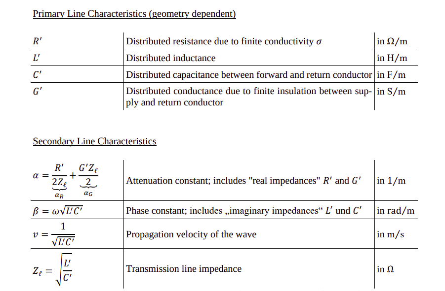

---

title:  Coaxial line

---

### Line (characteristic) impedance of a coaxial cable

$$Z_\ell = \underbrace{60\ \Omega}_{\text{always}} \cdot \underbrace{\sqrt{\frac{\mu_r'}{\varepsilon_r'}}}_{\text{dielectric}} \cdot \underbrace{\ln\left(\frac{D_a}{D_i}\right)}_{\text{geometry}}$$

Three independent pieces: a constant, the material, the geometry

$ε_r​$ (dielectric), $D$ (outer conductor inner diameter), $d$ (inner conductor outer diameter). $Z_0$ = impedance of free space

$$Z_\ell = \sqrt{\frac{L'}{C'}} = \sqrt{\frac{\mu_0\mu_r'\ln^2\left(\frac{D_a}{D_i}\right)}{4\pi^2\varepsilon_0\varepsilon_r'}} = \frac{1}{2\pi}\cdot\sqrt{\frac{\mu_0\mu_r'}{\varepsilon_0\varepsilon_r'}}\cdot\ln\left(\frac{D_a}{D_i}\right) = \frac{Z_0}{2\pi}\sqrt{\frac{\mu_r'}{\varepsilon_r'}}\cdot\ln\left(\frac{D_a}{D_i}\right)$$

When $\mu_r'$ is not given, assume $\mu_r' = 1$ mostly for non magnetic cases.

### Resistance per unit length of Coaxial cable 

$$R' = \frac{1}{2\pi}\sqrt{\frac{\pi f \mu}{\sigma}}\left(\frac{1}{a} + \frac{1}{b}\right)$$

where $a$ = outer radius of inner conductor, $b$ inner radius of outer conductor

### Shunt Conductance per unit length $(G′)$ of Coaxial cable

$$G' = \omega C' \tan\delta_\varepsilon = \frac{2\pi\omega\varepsilon_0\varepsilon_r'}{\ln\left(\frac{D_a}{D_i}\right)}\tan\delta_\varepsilon = \frac{2\pi\omega\varepsilon_0\varepsilon_r''}{\ln\left(\frac{D_a}{D_i}\right)} \quad \text{with } \varepsilon_r = \varepsilon_r' - j\varepsilon_r'' \text{ and } \tan\delta_\varepsilon = \frac{\varepsilon_r''}{\varepsilon_r'}$$

unit: Siemens per meter $(S/m)$.

### Capacitance per unit length of a coaxial cable

$$C' = \frac{2\pi \varepsilon_0 \varepsilon_r}{\ln\left(\frac{D}{d}\right)} = \frac{2\pi \varepsilon_0 \varepsilon_r}{\ln\left(\frac{r_a}{r_i}\right)}$$

where $r_i​$ (or $d/2$): radius of the inner conductor
$r_a$ (or $D/2$): inner radius of the outer conductor (shield)

unit: Farads per meter $(F/m)$.

### Inductance per unit length of coaxial cable

$$L' = \frac{\mu_0 \mu_r}{2\pi} \ln\left(\frac{r_a}{r_i}\right)$$

### Phase velocity (propagation velocity) (coaxial line and simple line)

$$

v_{ph} = \frac{1}{\sqrt{L'C'}} = \frac{1}{\sqrt{\varepsilon_0\varepsilon_r'\mu_0\mu_r'}} = \frac{c_0}{\sqrt{\varepsilon_r'\mu_r'}}

$$
unit: $m/s$
### Field wave impedance

$$Z_F = \frac{Z_{F0}}{\sqrt{\varepsilon_r}} = \frac{120\pi\ \Omega}{\sqrt{\varepsilon_r}} = \frac{\sqrt{\mu_0/\varepsilon_0}}{\sqrt{\varepsilon_r}}$$

$Z_F​$ : field wave impedance of the medium filling the line

### Field wave impedance of free space (vacuum).

$$Z_{F0} = \sqrt{\frac{\mu_0}{\varepsilon_0}} = 120\pi\ \Omega \approx 377\ \Omega$$

so **general field wave impedance** is just this vacuum value divided by $\sqrt{\varepsilon_r}$

### Reflection factor at a junction between two lines:

$$r_V = \frac{Z_{\ell,\mathrm{B}} - Z_{\ell,\mathrm{A}}}{Z_{\ell,\mathrm{B}} + Z_{\ell,\mathrm{A}}}$$

$rV​$ : reflection factor at the junction 

$Z_{\ell,\mathrm{B}} $: characteristic impedance of the line the wave is entering (the load side, here line B)

$Z_{\ell,\mathrm{A}}$ : characteristic impedance of the line the wave comes from (the source side, here line A)

### Reflected power:

$$P_r = P_0 \cdot |r_V|^2 \quad\Rightarrow\quad \frac{P_r}{P_0} = |r_V|^2$$

$P_0​$ : incident power,

$P_r​$ : reflected power,

$|r_V|^2$ : fraction of power reflected (power reflects with the square of the reflection factor, because power scales with amplitude squared)

### For no power reflection: the two line impedances must be equal (impedance matching).

$$Z_{\ell,\mathrm{B}} \overset{!}{=} Z_{\ell,\mathrm{A}}$$

$D_{a,B​}$ : outer conductor (inner) diameter of line B (a = außen = outer)

$D_i$ : inner conductor diameter (i = innen = inner)

$\mu_r$ : relative permeability

### Resonance condition for a λ/2 resonator (a line shorted at both ends)

Core idea: a transmission line shorted at both ends resonates when its total electrical length equals half a wavelength (or a multiple of it). Here the line is made of two
 sections (A and B) with different dielectrics, so you add up their electrical lengths.

**Resonance Condition**

$$\ell_A \sqrt{\varepsilon_{r,\mathrm{A}}} + \ell_B \overset{!}{=} \frac{\lambda_0}{2}$$

$\ell_A,\ \ell_B$ : physical lengths of line sections A and B

$\varepsilon_{r,\mathrm{A}}$ : dielectric constant of section A ($\varepsilon_{r,\mathrm{B}} = 1$, so B's factor $\sqrt{\varepsilon_{r,\mathrm{B}}} = 1$ and drops out)

$\lambda_0 = c_0/f_0$ : free-space wavelength at the resonant frequency

$\sqrt{\varepsilon_r}$ : converts a physical length into an equivalent free-space (electrical) length, because the wave travels slower in the dielectric

### Short-circuited and open-circuited transmission line

### Voltage profile on Coaxial cable

### Fields inside  coaxial cable

$$\hat{E} = \frac{\hat{U}}{r \cdot \ln(a/b)} \qquad \hat{H} = \frac{\hat{I}}{2\pi r}$$

$\hat{E},\ \hat{H}$ : peak (amplitude) field strengths

$\hat{U},\ \hat{I}$ : peak voltage and current on the line

$r$ : radial distance from the axis

$a/b = D_a/D_i$ : ratio of outer to inner conductor diameter 

### Getting  U^ and I^ from the fed-in power:

Base power formula: $$P = \frac{1}{2}\frac{\hat{U}^2}{Z_{\ell,\mathrm{A}}} = \frac{1}{2}\hat{I}^2 Z_{\ell,\mathrm{A}}$$

$$\hat{U} = \sqrt{2 P \, Z_{\ell,\mathrm{A}}} \qquad \hat{I} = \sqrt{\frac{2P}{Z_{\ell,\mathrm{A}}}}$$

Where $Z_{l,A}$ is characteristic impedance  of line A

### Power delivered to the load (dissipated power at the termination) of a lossy transmission line.
$$P(z=\ell) = \frac{|U_1^+|^2}{2 Z_\ell} \, e^{-2\alpha \ell} \left(1 - |r_A|^2\right)$$

**Alternative**

$$\hat{H}_{\max} = \frac{\hat{E}_{\max}}{Z_{F,\mathrm{A}}}$$

$Z_{F,\mathrm{A}}$is the *field wave impedance* of line A

### Phase constant of a transmission line
$$
\beta = \underbrace{\frac{\omega}{v}}_{\text{velocity form}} = \underbrace{\omega\sqrt{L'C'}}_{\text{per-unit-length form}} = \underbrace{\frac{\omega\sqrt{\varepsilon_r'}}{c_0}}_{\text{material-property form}} = \underbrace{\frac{2\pi}{\lambda}}_{\text{wavelength form}}
$$

### Attenuation constant of a low-loss transmission line

General formula $$\alpha = \frac{R'}{2 Z_l}$$

### Attenuation constant of a coaxial cable 

Decomposed as $$α=α_R+α_G$$

**Conductor Loss:** $$\alpha_R = \underbrace{\frac{1}{Z_0}\sqrt{\frac{\pi f \mu_0 \varepsilon_r'}{\sigma_{Cu}}}}_{\text{this is } K_1\text{, all constants}} \cdot \underbrace{\frac{1 + \frac{D_a}{D_i}}{D_a \ln\left(\frac{D_a}{D_i}\right)}}_{\text{the geometry, } \frac{1+x}{\ln x}}$$

&nbsp; where $D_a$ outer conductor inner diameter, $D_i$ inner conductor diameter

**Dielectric loss** $$\alpha_G = \frac{\omega}{2 c_0} \sqrt{\varepsilon_r' \mu_r'} \, \tan\delta_\varepsilon$$

**Combined**
$$\alpha = \alpha_R + \alpha_G = \frac{1}{Z_0}\sqrt{\frac{\pi f\mu_0\varepsilon_r'}{\sigma_{Cu}}}\cdot\frac{1+\frac{D_a}{D_i}}{D_a\ln\left(\frac{D_a}{D_i}\right)} + \frac{\omega}{2c_0}\sqrt{\varepsilon_r'\mu_r'}\ \tan\delta_\varepsilon$$

$$\text{Air-filled coax:}\quad \tan\delta_\varepsilon \approx 0 \;\Rightarrow\; \alpha_G = 0 \;\Rightarrow\; \alpha = \alpha_R$$
### Attenuation (or gain) $A_{dB}$  expressed in decibels

$$A_{dB} = 10 \cdot \log_{10}\left(\frac{P(l)}{P_0}\right)$$

### Power attenuation along a lossy transmission line

Power of a forward wave decays as it travels down a lossy line:

$$P(z) = P(0)\ e^{-2\alpha z}$$

$$\frac{P(l)}{P_0} = e^{-2\alpha l}$$

where $α:$ attenuation constant 

Half of the injected power reaches the end would mean 

$$\frac{P(z=\ell)}{P(z=0)} = e^{-2\alpha\ell} \overset{!}{=} \frac{1}{2}$$

A -20dB drop means you can find the power ratio and equate that in the above formula to find the length of the transmission line after whioch that drop will happen. Given that 
you have found the attenuation constant in previous part.

### Finding where power of max power and minimal attenuation optimized equal   

$$U_0 = E_D \cdot \frac{D_i}{2}\ln\left(\frac{D_a}{D_i}\right)$$

Attenuation constant different in two lines becuase of geomerty. find attenuation constant 

$$P_{in,max} = \frac{1}{2}\frac{|U_0|^2}{Z_\ell^*} = \frac{1}{2}\cdot\frac{E_D^2\,\frac{D_i^2}{4}\ln^2\left(\frac{D_a}{D_i}\right)}{60\ \Omega\cdot\ln\left(\frac{D_a}{D_i}\right)} = \frac{E_D^2\,D_i^2\,\ln\left(\frac{D_a}{D_i}\right)}{8\cdot 60\ \Omega}$$

You need to find how max power compare to attenunation optimized so divied them and get the factor

$$\frac{P_{in,max,2}}{P_{in,max,1}} = \frac{E_D^2 D_a^2 / 4872.9\ \Omega}{E_D^2 D_a^2 / 2613.6\ \Omega} = \frac{2613.6}{4872.9} = 0.536$$

$$P_{max}\,e^{-2\alpha_1 z} = (\text{some factor here eg 0.536})\,P_{max}\,e^{-2\alpha_2 z}$$ 
Power factor cancels 

$$e^{2(\alpha_2 - \alpha_1)z} = 0.536$$

$$z = \frac{\ln(0.536)}{2(\alpha_2 - \alpha_1)} = 58.5\ \text{m}$$

### Minimum attenuation (minimizes conductor loss for a given outer radius)
$$\frac{b}{a} \approx 3.591, \qquad Z_0 \approx 76.7\ \Omega \ \text{(air)}$$ 

### Maximum power capacity (maximizes power before dielectric breakdown for a given outer radius):

$$\frac{b}{a} = \sqrt{e} \approx 1.649, \qquad Z_0 \approx 30\ \Omega \ \text{(air)}$$

Basically we adjust the ratio of inner($a$) and outer($b$) radius to have desired chacracteris impedance of coaxial cable for max 
power or minimum attenuation. 

### Rectangular Coaxial cable treadted as plate capacitor 
Finding capacitacne of each side using 

$$C = \varepsilon_0 \varepsilon_r \frac{A}{d}$$

Rectangular Coaxial geometry Capacitance while ignoring corners

$$C = \varepsilon_0 \varepsilon_r \frac{a \cdot l}{\frac{b - a}{2}}$$

Then multiplied by 4 to account for each side

### Inductance of the hollow rectangular (square) conductor arrangement,

$$L = \frac{\mu_0 \mu_r \, l}{8} \ln\left(\frac{b}{a}\right)$$

$a$: inner side length of the square cross-section
$b$: outer side length of the square cross-section

### DC Resistance of a Rectangular Conductor 
General Formula:  $$R_{DC} = \frac{l}{\sigma \cdot A}$$

Inner: $$R_{DC,innen} = \frac{l}{\sigma \, a^2} $$

Outer: $$R_{DC,aussen} = \frac{l}{\sigma \left((b + 2D)^2 - b^2\right)}$$; &nbsp; where $D$ =wall thickness, $A=(b+2D)^2−b^2$

### HF Resistance of Rectangular Conductor 

General formula: $$R_{HF} = \frac{l}{\sigma \cdot A_{eff}}$$

Inner Condductor: $$R_{HF,innen} = \frac{l}{\sigma \left(a^2 - (a - 2\delta)^2\right)} $$

Outer Conductor: $$R_{HF,auss en} = \frac{l}{\sigma \left((b + 2D)^2 - (b + 2D - 2\delta)^2\right)}$$

### Skin Depth

$$\delta = \frac{1}{\sqrt{\pi \, f_0 \, \mu_0 \, \mu_r \, \sigma}}$$

$$R_{ges} = R_{HF,innen} + R_{HF,au\ss en} $$

## Course of Electrical Power Transmitted over line 

### Reflection coefficient at the load (antenna/termination side)

$$
r_A = \frac{Z_A - Z_\ell}{Z_A + Z_\ell}
$$

### Reflection coefficient at the generator (source side)

$$
r_G = \frac{R_i - Z_\ell}{R_i + Z_\ell}
$$

### Complex propagation constant
For the calculatiion of $\alpha$ and $\beta$ you can use the formula from above. 

$$
\gamma = \alpha + j\beta
$$

unit: $1/m$ (per meter).

### Local reflection coefficient at position z

$$
r(z) = r_A\, e^{-2\gamma(\ell - z)}
$$

unit: dimention less

### Initial launched wave (voltage divider, no reflections yet). 
$U_0$ the source voltage, $R_i$  the internal source resistance, $Z_\ell$ the line characteristic impedance.
$$
U_0^+ = \frac{Z_\ell}{R_i + Z_\ell}\, U_0
$$

### Total forward-wave amplitude on the line (steady state), with generator and load multiple reflections
The forward wave on the line after all the back-and-forth reflections between the source and load have settled.
Here $U_G$ = generator source voltage
$$
U_1^+ = \underbrace{\frac{2Z_\ell}{R_i + Z_\ell}}_{\text{initial launch}} \cdot \underbrace{\frac{1}{1 - r_G r_A e^{-2\gamma \ell}}}_{\text{multiple reflections}}\, U_G
$$

### Active (real) power at position z (low-loss line)

$$P_p(z) = \frac{|U_1^+|^2}{2Z_\ell}\, e^{-2\alpha z}\left(1 - |r_A|^2 e^{-4\alpha(\ell - z)}\right)$$

### Fully-combined power formula
$$P_p(z) = \underbrace{\frac{|U_G|^2}{8Z_\ell}}_{\text{source constant}}\cdot\underbrace{\frac{|1 - r_G|^2}{|1 - r_G r_A e^{-2\gamma\ell}|^2}}_{\text{launch + multi-bounce}}\cdot\underbrace{\left(1 - |r_A|^2 e^{-4\alpha(\ell-z)}\right)}_{\text{reflection correction}}\cdot\underbrace{e^{-2\alpha z}}_{\text{forward decay}}$$

Formula gives you the electrical real (active) power flowing through the cable at any position $z$ along its length.

### $\lambda/2$ Resonator 
resonance-frequency formula applies to both the both-shorted line and the both-open line, but only when both ends have the same type of termination

$$f_n = \frac{n\, v_{ph}}{2\ell} = \frac{n\, c_0}{2\ell\sqrt{\varepsilon_r'}}$$

### Quality factor of the resonator

$$
Q_0 = \frac{\beta}{2\alpha}
$$

### Input impedance of a lossy line with any load (general line-transformation formula)
the impedance you "see" looking into the input of a line, when the far end is terminated by a load $Z_A$

where 
$Z_E​$ = input impedance you see looking into the line

$Z_A$= load at the far end

$Z_\ell$ = characteristic impedance of the line

$\beta = 2\pi/\lambda$ = phase constant, 

$\ell$ = physical line length

$$
Z_E = \frac{Z_A + Z_\ell\tanh(\gamma\ell)}{Z_\ell + Z_A\tanh(\gamma\ell)}\,Z_\ell
$$

### Input impedance of a short-circuited lossy line (shorted stub)

same $Z_E$ as above, but for the special case where the far end is a short circuit, so $Z_A = 0$

$$Z_E = Z_\ell\tanh(\gamma\ell)$$

### Input impedance of a shorted lossy line, expanded into real and imaginary parts

$$Z_E = Z_\ell\,\frac{\tanh(\alpha\ell) + j\tan(\beta\ell)}{1 + j\tanh(\alpha\ell)\tan(\beta\ell)}$$

### Input impedance of an open-circuited lossy line (open stub)

$$Z_E = Z_\ell\,\frac{1}{\tanh(\gamma\ell)}$$

### Input impedance of a lossless line with any load (line transformation, lossless form)

$$
Z_E = \frac{Z_A + jZ_\ell\tan(\beta\ell)}{Z_\ell + jZ_A\tan(\beta\ell)}\,Z_\ell
$$ 

## Shortcuts for lossless case (mostly asked)

### Input impedance $(Z_E)$ when $\lambda/4$ length (lossless case) 
$tan$ gets simplied 

$$
Z_E = Z_\ell \cdot \frac{j\ Z_\ell \tan(\beta \ell)}{j\ Z_A \tan(\beta \ell)} = \frac{Z_\ell^2}{Z_A}
$$

In case of the quarter wave transformer the following formuls is used to calculate the characteristic impedacne of line 

$$Z_l = \sqrt{Z_s \cdot Z_A}$$

$Z_s$ = source impedance

$Z_ℓ​$ = the impedance the $\lambda/4$ section must have to make the load look like $Z_s$

$Z_A$= load impedance (what's connected at the far end)

### Shorted stub ($Z_A = 0$, any length, lossless)
$$
 Z_E = j\ Z_\ell \tan(\beta \ell)
$$

### Open stub, input impedance ($Z_A = \infty$, lossless case)

$$
Z_E = -j\ Z_\ell \cot(\beta\ell) = \frac{-j\ Z_\ell}{\tan(\beta\ell)}
$$

### Lossless lambda/2 case length of line

The input impedance equals the load exactly. The half-wave line is impedance-invisible. Tan(\pie) = zero
So on a lossy line, $Z_E \neq Z_A$. The line pulls the impedance slightly toward $Z_\ell$
### Voltage Standing Wave Ratio (VSWR)
$$\text{VSWR} = s = \frac{|U(z)|_{max}}{|U(z)|_{min}} $$

s=1 means perfectly matched, larger means more reflection.

### Magnitude of the load reflection coefficient from VSWR (low-loss line)

$$|r_A| = \frac{\text{VSWR} - 1}{\text{VSWR} + 1} $$

$$\text{VSWR} = \frac{1 + |r_A|}{1 - |r_A|}$$

On a lossless line, $|r|$ is the same at every point along the line, so it makes no difference whether you use the load reflection 
coefficient $|r_A|$(aussen) or the input one $|r_{E}|$ for VSWR
Only the phase changes as you move along the line

