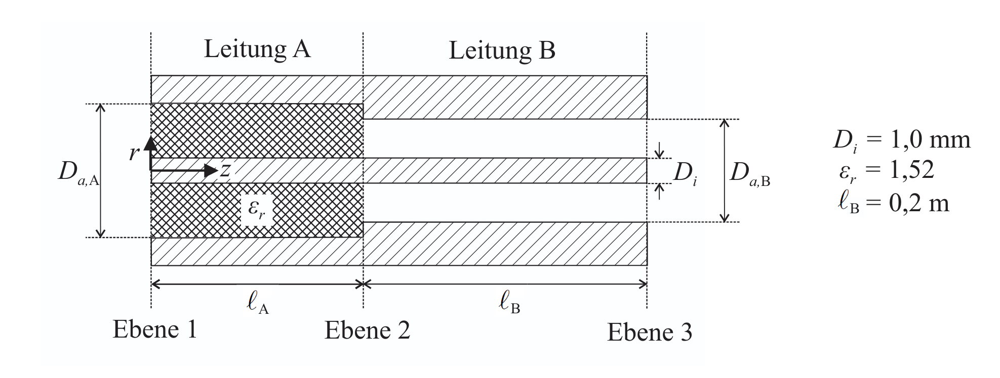
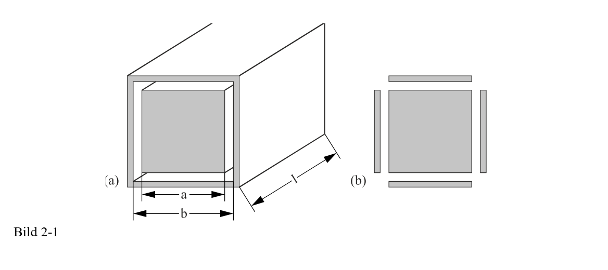

---

title:  Coaxial line

---

### Line (characteristic) impedance of a coaxial cable

$$ Z_\ell = \frac{Z_0}{\sqrt{\varepsilon_r}} = \frac{60\ \Omega}{\sqrt{\varepsilon_r}} \ln\!\left(\frac{D}{d}\right)$$

$ε_r​$ (dielectric), $D$ (outer conductor inner diameter), $d$ (inner conductor outer diameter). $Z_0$ = impedance of free space

### Capacitance per unit length of a coaxial cable

$$C' = \frac{2\pi \varepsilon_0 \varepsilon_r}{\ln\left(\frac{D}{d}\right)} = \frac{2\pi \varepsilon_0 \varepsilon_r}{\ln\left(\frac{r_a}{r_i}\right)}$$

where $r_i​$ (or $d/2$): radius of the inner conductor
$r_a$ (or $D/2$): inner radius of the outer conductor (shield)

### Inductance per unit length of coaxial cable

$$L' = \frac{\mu_0 \mu_r}{2\pi} \ln\left(\frac{r_a}{r_i}\right)$$

### Field wave impedance

$$Z_F = \frac{Z_{F0}}{\sqrt{\varepsilon_r}} = \frac{120\pi\ \Omega}{\sqrt{\varepsilon_r}} = \frac{\sqrt{\mu_0/\varepsilon_0}}{\sqrt{\varepsilon_r}}$$

$Z_F​$ : field wave impedance of the medium filling the line

### Field wave impedance of free space (vacuum).

$$Z_{F0} = \sqrt{\frac{\mu_0}{\varepsilon_0}} = 120\pi\ \Omega \approx 377\ \Omega$$

so **general field wave impedance** is just this vacuum value divided by $\sqrt{\varepsilon_r}$

### Reflection factor at a junction between two lines:

$$r_V = \frac{Z_{\ell,\mathrm{B}} - Z_{\ell,\mathrm{A}}}{Z_{\ell,\mathrm{B}} + Z_{\ell,\mathrm{A}}}$$

$rV​$ : reflection factor at the junction 

$Z_{\ell,\mathrm{B}} $: characteristic impedance of the line the wave is entering (the load side, here line B)

$Z_{\ell,\mathrm{A}}$ : characteristic impedance of the line the wave comes from (the source side, here line A)

### Reflected power:

$$P_r = P_0 \cdot |r_V|^2 \quad\Rightarrow\quad \frac{P_r}{P_0} = |r_V|^2$$

$P_0​$ : incident power,

$P_r​$ : reflected power,

$|r_V|^2$ : fraction of power reflected (power reflects with the square of the reflection factor, because power scales with amplitude squared)

### For no power reflection: the two line impedances must be equal (impedance matching).

$$Z_{\ell,\mathrm{B}} \overset{!}{=} Z_{\ell,\mathrm{A}}$$

$D_{a,B​}$ : outer conductor (inner) diameter of line B (a = außen = outer)

$D_i$ : inner conductor diameter (i = innen = inner)

$\mu_r$ : relative permeability

### Resonance condition for a λ/2 resonator (a line shorted at both ends)

Core idea: a transmission line shorted at both ends resonates when its total electrical length equals half a wavelength (or a multiple of it). Here the line is made of two
 sections (A and B) with different dielectrics, so you add up their electrical lengths.

**Resonance Condition**

$$\ell_A \sqrt{\varepsilon_{r,\mathrm{A}}} + \ell_B \overset{!}{=} \frac{\lambda_0}{2}$$

$\ell_A,\ \ell_B$ : physical lengths of line sections A and B

$\varepsilon_{r,\mathrm{A}}$ : dielectric constant of section A ($\varepsilon_{r,\mathrm{B}} = 1$, so B's factor $\sqrt{\varepsilon_{r,\mathrm{B}}} = 1$ and drops out)

$\lambda_0 = c_0/f_0$ : free-space wavelength at the resonant frequency

$\sqrt{\varepsilon_r}$ : converts a physical length into an equivalent free-space (electrical) length, because the wave travels slower in the dielectric

### Fields inside  coaxial cable

$$\hat{E} = \frac{\hat{U}}{r \cdot \ln(a/b)} \qquad \hat{H} = \frac{\hat{I}}{2\pi r}$$

$\hat{E},\ \hat{H}$ : peak (amplitude) field strengths

$\hat{U},\ \hat{I}$ : peak voltage and current on the line

$r$ : radial distance from the axis

$a/b = D_a/D_i$ : ratio of outer to inner conductor diameter 

### Getting  U^ and I^ from the fed-in power:

Base power formula: $$P = \frac{1}{2}\frac{\hat{U}^2}{Z_{\ell,\mathrm{A}}} = \frac{1}{2}\hat{I}^2 Z_{\ell,\mathrm{A}}$$

$$\hat{U} = \sqrt{2 P \, Z_{\ell,\mathrm{A}}} \qquad \hat{I} = \sqrt{\frac{2P}{Z_{\ell,\mathrm{A}}}}$$

Where $Z_{l,A}$ is characteristic impedance  of line A

### Power delivered to the load (dissipated power at the termination) of a lossy transmission line.
$$P(z=\ell) = \frac{|U_1^+|^2}{2 Z_\ell} \, e^{-2\alpha \ell} \left(1 - |r_A|^2\right)$$

**Alternative**

$$\hat{H}_{\max} = \frac{\hat{E}_{\max}}{Z_{F,\mathrm{A}}}$$

$Z_{F,\mathrm{A}}$is the *field wave impedance* of line A

### Phase elocity (propagation/wave velocity) on a transmission line

$$v = \frac{1}{\sqrt{L' C'}}$$

### Phase constant of a transmission line

$$\beta = \frac{\omega}{v} = \underbrace{\omega \sqrt{L' C'}}_{\text{per-unit-length form}} = \underbrace{\frac{\omega}{c_0 / \sqrt{\varepsilon_r'}} = \frac{\omega \sqrt{\varepsilon_r'}}{c_0}}_{\text{material-property form}}$$

### Attenuation constant of a low-loss transmission line

General formula $$\alpha = \frac{R'}{2 Z_l}$$

### Attenuation constant of a coaxial cable 

Decomposed as $$α=α_R+α_G$$

**Conductor loss**: $$\alpha_R = \frac{1}{Z_0} \sqrt{\frac{\pi f \mu_0 \varepsilon_r'}{\sigma_{Cu}}} \cdot \frac{1 + \frac{D_a}{D_i}}{D_a \ln\left(\frac{D_a}{D_i}\right)}$$
; &nbsp; where $D_a$ outer conductor inner diameter, $D_i$ inner conductor diameter

**Dielectric loss** $$\alpha_G = \frac{\omega}{2 c_0} \sqrt{\varepsilon_r' \mu_r'} \, \tan\delta_\varepsilon$$

### Attenuation (or gain) $A_{dB}$  expressed in decibels

$$A_{dB} = 10 \cdot \log_{10}\left(\frac{P(l)}{P_0}\right)$$

### Power attenuation along a lossy transmission line

$$\frac{P(l)}{P_0} = e^{-2\alpha l}$$

where $α:$ attenuation constant 

A -20dB drop means you can find the power ratio and equate that in the above formula to find the length of the transmission line after whioch that drop will happen. Given that 
you have found the attenuation constant in previous part.

### Rectangular Coaxial cable treadted as plate capacitor 
Finding capacitacne of each side using 

$$C = \varepsilon_0 \varepsilon_r \frac{A}{d}$$

Rectangular Coaxial geometry Capacitance while ignoring corners

$$C = \varepsilon_0 \varepsilon_r \frac{a \cdot l}{\frac{b - a}{2}}$$

Then multiplied by 4 to account for each side

### Inductance of the hollow rectangular (square) conductor arrangement,

$$L = \frac{\mu_0 \mu_r \, l}{8} \ln\left(\frac{b}{a}\right)$$

$a$: inner side length of the square cross-section
$b$: outer side length of the square cross-section

### DC Resistance of a Rectangular Conductor 
General Formula:  $$R_{DC} = \frac{l}{\sigma \cdot A}$$

Inner: $$R_{DC,innen} = \frac{l}{\sigma \, a^2} $$

Outer: $$R_{DC,aussen} = \frac{l}{\sigma \left((b + 2D)^2 - b^2\right)}$$; &nbsp; where $D$ =wall thickness, $A=(b+2D)^2−b^2$

### HF Resistance of Rectangular Conductor 

General formula: $$R_{HF} = \frac{l}{\sigma \cdot A_{eff}}$$

Inner Condductor: $$R_{HF,innen} = \frac{l}{\sigma \left(a^2 - (a - 2\delta)^2\right)} $$

Outer Conductor: $$R_{HF,auss en} = \frac{l}{\sigma \left((b + 2D)^2 - (b + 2D - 2\delta)^2\right)}$$

### Skin Depth

$$\delta = \frac{1}{\sqrt{\pi \, f_0 \, \mu_0 \, \mu_r \, \sigma}}$$

$$R_{ges} = R_{HF,innen} + R_{HF,au\ss en} $$

Minimum attenudation Optimized 
Max power optimized
