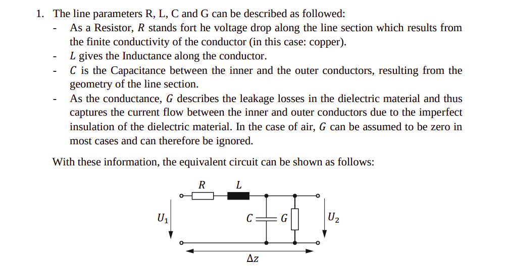

---
 
title: Phase and Group delay

---

### Equivalent circuit diagram of lossy transmission line segment (Coxial cable)

### Transfer function

$$
H(\omega) = \frac{U_2}{U_1}
$$

### Phase delay
time delay of a single frequency's phase; $\varphi(\omega) = \arg H(\omega)$

$$
\tau_{ph}(\omega) = -\frac{\varphi(\omega)}{\omega}
$$

### Group delay 
time delay of the signal envelope; slope of the phase

$$
\tau_{gr}(\omega) = -\frac{d\varphi(\omega)}{d\omega}
$$

**Linear phase** $\varphi(\omega) → \tau_{ph} = \tau_{gr}$ = constant → no distortion. 
All frequencies delayed equally, envelope stays intact.

**Nonlinear phase** → $\tau_{gr}$ depends on $\omega$ → different frequency components delayed differently → pulse smears → bit errors on long lines.

$$
\varphi(\omega) = \arctan\!\left(\frac{\operatorname{Im}\{H(\omega)\}}{\operatorname{Re}\{H(\omega)\}}\right)
$$

### ABCD Matrix 
represents a two-port network by relating the input voltage and current to the output voltage and current

$$
\begin{pmatrix} A & B \\ C & D \end{pmatrix} = \begin{pmatrix} A_{11} & A_{12} \\ A_{21} & A_{22} \end{pmatrix}
$$

$$
A_{ges} = A_1 \cdot A_2 = A^2
$$

## For RLC lossy circuit

### Transfer function from the chain matrix 

$$
H_{ges}(\omega) = \frac{U_3}{U_1} = \frac{1}{A_{11,ges}}
$$

### Impedance Matrix Elements
$Z_{11​}$ — input impedance with output open $(I_2=0)$

$$
Z_{11} = \frac{U_1}{I_1}\bigg|_{I_2=0} = j\omega L + R + \frac{1}{j\omega C}
$$

$Z_{21​}$ — forward transfer impedance

$$
Z_{21} = \frac{U_2}{I_1}\bigg|_{I_2=0} = \frac{1}{j\omega C}
$$

$Z_{12​}$ — reverse transfer impedance

$$
Z_{12} = \frac{U_1}{I_2}\bigg|_{I_1=0} = \frac{1}{j\omega C}
$$

$Z_{22​}$ — output impedance with input open $(I_1=0)$

$$
Z_{22} = \frac{U_2}{I_2}\bigg|_{I_1=0} = \frac{1}{j\omega C}
$$

When you cascade(interconnection in series) of two two port networks, ther overall chain matrix $A_ges$ is matrix product of
 indivual matrices 

### A-parameters (converted from Z)

$$
A_{11} = \frac{Z_{11}}{Z_{21}} = 1 - \omega^2 LC + j\omega CR
$$

$$
A_{21} = \frac{1}{Z_{21}} = j\omega C
$$

$$
A_{12} = \frac{\det Z}{Z_{21}} = j\omega L + R
$$

$$
A_{22} = \frac{Z_{22}}{Z_{21}} = 1
$$

$A_{11,ges​}$ for two cascaded sections

$$A_{11,ges} = A_{11}A_{11} + A_{12}A_{21} $$

### Phase and Group Velocity (from $\beta$)

Phase velocity — speed of the wavefronts; counterpart to phase delay $\tau_{ph}$

$$
v_{ph} = \left(\frac{\beta(\omega)}{\omega}\right)^{-1} = \frac{\omega}{\beta(\omega)}
$$

Group velocity — speed of the signal envelope; counterpart to group delay $\tau_{gr}$

$$
v_{gr} = \left(\frac{d\beta(\omega)}{d\omega}\right)^{-1}
$$

I need to understand the $\omega$ less than and greater than cases
