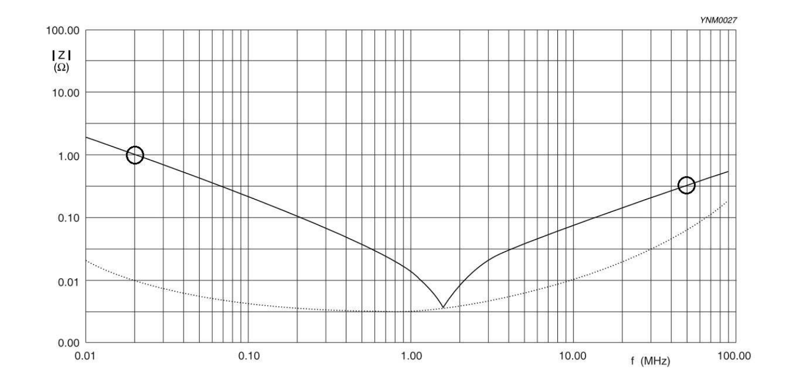

### Capacitance per unit length of coaxial (cylindrical) capacitor,

$$C'  = \frac{2\pi \varepsilon_0 \varepsilon_r}{\ln\!\left(\frac{D_a}{D_i}\right)}$$ ; &nbsp; &nbsp; where $D_a$ outer diameter, $D_i$ inner

$$C = \frac{2\pi \epsilon_0 \epsilon_r \ell}{\ln\!\left(\frac{D_a}{D_i}\right)}$$

### Parasitic effects in real Capacitor 
Lead inductance, contact transition resistance (or ohmic lead resistance), repolarization losses in the dielectric, or leakage currents in the dielectric.

### Two wire Line (Parallel wire/lecher line)

$$C' = \frac{\pi\varepsilon_0\varepsilon_r}{\ln\left(\frac{D}{a} + \sqrt{\left(\frac{D}{2a}\right)^2 - 1}\right)} \approx \frac{\pi\varepsilon_0\varepsilon_r}{\ln\left(\frac{D}{a}\right)} \quad \text{for } D \gg a$$

where $D$ = center-to-center spacing between the two wires, $a$ = wire radius. 

### Parallel Plate capacitor

$$C' = \frac{\varepsilon_0\varepsilon_r \cdot w}{h}$$

where $w$ = plate width, $h$ = separation between plates 

### Time between the maximum capacitive energy and the maximum inductive energy transfer

$$\Delta t = \frac{T}{4} = \frac{1}{4f_{Res}}$$

### Gemoteries of the Capacitor
- Spherical Capacitor 
- Plate Capacitor

Diferent dimensions capacitor(plate and spherical) can be combined together and asked for dimentions.Conceptually you can find combined series resistance and the mostly 
ratio fo cpacitance given and use that to find indivual capacitance and then apply spherical capacitor capacitance formula

**Dimentions of the high frequency real resistor in realtion to wavelength**

At very high frequencies (small wavelengths), the parasitic effects that occur can no longer be neglected, which means wave propagation effects must be taken into account.
As a result, the component can no longer be described as a lumped component.

### Finding Current(max) or Voltage(max)  in LC ciruit 
Max current between the LC ciruit is when there is resonacne and energy transfered from Capacitor to Inductor at resonance since the formula is 

$$\frac{1}{2}L I_{max}^2 = \frac{1}{2}CU^2$$

$$L I_{max}^2 = CU^2$$

$$I_{max} = \sqrt{\frac{CU^2}{L}}$$

### Capacitance of plate Capacitor
$$C = \varepsilon_0\ \varepsilon_r\ \frac{A}{d}$$

$$C_{total} = (N-1)\ \epsilon_0\epsilon_r\ \frac{A^2}{d}$$ 

where $d$ represent single layer thickness and number of layers $(N−1)$, it tells you the total capacitance of the parallel stack

### Dielectric Loss power Density Formula
$$P_V = 2\pi f \epsilon_0 \epsilon_r'' E^2$$
where E is electric field and P_v power loss density 

For a parallel-plate capacitor, $E$  relates to the applied voltage $U$ and the plate separation $d$ by:

$$E = \frac{U}{d}$$

### Equivalent Circuit Diagram(ECD) of Multilayer Plate Capacitor at High frequency

A real capacitor is not just an ideal $C$. At high frequencies, parasitic effects from the electrodes, leads, and dielectric must be included.

**Parallel elements** (across $C$):

- $R_p$: insulation/leakage resistance (DC leakage through dielectric, very large, negligible at high $f$)
- $R_{diel}$: dielectric loss resistance (AC losses from dipole/polarization damping)

**Series elements**:

- $R_S$: resistance of electrodes and leads (ESR); dominates at resonance
- $L_S$: inductance of electrode plates and leads (ESL); dominates at high $f$

### Full ECD

$$Z(\omega) = \left(R_p \parallel R_{diel} \parallel \frac{1}{j\omega C}\right) + R_S + j\omega L_S$$

### Simplified ECD

(valid since $R_p, R_{diel} \to \infty$ negligible in relevant range)

$$Z(\omega) = R_S + j\omega L_S + \frac{1}{j\omega C}$$

Impedance frequncy graph shown with left point being capacitance since impedance decreases as frequency increases and right is inductacne as impedance increases with frequency
 

### Polarization 

In Electric field tiny separation of positive and negative charge, created throughout the material, is called polarization.It's what allows a dielectric to store energy in a 
capacitor and boost its capacitance 

#### Diople 
A dipole is just a pair of charges, one positive and one negative, separated by some small distance.When a material polarizes, you're essentially creating (or aligning) a huge 
number of tiny dipoles

Three types of polarization
 
- **Electronic Polarization**: The electric field shifts an atom's electron cloud slightly relative to its nucleus, creating a small induced dipole.

- **Ionic Polarization:** The electric field displaces positive and negative ions in a lattice slightly apart, creating a dipole (stronger than electronic polarization since 
whole ions move).

- **Orientation Polarization:** The electric field rotates existing permanent dipoles (like polar molecules) to align with it, requires free rotational movement, so it's negligible 
in rigid solids like ceramics.

