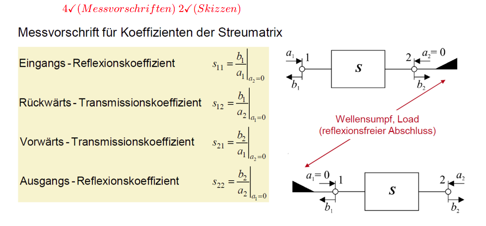

---
title: S-Parameters 
---
### General S-Matrix (two-port, relates outgoing waves to incoming waves
$$\begin{pmatrix} b_1 \\ b_2 \end{pmatrix} = \begin{pmatrix} s_{11} & s_{12} \\ s_{21} & s_{22} \end{pmatrix}\begin{pmatrix} a_1 \\ a_2 \end{pmatrix}$$

$$
b_1 = s_{11}\,a_1 + s_{12}\,a_2 \\b_2 = s_{21}\,a_1 + s_{22}\,a_2
$$

entries:
- **$s_{11}$** = input reflection,

-  **$s_{22}$** = output reflection,

- **$s_{21}$** = forward transmission (port 1 to port 2),

- **$s_{12}$** = reverse transmission (port 2 to port 1).

### Determinant
$$
\det(S) = s_{11}\,s_{22} - s_{12}\,s_{21}
$$

### Unitarity Condition (holds for lossless networks, energy conservation)
Two port $S$ Port is lossless if this condition holds

$$
S^{*T} \cdot S = E
$$

$S∗^T$ = conjugate transpose of $S$; $E$ = identity matrix.

### Power Balance from Unitarity (per-column power conservation, two-port)
$$
|s_{11}|^2 + |s_{21}|^2 = 1 \qquad |s_{12}|^2 + |s_{22}|^2 = 1
$$

### Reflected Power Fraction at a Port (fraction of input power reflected)
$$
\frac{P_1^-}{P_1^+} = |s_{11}|^2
$$

### Ideal Lossless Line S-Matrix (transmission line as a two-port, phase shift only)
$$
S = \begin{pmatrix} 0 & e^{-j\beta \ell} \\ e^{-j\beta \ell} & 0 \end{pmatrix}
$$

### Lossy Line S-Matrix (transmission line with attenuation)
$$
S = \begin{pmatrix} 0 & e^{-(\alpha + j\beta)\ell} \\ e^{-(\alpha + j\beta)\ell} & 0 \end{pmatrix}
$$

### Phase Constant of a Line (used to compute the transmission phase)
$$
\beta = \frac{\omega}{c_0}\sqrt{\varepsilon_r \mu_r}
$$

Check wethere the U_o and Epsilon_not is used or not for loss less case

### Wave Chain (Cascade) Matrix Definition (relates port-1 waves to port-2 waves)
$$
\begin{pmatrix} a_1 \\ b_1 \end{pmatrix} = C \begin{pmatrix} b_2 \\ a_2 \end{pmatrix} = \begin{pmatrix} c_{11} & c_{12} \\ c_{21} & c_{22} \end{pmatrix}\begin{pmatrix} b_2 \\ a_2 \end{pmatrix}
$$

### Wave Chain (Cascade) Matrix from S-Matrix (enables cascading of two-ports)
$$
C = \frac{1}{s_{21}}\begin{pmatrix} -\det(S) & s_{11} \\ -s_{22} & 1 \end{pmatrix}
$$

### Cascading Rule (total network from two cascaded two-ports)
$$
C_{\text{total}} = C_1 \cdot C_2
$$

### Shortcut for Two Matched Networks (skips the chain-matrix procedure) 
$$
s_{21,\text{total}} = s_{21}^{(1)} \cdot s_{21}^{(2)} \quad\text{when}\quad |s_{11}| = |s_{22}| = 0
$$

When both cascaded networks are reflection-free at both ports, the total forward transmission is simply the product of the 
individual ones

### Chain Matrix Back to S-Matrix (conversion from C to S)
$$
S = \frac{1}{c_{22}}\begin{pmatrix} c_{12} & \det(C) \\ 1 & -c_{21} \end{pmatrix}
$$
### S-Parameter in Decibels (magnitude of a wave-amplitude ratio)
$$|s_{ij}|_{\text{dB}} = 20 \log_{10} |s_{ij}|$$

### Reflection Coefficient in Decibels to Linear (converting a given $r_1$ in dB)
$r1$ is the reflection coefficient at port 1
formula takes a dB value as input and gives you the linear magnitude as output.
$$
|r_1| = 10^{\,|r_1|_{\text{dB}} / 20}
$$

### Absolute Power in dBm (used for input and reflected power)
Conert any power from **Watt (W)** to **dBm**
$$
P|_{\text{dBm}} = 10 \log_{10}\!\left(\frac{P}{1\ \text{mW}}\right)
$$

### VSWR 
When a wave travels down a transmission line toward a load that is not perfectly matched, part of it reflects back. The forward
and reflected waves interfere, producing a fixed pattern of voltage maxima and minima along the line, a standing wave. VSWR is the
ratio of the largest voltage amplitude to the smallest:

$$
VSWR = \frac{|E_{\max}|}{|E_{\min}|} = \frac{|E^+| + |E^-|}{|E^+| - |E^-|} = \frac{1 + |r|}{1 - |r|}
$$

- $r$ = reflection coefficient at the load
- $E$ = electric field amplitude
### VSWR from Reflection Coefficient (standing wave ratio in terms of $|s_{11}|$
$$
VSWR = \frac{1 + |s_{11}|}{1 - |s_{11}|}
$$

### Reflection Coefficient from VSWR (inverting the relation)

$$
|s_{11}| = \frac{VSWR - 1}{VSWR + 1}
$$

### Forward Gain (transmission from port 1 to port 2, amplification)

$$
10 \log\!\left(\frac{P_2^-}{P_1^+}\right) = 20 \log|s_{21}|
$$

### Backward Attenuation (reverse transmission, port 2 to port 1, isolation)

$$
-10 \log\!\left(\frac{P_1^-}{P_2^+}\right) = -20 \log|s_{12}|
$$

### Input Matching (input reflection $s_{11}$ from input VSWR)
$$
VSWR_E = \frac{|E_{\max}|}{|E_{\min}|} \qquad |s_{11}| = \frac{VSWR_E - 1}{VSWR_E + 1}
$$

### Output Matching (output reflection $s_{22}$ as reflection attenuation)
$$
-10 \log\!\left(\frac{P_2^-}{P_2^+}\right) = -20 \log|s_{22}|
$$

### Reciprocity (network behaves the same in both directions)
Signal transmission is identical forward and backward.For a two-port this means 
$$
s_{12} = s_{21}
$$

### Losslessness / Unitarity (no power dissipated inside the network)
Network is lossless when all incident power leaves through the ports and none is converted to heat. 
$$S^{*T} \cdot S = E$$

$$
|s_{11}|^2 + |s_{21}|^2 = 1 \qquad |s_{12}|^2 + |s_{22}|^2 = 1
$$

$$
P_V = 1 - |s_{11}|^2 - |s_{21}|^2
$$

If this is zero the network is lossless (regardless of how big $s_{11} is);
### Reflection Symmetry / Matching (self-reflection-free ports)
For a two-port this means $s_{11} = s_{22} = 0$

### Wave Amplitudes $a$ and $b$
$$
a = \frac{1}{2}(u + i) \qquad b = \frac{1}{2}(u - i)
$$

**a** = incident (ingoing) wave, **b** = reflected (outgoing) wave. 

### Magnitude Relations from Power Balance (abbreviation $\varrho$ for the reflection magnitude)
$$
|s_{11}| = \sqrt{1 - |s_{12}|^2} = \varrho \qquad |s_{12}| = \sqrt{1 - |s_{11}|^2} \\[4pt]|s_{22}| = \sqrt{1 - |s_{12}|^2} = \varrho
$$

### Impedance Matrix Definition (voltages from currents, Z-matrix)
$$
\begin{pmatrix} U_1 \\ U_2 \end{pmatrix} = \begin{pmatrix} Z_{11} & Z_{12} \\ Z_{21} & Z_{22} \end{pmatrix}\begin{pmatrix} I_1 \\ I_2 \end{pmatrix} \qquad U = Z \cdot I
$$

### The four parameters written out (two-port)

$$
Z_{11} = \left.\frac{U_1}{I_1}\right|_{I_2 = 0} \qquad Z_{12} = \left.\frac{U_1}{I_2}\right|_{I_1 = 0} \\[6pt]Z_{21} = \left.\frac{U_2}{I_1}\right|_{I_2 = 0} \qquad Z_{22} = \left.\frac{U_2}{I_2}\right|_{I_1 = 0}
$$

### Admittance Matrix Definition (currents from voltages, Y-matrix)
$$
\begin{pmatrix} I_1 \\ I_2 \end{pmatrix} = \begin{pmatrix} Y_{11} & Y_{12} \\ Y_{21} & Y_{22} \end{pmatrix}\begin{pmatrix} U_1 \\ U_2 \end{pmatrix} \qquad I = Y \cdot U
$$

### Normalized Impedance Matrix from S-Matrix (conversion S to z)
$$
z = (E - S)^{-1}(E + S)
$$

### S-Matrix from Normalized Impedance Matrix (conversion z to S)
$$
S = (z - E)(z + E)^{-1}
$$

### Inverse of a 2×2 Matrix (general formula)
$$
M^{-1} = \frac{1}{\det(M)}\begin{pmatrix} d & -b \\ -c & a \end{pmatrix}, \qquad \det(M) = ad - bc
$$

### Wave Source Definition
b is the wave coming out of the source (outgoing onto the cable). This is the total wave the source sends down the line toward 
the rest of the circuit.
$b_Q​$ = source wave (what the source launches on its own), $r_Q$ = source reflection coefficient
The outgoing wave b is made of two contributions added together:

- $b$ = **total outgoing wave** from the source onto the cable
- $a$ = **incoming wave** arriving back at the source (from the line)
- $b_Q$ = **source wave**, what the source launches on its own
- $r_Q$ = **source reflection coefficient**

$$
b = \underbrace{b_Q}_{\text{launched}} + \underbrace{r_Q \cdot a}_{\text{reflected}}
$$

### Available power of a source / power carried by a travelling wave

$$
P = \frac{1}{2}\,|b|^2
$$

it is called the available power of the source with a matched load you extract the maximum possible power

- **$P$:** time-averaged power carried by the outgoing wave, in watts
- **$b$:** complex amplitude of the outgoing (reflected/emitted) wave at a port

### Power delivered to an arbitrary (mismatched) load

$$
P = \frac{1}{2}\,|b_Q|^2\,\frac{1 - |r_2|^2}{|1 - r_Q r_2|^2}
$$

- $P$: time-averaged power dissipated in the load, in watts
- $|b_Q|$: magnitude of the source wave (the source's own generated wave)
- $r_2$: reflection coefficient of the load
- $r_Q$: reflection coefficient looking into the source
- $\frac{1}{2}|b_Q|^2$: the power the source would deliver into a matched load
- $1 - |r_2|^2$: fraction not reflected by the load
- $|1 - r_Q r_2|^2$: mismatch factor from multiple reflections between source and load

### Normalized Source Impedance and Voltage (dimensionless quantities)
$$
z_Q = \frac{Z_Q}{Z_\ell} \qquad u_Q = \frac{U_Q}{\sqrt{Z_\ell}}
$$

- $z_Q$ is the normalized source impedance,
- $Z_Q$ is the internal (source) impedance of the generator,
- $Z_ℓ​$ = cable characteristic impedance used as the reference for normalization.

### Source Wave from a Voltage Source (launched wave)
$$
b_Q = \frac{u_Q}{1 + z_Q}
$$

### Source Reflection Coefficient (reflection looking back into the source)
$$
r_Q = \frac{z_Q - 1}{z_Q + 1}
$$

### Current Source Version (via source transformation)

A current source $I_Q$  with parallel admittance $Y_Q$ is the same source, using $U_Q = I_Q / Y_Q$ and $Z_Q = 1/Y_Q$. In normalized form 
with $y_Q = Y_Q Z_\ell$

$$
r_Q = \frac{1 - y_Q}{1 + y_Q} \qquad b_Q = \frac{i_Q}{1 + y_Q}, \qquad i_Q = I_Q \sqrt{Z_\ell}
$$

$Z_Q​$ means source impedance. Quelle = source

### Measurement procedures for the coefficients of the scattering matrix S

### phase of wave traveling down a line 

$$
 \varphi = \frac{2\pi f \sqrt{\varepsilon_r}}{c_0}\,\ell
$$

### Load matching/Reflection Matching VS Power matching

Three impedances in the chain:

- The source, with internal impedance Z_Q
- The cable, with characteristic impedance Z_ℓ(50 Ω)
- The load, with impedance Z2

#### Reflection matching: match the load to the CABLE	
You pick a 50 Ω load because the cable is 50 Ω. Nothing bounces back off the load. The wave arrives, gets fully absorbed, done.
$$
Z_2​=Z_ℓ​ ⟹ r_2​=0
$$
We do this when we care about signal cleanliness: no echoes, no standing waves, no ghost images.

### Power matching: match the load to the SOURCE
You pick the **load** equal to the **complex conjugate of the source impedance**, whatever that happens to be. Now you squeeze the maximum possible watts out of the source.

Q-source(quelle)

$$
Z_2​=Z_Q∗​⟹  r_2​=r_Q∗
$$

You do this when you care about getting power out, not about echoes. Here a wave does bounce back off the load, and that is accepted

### Checking if the S matrix can be realized using the passive componnets

A network described by scattering matrix $S$ is realizable with only passive components if and only if it does not generate power. 

$$
P = E - S^{*T} S
$$

For a $2×2$, just check $P_{11} \geq 0$ and $det⁡P≥0$

## Power carried by the incoming and outgoing waves at a port

Both directions use the same rule. The factor $\tfrac{1}{2}$ appears because $a$ and $b$ are peak (amplitude) values, not RMS values.

| | Incoming (toward the two-port) | Outgoing (away from the two-port) |
|---|---|---|
| Wave quantity | $a_n$ | $b_n$ |
| Power | $P_n^+ = \tfrac{1}{2}\lvert a_n\rvert^2$ | $P_n^- = \tfrac{1}{2}\lvert b_n\rvert^2$ |

**Symbol definitions**

- $a_n$: complex amplitude of the wave running into the network at port $n$ (Watt$^{1/2}$)
- $b_n$: complex amplitude of the wave running out of the network at port $n$ (Watt$^{1/2}$)
- $P_n^+$: time-averaged power transported toward the network at port $n$, in W
- $P_n^-$: time-averaged power transported away from the network at port $n$, in W

**Net power delivered into port $n$**

$$
P_n = P_n^+ - P_n^- = \frac{1}{2}\left(\lvert a_n\rvert^2 - \lvert b_n\rvert^2\right)
$$

### Symmetry Properties of a Two-Port S-Matrix

| Property | Condition | Meaning |
|---|---|---|
| Reciprocal | $s_{12} = s_{21}$ | same transmission both ways |
| Reflection-symmetric | $s_{11} = s_{22}$ | both ports look the same |
| Both | $s_{12} = s_{21}$ and $s_{11} = s_{22}$ | fully symmetric two-port |

### S-Matrix Conditions: Loss, Gain, Reciprocity, Phase

$$
\mathbf{S}_1 = \begin{pmatrix} 0 & 1 \\ 1 & 0 \end{pmatrix} e^{j\frac{\pi}{4}} = \begin{pmatrix} 0 & e^{j\frac{\pi}{4}} \\ e^{j\frac{\pi}{4}} & 0 \end{pmatrix}
$$

| Desired element | Required change to $\mathbf{S}_1$ | Reason |
|---|---|---|
| Reciprocal, lossy line | $\lvert s_{12}\rvert,\ \lvert s_{21}\rvert < 1$ | Reciprocity keeps $s_{12} = s_{21}$; magnitude below 1 means power is lost in both directions |
| Attenuator (port 1 to port 2) | $\lvert s_{21}\rvert < 1$ | Only the forward path is attenuated |
| Ideal phase shifter by half a wavelength | nothing | $\ell = \lambda/2$ gives $\beta\ell = \pi$, and the given $e^{j\pi/4}$ already is a pure phase term with magnitude 1, so the matrix already describes a lossless phase shifter |
| Amplifier (port 1 to port 2) | $\lvert s_{21}\rvert > 1$ | Forward transmission gain greater than 1 |

| Symbol | Meaning | Unit |
|---|---|---|
| $a_1, a_2, a_3, a_4$ | incident wave quantity at a port | $\sqrt{\mathrm{W}}$ |
| $a_{0,\mathrm{dB}}$ | attenuation per unit length of a line | dB/m |
| $a_{\mathrm{dB}}$ | total attenuation of the whole line | dB |
| $\alpha$ | attenuation constant in Nepers | Np/m |

#### Total attenuation of the line

$$a_{\mathrm{dB}} = a_{0,\mathrm{dB}} \cdot \ell$$

#### Relation to the Neper attenuation constant $α$
$$a_{0,\mathrm{dB}} = 8{,}686 \cdot \alpha$$

### Make notes for the case where reflection between the source and teh input port in S port 

