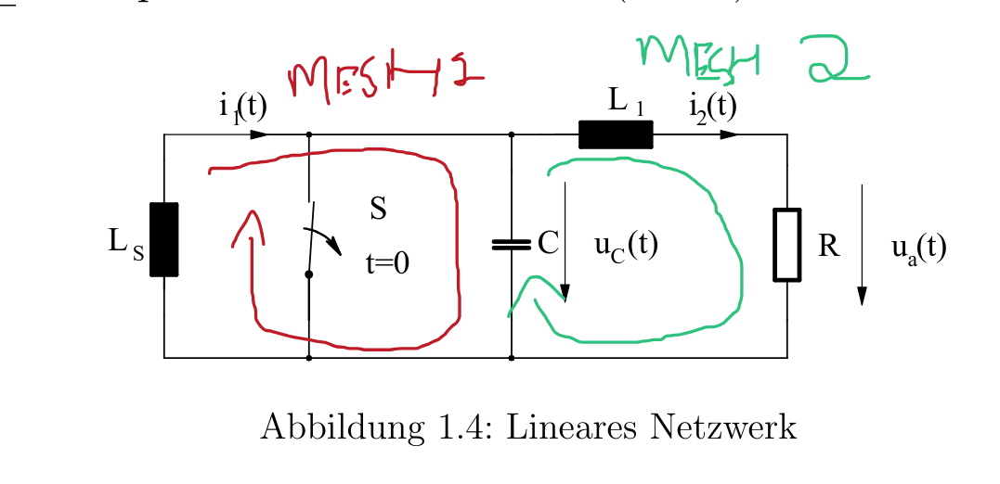

The core idea: to take the Laplace transform of a signal, you multiply it by $e^{−st}$
and integrate over all positive time.

$$
F(s) = \int_0^\infty f(t)\,e^{-st}\,dt
$$

## Fourier vs Laplace: Input and Output Domains
$$
e^{-st} = e^{-(\sigma + j\omega)t} = \underbrace{e^{-\sigma t}}_{\text{decay/growth}} \cdot \underbrace{e^{-j\omega t}}_{\text{oscillation}}
$$

- **Fourier** asks only which frequencies are present. Its kernel is a pure sinusoid, so it decomposes the signal into steady oscillations.
- **Fourier**: input $x(t)$ lives in the time domain, output $X(\omega)$ lives in the (real) frequency domain. The variable is $\omega$, a real frequency axis.
- **Laplace** asks which frequencies AND which decay/growth rates are present. Its kernel is a sinusoid multiplied by a real exponential, so it can 
also capture things that ramp up or die away.

- **Laplace**: input $f(t)$ lives in the time domain, output $F(s)$ lives in the complex frequency domain. The variable is $s = \sigma + j\omega$, a whole 2D plane.

$$
\text{Fourier: } t \to \omega \quad(\text{real frequency line})
\text{Laplace: } t \to s \quad(\text{complex frequency plane})
$$

Differentiating a signal in the time domain corresponds to multiplying its transform by $s$ in the s-domain, then subtracting the initial value $f(0)$

$$
\mathcal{L}\{\dot f(t)\} \quad\circ\!\!-\!\!\bullet\quad sF(s) - f(0)
$$ 

$$
\mathcal{L}\{\ddot f(t)\} = s^2 F(s) - sf(0) - \dot f(0)
$$

### Unit Step $\varepsilon(t)$ funciton 

The unit step $ε(t)$ is defined as:

$$
\varepsilon(t) = \begin{cases} 1 & t \ge 0 \\ 0 & t < 0 \end{cases}
$$

So when you multiply any signal 
$f(t)$ by $ε(t)$, you are switching the signal on at $t=0$: it keeps its normal value for positive time and is forced to zero for negative time.

$$
\varepsilon(t)\,f(t) = \begin{cases} f(t) & t \ge 0 \\ 0 & t < 0 \end{cases}
$$

### Table 1: Transform Pairs (Common Functions)

| $f(t)$ for $t \ge 0$ | $F(s)$ | Region of convergence |
| --- | --- | --- |
| $\delta(t)$ (impulse) | $1$ | all $s$ |
| $\varepsilon(t)$ (unit step) | $\dfrac{1}{s}$ | $\operatorname{Re}(s) > 0$ |
| $t$ | $\dfrac{1}{s^2}$ | $\operatorname{Re}(s) > 0$ |
| $t^n$ | $\dfrac{n!}{s^{n+1}}$ | $\operatorname{Re}(s) > 0$ |
| $e^{-at}$ | $\dfrac{1}{s+a}$ | $\operatorname{Re}(s) > -a$ |
| $t\, e^{-at}$ | $\dfrac{1}{(s+a)^2}$ | $\operatorname{Re}(s) > -a$ |
| $t^n e^{-at}$ | $\dfrac{n!}{(s+a)^{n+1}}$ | $\operatorname{Re}(s) > -a$ |
| $\cos(\omega_0 t)$ | $\dfrac{s}{s^2 + \omega_0^2}$ | $\operatorname{Re}(s) > 0$ |
| $\sin(\omega_0 t)$ | $\dfrac{\omega_0}{s^2 + \omega_0^2}$ | $\operatorname{Re}(s) > 0$ |
| $e^{-at}\cos(\omega_0 t)$ | $\dfrac{s+a}{(s+a)^2 + \omega_0^2}$ | $\operatorname{Re}(s) > -a$ |
| $e^{-at}\sin(\omega_0 t)$ | $\dfrac{\omega_0}{(s+a)^2 + \omega_0^2}$ | $\operatorname{Re}(s) > -a$ |

### Trick for conversion
$$
\frac{1}{s^2+\omega_0^2} = \frac{1}{\omega_0}\cdot\frac{\omega_0}{s^2+\omega_0^2}
$$
$$
\frac{1}{s^2+\omega_0^2} \;\longleftrightarrow\; \frac{1}{\omega_0}\sin\omega_0 t
$$

## Table 2: Operational Rules (Properties)

| Property | Time domain | s-domain |
| --- | --- | --- |
| Linearity | $a\, f(t) + b\, g(t)$ | $a F(s) + b G(s)$ |
| First derivative | $\dfrac{d}{dt} f(t)$ | $s F(s) - f(0)$ |
| Second derivative | $\dfrac{d^2}{dt^2} f(t)$ | $s^2 F(s) - s f(0) - \dot f(0)$ |
| $n$-th derivative | $\dfrac{d^n}{dt^n} f(t)$ | $s^n F(s) - \sum_{k=1}^{n} s^{n-k} f^{(k-1)}(0)$ |
| Integration | $\displaystyle \int_0^t f(\tau)\, d\tau$ | $\dfrac{F(s)}{s}$ |
| Time shift (delay) | $ \varepsilon(t-T)\,f(t-T)$ | $e^{-sT} F(s)$ |
| Frequency shift | $e^{-at} f(t)$ | $F(s+a)$ |
| Time scaling | $f(at),\ a > 0$ | $\dfrac{1}{a} F\!\left(\dfrac{s}{a}\right)$ |
| Multiply by $t$ | $t\, f(t)$ | $-\dfrac{d}{ds} F(s)$ |
| Convolution | $(f * g)(t)$ | $F(s)\, G(s)$ |

**Importnat:** Time shift and frequency shift. In laplace domain if a function is being multipled with the exponential this results in time shift in time domain and to write that
we attach unit step function with function and inverse is true for the frequncy shift 

Take note in multiplicity we are multiplying with the $t$ variable and not with constant 

## Special Theorems (Limit Rules)

### Initial Value Theorem

$$
f(0^+) = \lim_{s \to \infty} s F(s)
$$

In words: the starting value of the signal (just after switch-on) equals the limit of $sF(s)$ as $s$ goes to infinity.

Intuition for why $s→∞$: large 
$s$ in the s-domain corresponds to very small $t$ in the time domain (fast/early behavior). So pushing $s→∞$ "zooms in" on the instant right 
after $t=0$

### Final Value Theorem

$$
\lim_{t \to \infty} f(t) = \lim_{s \to 0} \; \underbrace{s\,F(s)}_{\text{multiply by } s \text{ FIRST}}
$$

- **Do not forget the $s$.** You always multiply $F(s)$ by $s$ *before* taking the limit. The $s$ comes from the theorem, not from $F(s)$ itself.

**Order of operations:** multiply by $s$ → cancel the common $s$ → then set $s \to 0$.

Valid only if the limit exists, i.e. all poles of $s F(s)$ have negative real part.

Important rule 
when applying the final value theorm and function turns into undeterminant state $∞/∞$ we first simplify 

$$
\lim_{s \to \infty} \frac{s^2}{s^2 + \omega_0^2} = 1
$$

$$
\frac{s^2}{s^2 + \omega_0^2} = \frac{1}{1 + \dfrac{\omega_0^2}{s^2}}
$$

$$
s = p = \sigma + j\omega \quad\longrightarrow\quad e^{pt} = \underbrace{e^{\sigma t}}_{\text{size}}\cdot\underbrace{e^{j\omega t}}_{\text{oscillation}}
$$

### Poles and the Sign of the Real Part

A **pole** of $sF(s)$ is a value of $s$ where the denominator becomes zero (the expression blows up to infinity). Each pole corresponds to a term in the time-domain signal of the form $e^{pt}$, where $p$ is the pole location.

Writing the pole as $p = \sigma + j\omega$:

$$
s = p = \sigma + j\omega \quad\longrightarrow\quad e^{pt} = \underbrace{e^{\sigma t}}_{\text{size}}\cdot\underbrace{e^{j\omega t}}_{\text{oscillation}}
$$

The size is controlled by $\sigma = \operatorname{Re}(p)$:

- **$\sigma < 0$ (negative real part):** $e^{\sigma t} \to 0$. The term dies out. The signal settles down. ✓
- **$\sigma > 0$ (positive real part):** $e^{\sigma t} \to \infty$. The term blows up. No final value exists. ✗
- **$\sigma = 0$ (on the imaginary axis):** $e^{\sigma t} = 1$, constant size. The term oscillates forever (like a pure cosine) and never settles. ✗

The final value theorem asks what the signal settles to as $t \to \infty$. That question only has an answer if the signal actually settles, which happens exactly when **every** pole has a negative real part (all poles in the left half of the s-plane).

$$
\text{All poles in the left half-plane} \iff \text{signal settles} \iff \text{final value theorem valid}
$$

This left-half-plane condition is also the exact condition for a system to be **stable**: a stable system is one whose transient response dies out.

### The causality rule

A signal is causal if it is zero for all negative time:

$$
f(t) = 0 \quad \text{for all } t < 0
$$

For the trig ratios (sin, cos) always convert to the exponential

## Trig to Exponential (Euler's Formulas)

A useful habit for Laplace transforms: whenever a $\sin$ or $\cos$ appears, convert it to complex exponentials first. Exponentials integrate cleanly, while trig functions do not. These conversions come straight from Euler's formula $e^{j\theta} = \cos\theta + j\sin\theta$.

### Cosine

$$
\cos(\omega_0 t) = \frac{e^{j\omega_0 t} + e^{-j\omega_0 t}}{2}
$$

Note the **plus** sign and division by **2**.

### Sine

$$
\sin(\omega_0 t) = \frac{e^{j\omega_0 t} - e^{-j\omega_0 t}}{2j}
$$

Note the **minus** sign and division by **2j**.

### For reference: the reverse (parent) form

$$
e^{j\omega_0 t} = \cos(\omega_0 t) + j\sin(\omega_0 t)
$$

## Making Equations Dimensionless (Normalization)

**Basic idea:** replace real time $t$ (which carries units of seconds) with a dimensionless variable $t_n$. By using $t_n$ instead of $\omega_0 t$, the equation becomes a general, universal form. You can then substitute any frequency value to get a specific answer, instead of redoing the whole derivation from scratch each time, and the equation looks cleaner along the way.

### The substitution

$$
t_n = \omega_0 t
$$

The seconds cancel, leaving a pure number:

$$
\underbrace{\omega_0}_{1/\text{s}} \cdot \underbrace{t}_{\text{s}} = \underbrace{t_n}_{\text{just a number}}
$$

### What it does to a signal

Everywhere the signal had $\omega_0 t$, you now write $t_n$. The frequency stops appearing explicitly:

$$
\varepsilon(t)\,\omega_0 t\,\sin(\omega_0 t) \quad\longrightarrow\quad \varepsilon(t_n)\,t_n \sin(t_n)
$$

### Worked example: comparing two frequencies

Say the real signal is $\sin(\omega_0 t)$ and you want it at two different frequencies.

**Without normalization**, these are two separate problems:

$$
\sin(5t) \quad\text{and}\quad \sin(100t)
$$

**With normalization**, both collapse to the *same* clean form $\sin(t_n)$. You solve it once, then recover each specific case by putting the frequency back at the end:

- For $\omega_0 = 5$: substitute $t_n = 5t$
- For $\omega_0 = 100$: substitute $t_n = 100t$

One universal result, reused for any frequency.

### Key point

You are not deleting $\omega_0$, only **hiding** it inside $t_n$. It comes back at the end during **denormalization**, using the time-scaling

## Denormalizing

Denormalizing means undoing the normalization, putting the real $\omega_0$ back after it was stripped out. The important thing: **it works differently in the two domains.**

### Time domain: trivial (just substitute)

In the time domain, denormalizing is a plain rename. Substitute $t_n = \omega_0 t$ and you are done:

$$
g(t_n) = \varepsilon(t_n)\, t_n \sin(t_n) \quad\xrightarrow{\ t_n = \omega_0 t\ }\quad g(t) = \varepsilon(t)\, \omega_0 t \sin(\omega_0 t)
$$

No extra factors. Swap the symbol, and it just returns the original function.

### s-domain: NOT a plain substitution (needs the scaling rule)

In the s-domain you **cannot** just swap symbols. You must apply the full time-scaling rule, which carries an extra $\frac{1}{c}$ amplitude factor:

$$
g(c t) \quad\circ\!\!-\!\!\bullet\quad \underbrace{\frac{1}{c}}_{\text{amplitude}} \; G\!\Big(\underbrace{\frac{s}{c}}_{\text{argument}}\Big)
$$

Here the frequency substitution is 

$$
s_n = \frac{s}{\omega_0}
$$

$c$ is whatever number multiplies $t$

$$
t_n = c\cdot t
$$
 inside your normalized time variable. In general:
 (note: frequency scales **inversely** to time), and the scaling factor is $c = \omega_0$.

### Side-by-side: the key difference

| | Time domain | s-domain |
| --- | --- | --- |
| **Operation** | plain substitution | time-scaling rule |
| **What you do** | swap $t_n = \omega_0 t$ | swap $s_n = s/\omega_0$ **and** multiply by $1/\omega_0$ |
| **Extra factor?** | none | yes, the $\frac{1}{\omega_0}$ amplitude factor |
| **Result** | returns original $g(t)$ (already known) | gives the new transform $G(s)$ |

The one-line takeaway: **time-domain denormalization is a simple rename; s-domain denormalization is a rule with a scaling factor you must not forget.**

### Which column applies? (read this in the exam)

The choice depends on **what you start from**:

- **Start from a time function** $g(t_n)$ and just want it in real time → **time-domain column**: plain rename $t_n \to \omega_0 t$, no factor.
- **Start from a transform** $G(s_n)$ and inverse-transform to real time → **s-domain column**: the scaling factor is unavoidable, it falls out of the transform.

**For the resonant-circuit problem (H2.4): use the s-domain column.** You start from $I_C(s_n)$ and transform out of it, so the amplitude factor $\frac{1}{\sqrt{LC}}$ must be included. That factor is what turns $U_0 C$ into $U_0\sqrt{C/L}$. Skipping it gives the wrong amplitude.

One-line rule: **if a Laplace transform is involved anywhere in the trip, the factor comes along; a pure symbol-rename has no factor.**

## Exponential Times a Signal = Frequency Shift (NOT a separate factor)

When a signal is multiplied by an exponential $e^{-at}$, that exponential is a **frequency shift**, not a separate piece to transform on its own.

### The rule

$$
e^{-at} f(t) \quad\circ\!\!-\!\!\bullet\quad F(s + a)
$$

Transform the base signal $f(t)$ first to get $F(s)$, then replace every $s$ with $s + a$. This is **always true**, for any signal $f(t)$ and any constant $a$ (real, imaginary, or complex), as long as the transform converges.

### Worked example

For the input $u_{in}(t_n) = \varepsilon(t_n)\, U_0\, e^{-t_n}$:

**Step 1, base signal (step of height $U_0$):**

$$
\varepsilon(t_n)\, U_0 \quad\circ\!\!-\!\!\bullet\quad \frac{U_0}{s_n}
$$

**Step 2, the $e^{-t_n}$ shifts the argument** (here $a = 1$): replace $s_n$ with $s_n + 1$:

$$
U_{in}(s_n) = \frac{U_0}{s_n + 1}
\qquad\qquad \left[\text{rule: } e^{-at}f(t) \ \circ\!\!-\!\!\bullet\ F(s + a)\right]
$$

### The common mistake to avoid

Do **not** transform each factor separately and multiply, because the Laplace transform is not multiplicative:

$$
\mathcal{L}\{f(t)\cdot g(t)\} \ne F(s)\cdot G(s)
$$

| Method | Result | Correct? |
| --- | --- | --- |
| Multiplying transforms | $\dfrac{U_0}{s_n(s_n + 1)}$ | ✗ wrong (extra $s_n$) |
| Frequency shift | $\dfrac{U_0}{s_n + 1}$ | ✓ correct |

(Multiplying transforms only corresponds to **convolution** in time, $\mathcal{L}\{f * g\} = F(s)\,G(s)$, not point-by-point multiplication.)

## Partial Fractions: Two Methods for Finding Coefficients

Both methods give the same answer, they are just different routes.

### Method 1: Algebraic (solve the system)

Write the decomposition, multiply out to clear denominators, collect powers of $s$, match coefficients on both sides, and solve for all unknowns at once.

- Best when you need **all** coefficients.
- Works for any pole type, but the algebra gets messy with complex or high-degree denominators.

### Method 2: Cover-up Method: Simple Worked Example

**Goal:** split $\dfrac{5}{(s+1)(s+3)}$ into partial fractions.

### Step 1: Write the form

$$
\frac{5}{(s+1)(s+3)} = \frac{A}{s+1} + \frac{B}{s+3}
$$

### Step 2: Find A (cover up its pole, $s = -1$)

Multiply by $(s+1)$ and set $s = -1$. The rule: cover the $(s+1)$ factor, then plug $s = -1$ into what's left.

$$
A = \left.\frac{5}{s+3}\right|_{s=-1} = \frac{5}{-1+3} = \frac{5}{2}
$$

### Step 3: Find B (cover up its pole, $s = -3$)

Cover the $(s+3)$ factor, then plug $s = -3$ into what's left.

$$
B = \left.\frac{5}{s+1}\right|_{s=-3} = \frac{5}{-3+1} = \frac{5}{-2} = -\frac{5}{2}
$$

### Result

$$
\frac{5}{(s+1)(s+3)} = \frac{5/2}{s+1} - \frac{5/2}{s+3}
$$

### The recipe in one line

For each simple pole: **cover its factor, set $s$ to that pole, evaluate what remains.** That value is the coefficient.

## Laplace Delay Theorem: When Can You Substitute?

**Theorem:**
$$
g(t-a)\,\varepsilon(t-a) \longleftrightarrow e^{-as}G(s)
$$

**Rule:** You can strip the shift (replace every $(t-a)$ with a plain $t$, transform, then multiply by $e^{-as}$) **only if every $t$ in the expression carries the same shift $(t-a)$.**

**Works** (all factors shifted by $\sqrt{3}$):

$$
(t-\sqrt{3})^2 \sin(t-\sqrt{3})\,\varepsilon(t-\sqrt{3})
$$

Base $g(t) = t^2\sin t$, so the transform is $e^{-\sqrt{3}s}\,G(s)$.

**Does NOT work directly** (mixed: $t^2$ unshifted, rest shifted):

$$
t^2 \sin(t-\sqrt{3})\,\varepsilon(t-\sqrt{3})
$$

Not a single $g(t-a)$, so the shortcut fails; needs extra algebra first.

## The Unit Step ε(t) Does NOT Always Mean 1/s

**Wrong assumption:** "Every step function ε(t) → 1/s."

**Correct rule:** $ε(t)$ → 1/s **only when it stands alone** (multiplying just the constant 1). When $ε(t)$ multiplies another function, it adds NO 1/s factor, it just enforces causality ("the function starts at t = a"). The one-sided transform already integrates from 0 to ∞, so the step 
is redundant for an already-causal function.

### Quick decision
- $ε(t)$ alone (multiplying only 1) → **1/s**
- $ε(t)$ × cos, sin, polynomial, etc. → use **that function's** transform, no extra $1/s$; add **$e^{-as}$** if the argument is shifted by a.

### Examples
$$
\varepsilon(t)\cdot 1 \longleftrightarrow \frac{1}{s}
$$
$$
\varepsilon(t)\cos(t) \longleftrightarrow \frac{s}{s^2+1} \quad(\text{same as plain } \cos t)
$$

$$
\varepsilon(t-a)\,\sin(t-a) \;\longleftrightarrow\; \underbrace{e^{-as}}_{\text{delay theorem}}\cdot\underbrace{\frac{1}{s^2+1}}_{\text{transform of }\sin t}
$$

No shift (argument is plain $t$): the step is effectively ignored, you just use the function's transform.

Shift by $a$ (argument is $(t−a)$): the step signals the delay, so you add 
$e^{−as}$

## Inverse Transform via the Shift Theorem (sin with shifted arguments)

### Starting point (what we transform back to time)

$$
I_C(s_n) = \frac{U_0 C}{s_n^2 + 1}\sum_{k=0}^{\infty}\left(e^{-s_n\cdot 4\pi k} - e^{-s_n\cdot 2\pi(2k+1)}\right)
$$

Goal: get $i_C(t_n)$. The $e^{-s_n\cdot a}$ factors are time shifts, handle them with the **shift theorem**.

### The shift theorem

$$
e^{-s\,a}\,F(s) \;\longleftrightarrow\; \varepsilon(t-a)\,f(t-a)
$$

An $e^{-s\cdot a}$ factor delays $f(t)$ by $a$ and switches it on at $t=a$. The exponent $a$ moves inside as $t-a$.

### Step 1: Base transform (where sin comes from)

$$
\frac{1}{s^2 + 1} \;\longleftrightarrow\; \sin t
$$

So before shifting, the function is $\sin t_n$.

### Step 2: Each exponential shifts the sine

The exponent drops inside the sin as $t_n - a$:

$$
e^{-s_n\cdot a} \;\Rightarrow\; \varepsilon(t_n - a)\,\sin(t_n - a)
$$

Applied to both exponents ($a = 4\pi k$ and $a = 2\pi(2k+1)$).

### Step 3: Time-domain result

$$
i_C(t_n) = U_0 C\sum_{k=0}^{\infty}\Big[\varepsilon(t_n - 4\pi k)\sin(t_n - 4\pi k) - \varepsilon(t_n - 2\pi(2k+1))\sin(t_n - 2\pi(2k+1))\Big]
$$

### Step 4: Simplify (sine has period $2\pi$)

All shifts are multiples of $2\pi$, so $\sin(t_n - 2\pi m) = \sin t_n$. Every sine collapses to $\sin t_n$ and pulls out front; shifts survive only in the steps:

$$
i_C(t_n) = U_0 C\,\sin t_n\sum_{k=0}^{\infty}\Big[\varepsilon(t_n - 4\pi k) - \varepsilon(t_n - 2\pi(2k+1))\Big]
$$

### Summary
- **sin** from $\frac{1}{s^2+1} \leftrightarrow \sin t$
- **argument inside sin** from the exponent of $e^{-s\cdot a}$ ($a \to t-a$)
- **step $\varepsilon(t-a)$** because a delayed function is off until $t=a$
- shifts that are multiples of $2\pi$ vanish from the sine, stay in the steps

## Circuit analysis with Laplace: initial conditions and switches

While writing the laplace transform of the output signal of the linear cirucit(inductor/capacitor present) make sure to include the initial 
condition current or voltage which we get after having converted the derivatives of current, voltage into laplace domain while writing the 
mesh equations of the cicrcuit. Also note since for most of the question laplace domain only deal with $t > 0$ and if the switch is opened at 
$t = 0^+ $so we ignore it and make mesh around it. 

## Initial Conditions in the s-Domain: Equivalent Circuit Models for L and C

When transforming a circuit into the Laplace domain, the energy already stored in an inductor or capacitor at $t = 0$ does not disappear. It appears as an extra independent source next to the element's impedance. Each element has two equivalent models, and you pick whichever matches your analysis method.

### The four models

| Element | Impedance | Series form (for mesh analysis) | Parallel form (for nodal analysis) |
|---|---|---|---|
| Inductor | $sL$ | voltage source $L\ i_L(0)$ in series | current source $\dfrac{i_L(0)}{s}$ in parallel |
| Capacitor | $\dfrac{1}{sC}$ | voltage source $\dfrac{u_C(0)}{s}$ in series | current source $C\ u_C(0)$ in parallel |

Symbols:
- $sL$: inductor impedance in the s-domain
- $1/(sC)$: capacitor impedance in the s-domain
- $i_L(0)$: inductor current immediately before switching, in amperes
- $u_C(0)$: capacitor voltage immediately before switching, in volts

### Where the models come from

**Inductor element law, transformed**

$$
U_L(s) = sL\ I_L(s) - L\ i_L(0)
\qquad\Longleftrightarrow\qquad
I_L(s) = \frac{U_L(s)}{sL} + \frac{i_L(0)}{s}
$$

Solved for voltage, the initial condition adds as a **voltage**, so it sits in series. Solved for current, it adds as a **current**, so it sits in parallel.

**Capacitor element law, transformed**

$$
U_C(s) = \frac{I_C(s)}{sC} + \frac{u_C(0)}{s}
\qquad\Longleftrightarrow\qquad
I_C(s) = sC\ U_C(s) - C\ u_C(0)
$$

Same logic: a sum of voltages along a branch means series, a sum of currents into a node means parallel.

### Reading the symbols

A quick way to tell a voltage source from a current source without memorising the table:

- lowercase $u$ in the expression means it is a **voltage** source
- lowercase $i$ in the expression means it is a **current** source
- multiplying or dividing by $L$, $C$, or $s$ only rescales it, it never changes the type

Unit check confirms it. In the s-domain a voltage carries $\mathrm{V}\cdot\mathrm{s}$ and a current carries $\mathrm{A}\cdot\mathrm{s}$:

$$
[L\ i_L(0)] = \mathrm{H}\cdot\mathrm{A} = \mathrm{V}\cdot\mathrm{s}, \qquad
\left[\frac{i_L(0)}{s}\right] = \mathrm{A}\cdot\mathrm{s}
$$

$$
\left[\frac{u_C(0)}{s}\right] = \mathrm{V}\cdot\mathrm{s}, \qquad
[C\ u_C(0)] = \mathrm{F}\cdot\mathrm{V} = \mathrm{C} = \mathrm{A}\cdot\mathrm{s}
$$

### Why series pairs with voltage and parallel with current

An ideal voltage source holds its terminal voltage regardless of current, so only a **series** element can make that voltage change with load. An ideal current source holds its current regardless of voltage, so only a **parallel** element can divert part of that current. This is why a source in series is always a voltage source and a source in parallel is always a current source.

The two forms convert into each other by the usual source transformation:

$$
I_N = \frac{U_{th}}{Z}, \qquad U_{th} = I_N\ Z, \qquad Y = \frac{1}{Z}
$$

Check: $L\ i_L(0)$ divided by $sL$ gives $i_L(0)/s$, and $\dfrac{u_C(0)}{s}$ divided by $\dfrac{1}{sC}$ gives $C\ u_C(0)$. The two models of each element are genuinely the same thing.

### Choosing a form in practice

- **Mesh analysis** wants every branch as impedance plus series voltage source, giving $\mathbf{Z}\ \mathbf{i} = \mathbf{v}$
- **Nodal analysis** wants every branch as admittance plus parallel current source, giving $\mathbf{Y}\ \mathbf{v} = \mathbf{i}$

Mixing the two forms in one drawing is not wrong, it just costs an extra source transformation before you can set up the matrix.

### Polarity, the part that costs marks

- The inductor's series source $L\ i_L(0)$ drives current in the **same direction** as $i_L(0)$, and the parallel source $i_L(0)/s$ points in that same direction.
- The capacitor's series source $u_C(0)/s$ has its plus terminal on the **plate that was positive** at $t = 0$; the parallel source $C\ u_C(0)$ pushes current into that same plate.

### Finding the initial values

Both $i_L(0)$ and $u_C(0)$ come from the DC steady state **before** switching, where the inductor is a short circuit and the capacitor is an open circuit. They carry across the switching instant unchanged, since inductor current and capacitor voltage cannot jump:

$$
i_L(0^+) = i_L(0^-), \qquad u_C(0^+) = u_C(0^-)
$$

Everything else in the circuit (resistor voltages, source currents) may jump freely at $t = 0$.

## s-Domain Models of L and C with Initial Conditions

**Important details**

A source in **series** is always a **voltage** source, paired with an impedance. A source in **parallel** is always a **current** source, paired with an admittance. There is no other combination, because a series element cannot change a current source's current and a parallel element cannot change a voltage source's voltage.

Each storage element therefore has **two** equivalent models, and the stored energy always shows up as an extra source:

- **Inductor**: either $sL$ in parallel with a current source $i_L(0)/s$, or $sL$ in series with a voltage source $L\ i_L(0)$. Either way it represents the **initial current**.
- **Capacitor**: either $1/(sC)$ in series with a voltage source $u_C(0)/s$, or $1/(sC)$ in parallel with a current source $C\ u_C(0)$. Either way it represents the **initial voltage**.

Pick the parallel forms for nodal analysis and the series forms for mesh analysis.

## s-Domain Models of L and C with Initial Conditions

**Lookup (memorise this, skip the rest in the exam)**

| Element | Impedance | Nodal (parallel) | Mesh (series) |
|---|---|---|---|
| $L$ | $sL$ | $\parallel$ current source $\dfrac{i_L(0)}{s}$ | in series with voltage source $L\ i_L(0)$ |
| $C$ | $\dfrac{1}{sC}$ | $\parallel$ current source $C\ u_C(0)$ | in series with voltage source $\dfrac{u_C(0)}{s}$ |

**Three rules that regenerate the whole table**

1. Series source is always a **voltage** source. Parallel source is always a **current** source.
2. Lowercase letter tells you the type: $i_L(0)$ gives a current source, $u_C(0)$ gives a voltage source. Multiply by the impedance to convert one into the other.
3. Nodal wants parallel everywhere, mesh wants series everywhere.

**Polarity**

Both inductor sources point in the direction of $i_L(0)$. Both capacitor sources push toward the plate that was positive at $t = 0$.

**Initial values**

From DC steady state before switching: $L$ is a short, $C$ is an open. Then $i_L(0^+) = i_L(0^-)$ and $u_C(0^+) = u_C(0^-)$.

## Standard Workflow: Time Domain → Laplace → Time Domain

**Important detail:** when the transfer function is given (it is always in the Laplace domain) and the input signal is given in the time domain
, and we have to find the output signal, we proceed as follows. First convert the time-domain input signal into the Laplace domain using the 
correspondence table. Then multiply it by the transfer function. Then do a partial fraction decomposition of the resulting fraction, so that the 
individual terms match the entries in the table and can be transformed back into the time domain.

