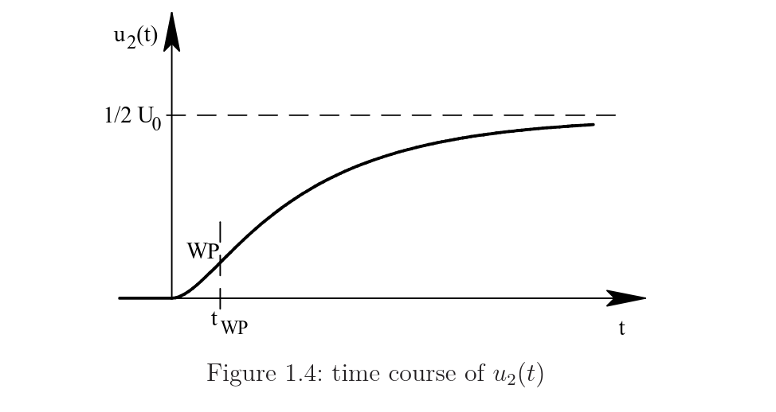

--- 
title: 05 Network Analysis 
---
**Balancing process(Ausgleichen) = transient behaviour**

Mainly in Network Analysis I am learning the transient behaviour of the circuits (z.B. RL, damped RLC, damped series resonant circuit).

Drawing the circuit from the time domain to Laplace domain: since the coil and capacitor have a derivative in the time domain, which when converted to the Laplace domain results in initial conditions. Each element can be represented as either a series 
voltage source (Thévenin) or a parallel current source (Norton), as shown in the table below.

 
| Component | Impedance | Series source (Thévenin) | Parallel source (Norton) |
|---|---|---|---|
| Inductor | $sL$ | voltage $L\;i_L(0)$ | current $\dfrac{i_L(0)}{s}$ |
| Capacitor | $\dfrac{1}{sC}$ | voltage $\dfrac{u_C(0)}{s}$ | current $C\;u_C(0)$ |

## Writing Transfer Function $G(s)$

- Write the circuit equations (mesh or node method).
- Figure out which variables to eliminate. For $G(s)$ we only want input and output voltage, so the currents get removed.

$$
G(s) = \frac{U_2(s)}{U_1(s)}
$$

- The element equations link current and voltage, so they are what let us swap a current for a voltage:

$$
u_L(t) = L\,\frac{di(t)}{dt} \qquad i_C(t) = C\,\frac{du(t)}{dt}
$$

- Steps to eliminate the currents:
    - Take one loop equation, make the first current the subject, substitute it into the second loop equation (removes current 1).
    - Use the element equation to replace the remaining current with a voltage (removes current 2).
- What's left is a relation between $U_1$ and $U_2$ only. Take the ratio to get $G(s)$.

- In the Laplace domain the derivatives become multiplication by $s$, so the element equations turn into plain algebra:

$$
U_L(s) = sL\,I(s) \qquad I_C(s) = sC\,U(s)
$$

### Worked example (the RLC circuit)

**Start: two mesh equations + one element equation.**

$$
\text{I}: \quad -U_1 + 2R I_1 - R I_2 = 0
$$

$$
\text{II}: \quad \left(2R + sL + \tfrac{1}{sC}\right) I_2 - R I_1 = 0
$$

$$
\text{element}: \quad I_2 = sC\,U_2
$$

**Remove current 1:** solve I for $I_1$, substitute into II:

$$
I_1 = \frac{U_1 + R I_2}{2R} \;\Rightarrow\; \left(2R + sL + \tfrac{1}{sC}\right) I_2 - \frac{U_1 + R I_2}{2} = 0
$$

**Remove current 2:** replace every $I_2$ with $sC\,U_2$, expand, collect $U_2$ vs $U_1$, multiply by 2:

$$
\left(s^2\,2LC + s\,3RC + 2\right) U_2 = U_1
$$

**Take the ratio:**

$$
G(s) = \frac{U_2}{U_1} = \frac{1}{s^2\,2LC + s\,3RC + 2}
$$

### DC source switched on at $t=0$ → transform to $\frac{U_0}{s}$

- A DC source that closes a switch at $t=0$ is not constant for all time, it is $0$ before and $U_0$ after. That "on at $t=0$" behaviour is a **step**, so we write it with the unit step $\varepsilon(t)$:

$$
u_1(t) = \varepsilon(t)\,U_0
$$

- The $\varepsilon(t)$ is what makes the voltage exist only for $t > 0$. Its Laplace transform is the standard step pair $\varepsilon(t) \leftrightarrow 1/s$, so a constant times a step gives:

$$
U_1(s) = \frac{U_0}{s}
$$

- **Takeaway:** any DC value switched on at $t=0$ transforms to (that value)$/s$. The $1/s$ is the fingerprint of the step.

### Putting a denominator into standard pole form (worked on $U_2(s)$)

**Start:**

$$
U_2(s) = \frac{U_0}{s^3\,2LC + s^2\,3RC + 2s}
$$

**Step 1: factor $s$ out of the denominator** (gives pole $s_1 = 0$):

$$
U_2(s) = \frac{U_0}{s\left(s^2\,2LC + s\,3RC + 2\right)}
$$

**Step 2: pull out the $s^2$ coefficient $2LC$** so $s^2$ has coefficient 1:

$$
U_2(s) = \frac{U_0}{2CL}\cdot\frac{1}{s\left(s^2 + s\,\frac{3R}{2L} + \frac{1}{LC}\right)}
$$

**Step 3: substitute** $\frac{1}{LC} = \omega_0^2$ and the given middle-term relation $\frac{3R}{2L} = \frac{6}{\sqrt5}\omega_0$. The front $\frac{1}{2CL}$ becomes $\frac{\omega_0^2}{2}$:

$$
U_2(s) = \frac{U_0\,\omega_0^2}{2}\cdot\frac{1}{s\left(s^2 + s\,\frac{6}{\sqrt5}\omega_0 + \omega_0^2\right)}
$$

**Poles:** $s_1 = 0$ from the factored $s$; $s_{2,3}$ from solving

$$
s^2 + s\,\frac{6}{\sqrt5}\omega_0 + \omega_0^2 = 0
$$

Every entry in the standard Laplace table implicitly carries an $ε(t)$, whether or not it's written. So:

$$
e^{-at} \text{ in the table always means } \varepsilon(t)\,e^{-at}
$$

## Physical Meaning of the Capacitor Voltage

The step response describes how the capacitor voltage evolves after the switch closes at $t=0$. Its S-shape comes directly from the circuit physics: each feature of the curve maps to one circuit element.

### Start: zero voltage, zero slope

At switch-on both the voltage and its rate of rise are zero:

$$
u_2(t=0) = 0 \qquad u_2'(t=0^+) = 0
$$

- **Voltage can't jump** (from $i = C\frac{du}{dt}$): a jump means $\frac{du}{dt}=\infty$, so $i=\infty$, impossible. The voltage is pinned to its pre-switch value $0$ and can only rise gradually.
- **Slope starts flat** because of the inductor: it resists a sudden current change, so at $t=0$ almost no current reaches the capacitor yet. No current means no charge arriving, so the voltage barely moves. This is the flat "foot". (A plain RC circuit, no inductor, would rise fastest at $t=0$.)

### Fastest rise: the inflection point

As current builds, charge flows in faster and the voltage climbs more steeply, reaching its steepest point at the inflection time $t_{WP}$ (Wendepunkt). After this, the rise slows down.

### Final value: half the source

For $t \to \infty$ the voltage settles at:

$$
u_2(t \to \infty) = \frac{1}{2}U_0
$$

It stops at **half** $U_0$, not the full source. At steady state the capacitor stops drawing current and acts as an open branch, so $U_0$ is divided across the two left-hand resistors; the capacitor sees only the divided-down half.

### Summary of the shape

$$
\text{zero start} + \text{zero start-slope} + \text{finite asymptote} \Rightarrow \text{S-curve}
$$

- Starts at $0$: uncharged capacitor
- Rises slowly at first: inductor delays the current
- Steepest at $t_{WP}$: inflection point
- Flattens toward $\frac{1}{2}U_0$: resistor divider sets the final value

## Goal when asked to "write the differential equation" for a variable X

**TARGET:** one equation containing only X and its derivatives, every other variable eliminated. (Here X $= u_C$.)

**Step 1: Write the loop (mesh) equation.** It contains several variables:

$$
i_L R + u_L - u_C = 0
$$

Unknowns here: $i_L$, $u_L$, $u_C$. Three variables, need to kill two.

**Step 2: Write each unwanted variable in terms of X using element laws.**

Capacitor (note the $-i_L$ from the arrow directions):

$$
i_C = C\,\frac{du_C}{dt} = -i_L \quad\Rightarrow\quad i_L = -C\,\frac{du_C}{dt}
$$

Inductor (substitute the $i_L$ just found):

$$
u_L = L\,\frac{di_L}{dt} = -LC\,\frac{d^2 u_C}{dt^2}
$$

**Step 3: Substitute both into the loop equation.**

$$
\underbrace{-RC\,\frac{du_C}{dt}}_{i_L R} \;\underbrace{-\,LC\,\frac{d^2 u_C}{dt^2}}_{u_L} \;-\; u_C = 0
$$

**Step 4: Only X remains.** Every term is now in $u_C$, no $i_L$ or $u_L$ left.

**Step 5: Tidy up** (multiply by $-1$, divide by $LC$, order by derivative):

$$
\frac{d^2 u_C}{dt^2} + \frac{R}{L}\,\frac{du_C}{dt} + \frac{1}{LC}\,u_C = 0
$$

**Order check:** 2 energy elements ($L$ and $C$) → highest derivative is 2nd → second-order equation. Falls out automatically.

## Behavior of the components in DC steady state:

- The inductance $L$  acts as a short circuit $(u_L=0)$.
- The capacitance $C$ acts as an open circuit $(i_C=0)$.
so in a steady circuit state current doesn't pass through the capacitor since capacitor acting as open circuit and inductor act as short circuit 
so current passing through the inductor

## Initial Conditions (IC) — cheat sheet

### Core rule: "can't jump"
Each energy element pins one starting value, because it can't change instantly:
- **Capacitor voltage can't jump:** $u_C(0^+) = u_C(0^-)$
- **Inductor current can't jump:** $i_L(0^+) = i_L(0^-)$
- Why: $i_C = C\frac{du_C}{dt}$, $u_L = L\frac{di_L}{dt}$ → a jump means infinite slope → infinite current/voltage → impossible.

### How many ICs
Number of ICs = number of energy elements = order of the differential equation.
(2nd-order needs 2: a starting **value** and a starting **slope**.)

### Getting the two ICs (value + slope)
- **1st IC (value):** read the capacitor voltage (or inductor current) directly at $t=0$.
- **2nd IC (slope):** get it from the element law, using the "can't jump" current/voltage.

$$
\frac{du_C}{dt}\bigg|_0 = \frac{i_C(0)}{C} \qquad \frac{di_L}{dt}\bigg|_0 = \frac{u_L(0)}{L}
$$

$|$ means evaluated at and zero next to it means at $t=0$

### One-line hook
*No current at the start ⟹ capacitor voltage isn't moving ⟹ slope = 0.*
(Switch was open → $i(0)=0$ → $\frac{du_C}{dt}\big|_0 = 0$.)

The differential equation gives the shape of possible solutions; the two ICs select the one that's physically happening.

The slope initial condition tells you how fast the voltage (or current) is changing at the very moment the circuit turns on $(t=0)$.

$$
\frac{du_C}{dt}\bigg|_0 = \text{how fast the voltage is CHANGING at } t=0
$$

## Solving a 2nd-Order Homogeneous ODE (Characteristic Equation Method)

Use this whenever the differential equation is homogeneous (right-hand side = 0), like the pre-charged RLC circuit.

### Starting point

$$
\frac{d^2 u_C}{dt^2} + \frac{R}{L}\frac{du_C}{dt} + \frac{1}{LC}u_C = 0
$$

### Step 1: Exponential ansatz (the guess)

Guess the solution is an exponential, because differentiating it just multiplies by $s$:

$$
u_C(t) = e^{st} \quad\Rightarrow\quad \frac{du_C}{dt} = s\,e^{st}, \quad \frac{d^2 u_C}{dt^2} = s^2\,e^{st}
$$

### Step 2: Substitute → characteristic equation

Insert the guess, every term carries $e^{st}$, divide it out (it's never zero):

$$
s^2 + \frac{R}{L}s + \frac{1}{LC} = 0
$$

This is the **characteristic equation**. Its roots are the **poles** (textbook calls them eigenvalues).

### Step 3: Solve for the poles (quadratic formula)

$$
s_{1,2} = -\underbrace{\frac{R}{2L}}_{\sigma} \pm \sqrt{\underbrace{\left(\frac{R}{2L}\right)^2}_{\sigma^2} - \underbrace{\frac{1}{LC}}_{\omega_0^2}}
$$

Name the pieces: $\sigma = \frac{R}{2L}$ (decay rate), $\omega_0^2 = \frac{1}{LC}$ (undamped frequency squared).

### Step 4: Check the case (sign under the root)

The sign under the root decides whether the circuit **oscillates or not**, which changes the whole shape of the answer:

$$
\left(\frac{R}{2L}\right)^2 > \frac{1}{LC} \;\Rightarrow\; \text{two real poles} \;\Rightarrow\; \text{smooth decay (no oscillation)}
$$

$$
\left(\frac{R}{2L}\right)^2 < \frac{1}{LC} \;\Rightarrow\; \text{complex conjugate poles} \;\Rightarrow\; \text{decaying oscillation (ringing)}
$$

**Point of the "complex conjugate" case:** it's the ringing case. Small $R$ means weak damping, so energy sloshes between $L$ and $C$ before dying out. This problem tells us to use it, so the answer will have sin/cos.

**How $\frac{1}{LC}$ becomes positive under the root.** In the complex case the root holds a negative number ($\frac{1}{LC}$ is bigger). A negative under a root is the problem, so factor out $-1$. **This flips the order of the two terms** (small − big becomes −(big − small)), which is why $\frac{1}{LC}$ ends up in front and positive:

$$
\left(\frac{R}{2L}\right)^2 - \frac{1}{LC} = -\left(\frac{1}{LC} - \left(\frac{R}{2L}\right)^2\right)
$$

Then $\sqrt{-1} = j$ splits off, and the now-positive bracket is named $\omega_d$:

$$
s_{1,2} = -\sigma \pm j\omega_d, \qquad \sigma = \frac{R}{2L}, \qquad \omega_d = \sqrt{\frac{1}{LC} - \left(\frac{R}{2L}\right)^2}
$$

- $\sigma$ = real part = **decay rate**
- $\omega_d$ = imaginary part = **damped oscillation frequency**

### Step 5: Write the general solution

**Where sin and cos come from.** Put a complex pole into the guess $e^{st}$ and split the exponent ($e^{a+b}=e^a e^b$):

$$
e^{st} = e^{(-\sigma + j\omega_d)t} = e^{-\sigma t}\cdot e^{j\omega_d t}
$$

The first factor $e^{-\sigma t}$ is the real decaying envelope. The second factor $e^{j\omega_d t}$ (imaginary exponent) becomes sin/cos through **Euler's formula**:

$$
e^{j\omega_d t} = \cos\omega_d t + j\sin\omega_d t
$$

**Why the final answer is real (the $j$ disappears).** The two poles are a conjugate pair, so their solutions differ only in the sign of the sin. Adding the pair collects cos and sin; the imaginary parts are equal and opposite, so they cancel and leave real coefficients:

$$
s_{1,2} \text{ conjugate pair} \;\xrightarrow{\text{add}}\; \text{imaginary parts cancel} \;\Rightarrow\; \text{real solution}
$$

The two basis solutions and the general solution:

$$
u_{C,1} = e^{-\sigma t}\cos\omega_d t \qquad u_{C,2} = e^{-\sigma t}\sin\omega_d t
$$

$$
u_C(t) = e^{-\sigma t}\left(k_1\cos\omega_d t + k_2\sin\omega_d t\right)
$$

$k_1, k_2$ are real unknown constants, found next from the two initial conditions.

### Step 6: Apply the two initial conditions

**First IC** (value), $u_C(0) = U$. Set $t=0$ ($e^0=1$, $\cos 0=1$, $\sin 0=0$):

$$
u_C(0) = k_1 = U
$$

**Second IC** (slope), $\left.\frac{du_C}{dt}\right|_0 = 0$. Differentiate, then set $t=0$:

Differentiate the follwoing equation using the product rule and equate to zero since slope 
zero at the start  $(t=0)$ and find the $k_2$

$$
u_C(t) = e^{-\sigma t}\left(k_1\cos\omega_d t + k_2\sin\omega_d t\right)
$$ 

$$
\left.\frac{du_C}{dt}\right|_0 = -k_1\sigma + k_2\omega_d = 0 \quad\Rightarrow\quad k_2 = \frac{k_1\sigma}{\omega_d} = \frac{U\sigma}{\omega_d}
$$

Need to understand how the derivative was applied

### Step 7: Final result

Substitute $k_1 = U$ and $k_2 = \frac{U\sigma}{\omega_d}$ back in:

$$
u_C(t) = U\,e^{-\sigma t}\left(\cos\omega_d t + \frac{\sigma}{\omega_d}\sin\omega_d t\right)
$$

### Optional: single-sinusoid form (easier to sketch)

Using $\sin(\alpha+\beta) = \sin\alpha\cos\beta + \sin\beta\cos\alpha$:

$$
u_C(t) = \frac{U}{\sin\gamma}\,e^{-\sigma t}\sin(\omega_d t + \gamma), \qquad \gamma = \arctan\frac{\omega_d}{\sigma}
$$

A decaying sine: amplitude shrinks as $e^{-\sigma t}$, oscillates at $\omega_d$, phase-shifted by $\gamma$.

### Current through the inductor (for part f)

From $i_L = -C\frac{du_C}{dt}$:

$$
i_L(t) = \frac{CU\omega_d}{\sin^2\gamma}\,e^{-\sigma t}\sin\omega_d t
$$

Also a decaying oscillation, as expected.

### Vocabulary (textbook synonyms, don't get thrown)
- pole = root = **eigenvalue** (textbook uses $\lambda$; I use $s$)
- decay rate $\sigma$ = **damping** (textbook uses $d = \frac{R}{2L}$)
- $u_{C,1}, u_{C,2}$ = **solution basis** (independent solutions)
- $\omega_0 = \frac{1}{\sqrt{LC}}$ undamped frequency; $\omega_d$ = damped (actual) frequency

### The method in one line
Guess $e^{st}$ → characteristic quadratic → solve for poles → if complex, write $e^{-\sigma t}(k_1\cos\omega_d t + k_2\sin\omega_d t)$ → fix $k_1,k_2$ from the two ICs.

## Idea  of differential equation 

A linear ODE of order 𝑛 has exactly n independent solutions, and the general solution is a weighted sum of them.

Second-order means $𝑛=2$, so you need two independent solutions. Call them $𝑢_1$ and $𝑢_2$
	
$$
u(t) = k_1 u_1 + k_2 u_2
$$

The two weights $𝑘_1$,$𝑘_2$ are unknowns you'll pin down at the very end using two initial conditions

$$
e^{j\omega_d t} = \cos\omega_d t + j\sin\omega_d t
e^{-j\omega_d t} = \cos\omega_d t - j\sin\omega_d t
$$

$$
e^{j\omega_d t} + e^{-j\omega_d t} = 2\cos\omega_d t + \underbrace{(j\sin - j\sin)}_{= 0} = 2\cos\omega_d t
$$

$$
u_1 = e^{-\sigma t}e^{j\omega_d t}, \quad u_2 = e^{-\sigma t}e^{-j\omega_d t}
$$

These are correct solutions, but they contain , the imaginary unit. That's a problem: the voltage across your capacitor is a real,
 measurable number. You can't hand an engineer an answer with $j$ in it. You need real functions.

The superposition theorem says any combination 
$𝐴𝑢_1 + 𝐵𝑢_2$  is also a valid solution, for any numbers 
𝐴 and 𝐵 you like. So you have total freedom to pick A and B.

$$
u_C(t) = A\,u_1 + B\,u_2
$$

$$
u_1 + u_2 = e^{-\sigma t}\big[(\cos + j\sin) + (\cos - j\sin)\big] = e^{-\sigma t}\cdot 2\cos\omega_d t
$$

## Characteristic Time

Every circuit with energy storage (capacitors, inductors) has a built-in speed. Left to itself, it doesn't respond instantly and it doesn't take forever, it settles or 
oscillates over some particular stretch of time. That stretch is the characteristic time. It's the circuit's natural clock: the timescale on which its own physics plays out.

For circuits that decay (RC, RL), the characteristic time is how long the circuit takes to substantially settle after a disturbance. It's usually called the time constant, 
symbol $τ$. After about one $τ$, a charging capacitor has covered roughly 63% of its journey; after a few 
$τ$, it's essentially done.

For circuits that oscillate (LC), the characteristic time is how long one bit of the ringing takes, one radian of the oscillation. It's the reciprocal of the natural frequency 
$ω_0$	​

## Time Normalization Rules (Circuit Analysis)
Normalizing means measuring time in units of the circuit's own natural timescale, so component constants fold away and you work with clean dimensionless numbers.

Define the normalized time, substitute, solve, then denormalize:

$$
t_n = \frac{t}{\tau} \quad\Longleftrightarrow\quad t = t_n\,\tau
$$

$$
t_\mathrm{n} = \frac{t}{\tau} \quad\Longleftrightarrow\quad s_\mathrm{n} = s\,\tau = s\sqrt{LC}
$$

## The three characteristic times

| Circuit | Characteristic time $\tau$ | Why (physical meaning) |
|---------|---------------------------|------------------------|
| RC | $\tau = RC$ | Time constant of the decay. Bigger $R$ slows the current, bigger $C$ needs more charge, both make settling slower. Response goes like $e^{-t/RC}$. |
| RL | $\tau = \dfrac{L}{R}$ | Time constant of the decay. Bigger $L$ makes current more sluggish, bigger $R$ settles it faster. Response goes like $e^{-Rt/L}$. |
| LC | $\tau = \sqrt{LC}$ | No resistor to dissipate, so it oscillates instead of decaying. This is the time per radian of the ringing, the reciprocal of the natural frequency $\omega_0 = 1/\sqrt{LC}$. |

## Procedure (exam checklist)

| Step | Action |
|------|--------|
| 1 | Identify the storage components: L and C? R and C? R and L? |
| 2 | Pick $\tau$ from the table (or derive it by units). |
| 3 | Define $t_n = t/\tau$; substitute $t = t_n\,\tau$ everywhere. |
| 4 | Solve the problem with clean dimensionless numbers. |
| 5 | Multiply $\tau$ back in at the end to recover real seconds and amperes. |

The branch that produces the ringing, the oscillation you're solving for, contains only $L$ and $C$.$R$ is not in that loop. The natural frequency of the thing that oscillates is
therefore set by $L$ and $C$

$$
\omega_0 = \frac{1}{\sqrt{LC}} \quad\Rightarrow\quad \tau = \sqrt{LC}
$$

## Denormalizing a Time Function (the two-edit rule)

### The plain fact

To take a normalized time answer back to real time, do these two edits, every single time:

1. Replace every $t_n$ with $\dfrac{t}{\sqrt{LC}}$
2. Multiply the whole expression by $\dfrac{1}{\sqrt{LC}}$

Both edits always. You never skip edit 2. They come as a pair (this pairing is the expansion/compression theorem, just do both and you have applied it).

### The rule as a transform pair

$$
i_C(t_n) \;\longrightarrow\; \frac{1}{\sqrt{LC}}\,i_C\!\left(\frac{t}{\sqrt{LC}}\right)
$$

Left side is what you have (normalized). Right side is the answer: same function, argument changed to $t/\sqrt{LC}$, and a $\frac{1}{\sqrt{LC}}$ stuck in front. Nothing else to decide.

## General version (any normalization factor)

If time was normalized by a characteristic time $\tau$ (so $t_n = t/\tau$), then denormalize using the **expansion and compression theorem** (also called the time-scaling property of the Laplace transform):

$$
f(t_n) \;\longrightarrow\; \frac{1}{\tau}\,f\!\left(\frac{t}{\tau}\right)
$$

This is the theorem in its general form $f(at) \;\multimap\; \frac{1}{a}F(s/a)$ applied with $a = 1/\tau$. For this problem $\tau = \sqrt{LC}$. (For RC circuits $\tau = RC$, for RL circuits $\tau = L/R$.)

## Worked example (the capacitor current)

Start from the normalized answer:

$$
i_C(t_n) = U_0 C\,\sin t_n \sum_{k=0}^{\infty}\Big[\varepsilon(t_n - 4\pi k) - \varepsilon(t_n - 2\pi(2k+1))\Big]
$$

Edit 1: swap every $t_n \to t/\sqrt{LC}$.

Edit 2: multiply by $\frac{1}{\sqrt{LC}}$, which only changes the front constant:

$$
U_0 C \cdot \frac{1}{\sqrt{LC}} = U_0\,\frac{C}{\sqrt{LC}} = U_0\sqrt{\frac{C}{L}}
$$

(Simplification: $\frac{C}{\sqrt{LC}} = \frac{C}{\sqrt{L}\sqrt{C}} = \frac{\sqrt{C}}{\sqrt{L}} = \sqrt{\frac{C}{L}}$.)

Result (real-time current):

$$
i_C(t) = U_0\sqrt{\frac{C}{L}}\,\sin\frac{t}{\sqrt{LC}} \sum_{k=0}^{\infty}\left[\varepsilon\!\left(\frac{t}{\sqrt{LC}} - 4\pi k\right) - \varepsilon\!\left(\frac{t}{\sqrt{LC}} - 2\pi(2k+1)\right)\right]
$$

## Caveat for the front factor

The $\frac{1}{\sqrt{LC}}$ factor is always the same, but it merges with whatever constant sits out front, so the final constant differs per quantity. For the current it made 
$U_0\sqrt{C/L}$; for the voltage $u_C$ the front constant is different, so the same $\frac{1}{\sqrt{LC}}$ combines into a different final constant. The edits are identical each 
time; only the surrounding constant changes.

# Normalizing a Time Function (concise)

## The two edits (real → normalized)

To normalize a real-time function $f(t)$ into $f(t_n)$:

1. Replace every $t$ with $t_n\,\tau$  (from $t = t_n\tau$)
2. Multiply the whole expression by $\tau$

As a pair:

$$f(t) \;\longrightarrow\; \tau\, f(t_n\,\tau)$$

For this circuit $\tau = \sqrt{LC}$, so $f(t) \longrightarrow \sqrt{LC}\; f(t_n\sqrt{LC})$.

## Normalize vs denormalize (mirror image)

| Direction | Argument edit | Amplitude edit |
|-----------|--------------|----------------|
| Normalize (real → normalized) | $t \to t_n\tau$ | $\times\ \tau$ |
| Denormalize (normalized → real) | $t_n \to t/\tau$ | $\times\ \frac{1}{\tau}$ |

Both use the **expansion and compression theorem**. The amplitude factors are reciprocals, so normalizing then denormalizing gives $\times 1$ (safety check).

## In practice: normalize in Laplace instead

You rarely normalize in the time domain. The standard workflow normalizes in Laplace (just a variable swap, no amplitude factor):

| Step | Action | Domain |
|------|--------|--------|
| Normalize | swap $s \to s_n/\tau$ | Laplace |
| Solve + inverse transform | get $f(t_n)$ | normalized time |
| Denormalize | $t_n \to t/\tau$, then $\times \frac{1}{\tau}$ | real time |

$$
t_n = \omega_0\, t = \frac{1}{\sqrt{LC}}\cdot t = \frac{t}{\sqrt{LC}}
$$
we can use $\omega$ instead of explicitly the $1/\sqrt{LC}$

## Resonant Period LC circuit 
For any LC circuit, the resonant (natural) period is always

$$
T_{res} = \frac{2\pi}{\omega_0} = 2\pi\sqrt{LC}
$$

This depends only on the components, not on how you drive the circuit. So yes, it's always true for an ideal LC circuit,

## Derive Period 
"Drive" refers to the external source pushing the circuit, here, the square-wave voltage $u(t)$. Anything forcing the circuit from outside is the "drive" or "excitation."

The drive period $T$ is simply the period of that source, how long one full ON-OFF cycle of the square wave takes.

So there are two separate periods,

| Period | Symbol | Set by | Value |
|--------|--------|--------|-------|
| Natural / resonant period | $T_{res}$ | the circuit ($L$, $C$) | $2\pi\sqrt{LC}$, fixed |
| Drive period | $T$ | the source (you) | whatever the square wave uses |

When the drive period equals the resonant period, you get resonance: energy keeps accumulating in the circuit and the oscillation grows larger every cycle

If $T = T_{res} = 2\pi\sqrt{LC}$, the ON window (half the drive period) lasts $\pi\sqrt{LC}$, which is **half** the natural oscillation. So the source switches off exactly when 
the oscillation is halfway through, at the moment the capacitor voltage is at its **peak** (maximum stored energy), not back at zero.

## Resonance Test (drive vs natural period)

$$
\frac{T}{T_{res}} = \frac{T}{2\pi\sqrt{LC}}
$$

- Ratio $= 1$ (drive period = natural period) → **resonance** (energy builds up, oscillation grows each cycle).
- Ratio $= 2$ (or other non-1) → **off-resonance** (clean reset each cycle, constant amplitude).

Natural (resonant) period, always: $T_{res} = 2\pi\sqrt{LC}$.

## Equivalent physical test

ON window $= T/2$ (50% duty square wave). Voltage peaks at half the natural period, $T_{res}/2$.

- Resonance when switch-off lands at the voltage peak: $\dfrac{T}{2} = \dfrac{T_{res}}{2}$, i.e. $T = 2\pi\sqrt{LC}$.

## Worked example (the two cases from H2.4)

Natural period: $T_{res} = 2\pi\sqrt{LC}$.

**Case e:** $T = 2\pi\sqrt{LC}$

$$
\frac{T}{T_{res}} = \frac{2\pi\sqrt{LC}}{2\pi\sqrt{LC}} = 1 \;\Rightarrow\; \textbf{resonance}
$$

ON window $= T/2 = \pi\sqrt{LC} = $ half the natural period → switch-off at the peak → builds up.

**Case d:** $T = 4\pi\sqrt{LC}$

$$
\frac{T}{T_{res}} = \frac{4\pi\sqrt{LC}}{2\pi\sqrt{LC}} = 2 \;\Rightarrow\; \text{off-resonance}
$$

ON window $= T/2 = 2\pi\sqrt{LC} = $ full natural period → switch-off at zero → clean reset.

### Exam steps: is the circuit at resonance?

1. Natural period: $T_{res} = 2\pi\sqrt{LC}$
2. Divide the given drive period by it: ratio $= T / T_{res}$
3. Interpret:
   - ratio $= 1$ → **resonance**, energy builds up (drive always in phase)
   - ratio = decimal (non-integer) → **off-resonance**, drive drifts in and out of phase, no sustained buildup

### Why the drive switches at the half-period

The current in an $LC$ oscillation reverses direction every **half-period**:

$$
\frac{T_0}{2} = \pi\sqrt{LC}, \qquad T_0 = 2\pi\sqrt{LC}
$$

**The one rule:** the drive must never push *against* the current (opposing it removes energy). It only adds energy during the half-cycle when the current flows *with* it. The next half-cycle the current reverses, so the drive must adapt, and there are two valid ways:

- **Bipolar drive** ($+U_0 \leftrightarrow -U_0$): flips direction each half-period, so the push always lines up with the current.
- **Unipolar drive** ($U_0 \leftrightarrow 0$, our case): turns **off** during the unfavorable half-cycle instead of opposing. The oscillation coasts on its stored energy; the source switches back on for the next favorable half-cycle.

$$
\text{ON: current flows with source} \Rightarrow \text{energy added}
$$

$$
\text{OFF: current reversed} \Rightarrow \text{no opposing push, energy preserved}
$$

Either way the switching happens every half-period ($\pi\sqrt{LC}$), because that is how often the phase flips from favorable to unfavorable. This is why the on/off times in the solution march along at half-period spacing (the $4\pi k$ and $2\pi(2k+1)$ terms).

**Swing analogy (unipolar):** you can only push, not pull. Push while the swing moves away (adds energy), let go while it swings back (push zero, don't block it). You never oppose it, so it builds up. The "let go" is the source turning off.

Yes, for pushing energy in, the source (voltage) must be lined up with the current, not the capacitor voltage. The reason is that power is source-voltage times current

## RLC Damping Cases

Poles: $s_{1,2} = -\sigma \pm \sqrt{\sigma^2 - \omega_0^2}$, where $\sigma = \frac{R}{2L}$ (damping) and $\omega_0 = \frac{1}{\sqrt{LC}}$ (natural frequency).

| Condition | Discriminant $\sigma^2 - \omega_0^2$ | Poles | Case (technical name) | Solution form |
|-----------|:---:|-----------|-----------------------|---------------|
| $\sigma > \omega_0$ | $> 0$ | two distinct real | **Overdamped** (aperiodischer Fall) | $A\,e^{s_1 t} + B\,e^{s_2 t}$ |
| $\sigma = \omega_0$ | $= 0$ | one repeated real | **Critically damped** = aperiodic limit (aperiodischer Grenzfall) | $(A + Bt)\,e^{-\sigma t}$ |
| $\sigma < \omega_0$ | $< 0$ | complex conjugate | **Underdamped** (Schwingfall) | $e^{-\sigma t}(A\cos\omega_d t + B\sin\omega_d t)$ |

- **Overdamped:** strong damping wins, slow smooth decay, no oscillation.
- **Critically damped:** exact balance, fastest return with no overshoot (the $t$ term is the giveaway).
- **Underdamped:** weak damping, oscillates and rings while decaying.

### Damping σ depends on the circuit (not always R/2L)

General rule: write the characteristic equation as $s^2 + 2\sigma s + \omega_0^2 = 0$,
then $\sigma = \frac{1}{2}(\text{coeff of } s)$, $\omega_0 = \sqrt{\text{constant term}}$.

- **Series RLC:** $s^2 + \frac{R}{L}s + \frac{1}{LC} = 0 \Rightarrow \sigma = \frac{R}{2L}$
  (bigger $R$ = more damping)
- **Parallel RLC:** $s^2 + \frac{1}{RC}s + \frac{1}{LC} = 0 \Rightarrow \sigma = \frac{1}{2RC}$
  (bigger $R$ = LESS damping)

$\omega_0 = \frac{1}{\sqrt{LC}}$ in both. Only $\sigma$ changes with topology.
Always re-derive $\sigma$ from YOUR characteristic equation, don't assume R/2L.

### Harmonic vs transient (from pole location)

Rule: the pole location tells you the behavior.

| Denominator | Poles | Label | Time function |
|-------------|-------|-------|---------------|
| $s^2 + \omega_0^2$ | $\pm j\omega_0$ (imaginary) | **Harmonic** | $\cos\omega_0 t, \sin\omega_0 t$ (oscillates, never dies) |
| $R + sL$ (i.e. $s + \frac{R}{L}$) | $-\frac{R}{L}$ (real neg.) | **Transient** | $e^{-\frac{R}{L}t}$ (decays away) |

- Imaginary poles → no decay → steady oscillation → harmonic (steady-state).
- Negative real pole → decays → temporary → transient (startup, dies out).
- The partial fraction groups poles by type, so each fraction = one behavior.

Purely imaginary poles (no real part, so no decay) mean pure oscillation.
$$
\frac{As + B}{s^2 + \omega_0^2} \;\longleftrightarrow\; \cos\omega_0 t, \sin\omega_0 t
$$

Solving 
$$s^2= −ω_0^{2}$$
$$
s = \pm\sqrt{-\omega_0^2}
$$
$$
\sqrt{-\omega_0^2} = \sqrt{-1}\cdot\sqrt{\omega_0^2}
$$

$$
s = \pm\,j\,\omega_0
$$

### Pole location → time behavior

| Denominator form | Poles | Behavior | Time function |
|------------------|-------|----------|---------------|
| $s^2 + \omega^2$ | $\pm j\omega$ (imaginary) | **Harmonic** (oscillates, never decays) | $\cos\omega t,\ \sin\omega t$ |
| $s + a\ (a>0)$ | $-a$ (real negative) | **Transient** (decays away) | $e^{-a t}$ |
| $(s+\sigma)^2 + \omega_d^2$ | $-\sigma \pm j\omega_d$ (complex) | **Damped oscillation** (both: rings while decaying) | $e^{-\sigma t}\cos\omega_d t,\ e^{-\sigma t}\sin\omega_d t$ |

**Reading the poles:** the real part controls decay (negative = dies out, zero = lasts forever), the imaginary part controls oscillation (nonzero = sin/cos). Imaginary-only → pure oscillation; real-only → pure decay; both → damped oscillation.
## When to Expand sin/cos with the Addition Theorem

**Trigger:** a sinusoid with a constant phase inside, $\sin(\omega_0 t + \alpha)$ or $\cos(\omega_0 t + \alpha)$, that you need to Laplace transform.

**Why it's needed:** the Laplace table only has clean $\sin\omega_0 t$ and $\cos\omega_0 t$. The $+\alpha$ inside blocks a direct lookup.

### Steps

1. **Spot the constant phase** inside the sine/cosine ($+\alpha$, a fixed number, not a function of $t$).
2. **Apply the addition theorem** with $a = \omega_0 t$, $b = \alpha$:
   $$\sin(\omega_0 t + \alpha) = \sin\omega_0 t\cos\alpha + \cos\omega_0 t\sin\alpha$$
3. **Treat $\cos\alpha$ and $\sin\alpha$ as constants** (just numbers, since $\alpha$ is fixed).
4. **Read off two table-ready terms:** (number)$\times\sin\omega_0 t$ and (number)$\times\cos\omega_0 t$.
5. **Transform each** using the standard table entries.

### Worked example

Signal: $u_{in}(t) = \varepsilon(t)\,U_0\sin(\omega_0 t + \alpha)$

**Step 1-3, expand:**

$$
u_{in}(t) = \varepsilon(t)\,U_0\big[\cos\alpha\,\sin\omega_0 t + \sin\alpha\,\cos\omega_0 t\big]
$$

**Step 4, two clean terms** (with constant weights $\cos\alpha$, $\sin\alpha$):

$$
u_{in}(t) = U_0\cos\alpha\cdot\underbrace{\sin\omega_0 t}_{\text{table}} + U_0\sin\alpha\cdot\underbrace{\cos\omega_0 t}_{\text{table}}
$$

**Step 5, transform each:**

$$
U_{in}(s) = U_0\cos\alpha\cdot\frac{\omega_0}{s^2+\omega_0^2} + U_0\sin\alpha\cdot\frac{s}{s^2+\omega_0^2}
$$

$$
= U_0\,\frac{\omega_0\cos\alpha + s\sin\alpha}{s^2+\omega_0^2}
$$

### Do NOT confuse with the shift theorem
- Shift theorem needs $\omega_0(t-a)$ in **both** the sine and the step $\varepsilon(t-a)$ (a real time delay).
- Here the $+\alpha$ is **inside the sine only**; the step is still $\varepsilon(t)$, not shifted.
- Shift inside the sine $\neq$ time delay → shift theorem does **not** apply, use the addition theorem.

## Making the circuit reach steady state instantly

**Goal:** eliminate the transient so the circuit jumps straight to steady state when the switch closes, no startup wobble.

**How:** in the partial-fraction form, set the coefficient of the transient term to zero. The transient is the term whose pole has a **negative real part** (e.g. $s_3 = -\frac{R}{L}$, the $\frac{C}{R+sL}$ fraction). Zeroing it leaves only the harmonic (steady-state) part.

**How to identify each part:**
- **Harmonic (keep):** poles on the imaginary axis, real part $= 0$, denominator $s^2 + \omega_0^2$. This is the lasting oscillation.
- **Transient (remove):** pole with negative real part, denominator $s + a$ ($a>0$). This decays as $e^{-at}$ and is what we cancel.

**Condition:** find the value (e.g. the switch-on phase $\alpha$, or a component value) that makes the transient coefficient $C = 0$. At that setting the transient never appears and the circuit is instantly at steady state.

$$
\underbrace{\frac{As+B}{s^2+\omega_0^2}}_{\text{harmonic, keep}} + \underbrace{\frac{C}{R+sL}}_{\text{transient, remove}}
$$

**Note**: $ω_0$ just names wherever the imaginary-axis poles happen to sit, $s=±jω0$

## Sinusoidal Signals by Envelope Shape

All are a sine carrier switched on at $t = 0$ by the unit step $\varepsilon(t)$, shaped by an envelope $a(t)$.

| Type | Time-Domain Equation | Envelope $a(t)$ | Laplace Transform $U(s)$ |
|---|---|---|---|
| **Constant** (horizontal line) | $u(t) = A\,\sin(\omega t)\,\varepsilon(t)$ | $A$ | $\dfrac{A\,\omega}{s^2 + \omega^2}$ |
| **Linear** (growing ramp) | $u(t) = a\,t\,\sin(\omega t)\,\varepsilon(t)$ | $a\,t$ | $\dfrac{2 a\,\omega\, s}{(s^2 + \omega^2)^2}$ |
| **Exponential decaying** (damped) | $u(t) = A\,e^{-\delta t}\,\sin(\omega t)\,\varepsilon(t)$ | $A\,e^{-\delta t}$ | $\dfrac{A\,\omega}{(s + \delta)^2 + \omega^2}$ |
| **Exponential growing** | $u(t) = A\,e^{+\delta t}\,\sin(\omega t)\,\varepsilon(t)$ | $A\,e^{+\delta t}$ | $\dfrac{A\,\omega}{(s - \delta)^2 + \omega^2}$ |

**Symbols:** $A$ amplitude, $a$ envelope slope (V per unit time), $\delta$ damping/growth coefficient ($\delta > 0$), $\omega$ angular frequency, $\varepsilon(t)$ unit step (signal starts at $t=0$).

**Key relationships:**

- The exponential cases follow from the constant case by the shift theorem: multiplying by $e^{\mp \delta t}$ in time shifts $s \to s \pm \delta$ in the Laplace domain.
- The linear case follows from the $t$-multiplication rule $\mathcal{L}\{t\,f(t)\} = -\dfrac{d}{ds}F(s)$ applied to the constant case.

**Display equations:**

$$
u_\text{const}(t) = A\,\sin(\omega t)\,\varepsilon(t)
$$

$$
u_\text{lin}(t) = a\,t\,\sin(\omega t)\,\varepsilon(t)
$$

$$
u_\text{dec}(t) = A\,e^{-\delta t}\,\sin(\omega t)\,\varepsilon(t)
$$

$$
u_\text{grow}(t) = A\,e^{+\delta t}\,\sin(\omega t)\,\varepsilon(t)
$$

## Finding the Decay / Growth Constant $\delta$

The exponential envelope is $a(t) = A\,e^{-\delta t}$ (decay) or $A\,e^{+\delta t}$ (growth). Read $\delta$ off the envelope by comparing two peak heights at two times.

| Field | Content |
|---|---|
| **What** | Decay/growth constant $\delta$ of an exponential envelope |
| **Envelope** | $a(t) = A\,e^{-\delta t}$ (decay) or $A\,e^{+\delta t}$ (growth) |
| **Read from graph** | Two envelope peak heights $a(t_1)$, $a(t_2)$ at times $t_1 < t_2$ |
| **Formula** | $\delta = \dfrac{1}{t_2 - t_1}\,\ln\!\left(\dfrac{a(t_1)}{a(t_2)}\right)$ |
| **Shortcut** | $\delta = \dfrac{1}{\tau}$, where $\tau$ is the time the envelope falls to $A/e$ |
| **Units** | $\text{s}^{-1}$ (reciprocal time) |
| **Sign** | Envelope shrinking, decay ($-\delta$); envelope rising, growth ($+\delta$) |

## Finding the Phase Angle That Removes a Transient

To force a transient term to vanish, set its coefficient to zero and solve for $\varphi$. The coefficient of each real pole is found by the cover-up method.

Given:

$$
F(s) = \frac{6\left(s\sin\varphi + \sqrt{5}\cos\varphi\right)}{(s^2+5)(s+2)(s+3)} = \underbrace{\frac{A}{s+2} + \frac{B}{s+3}}_{\text{transient (real poles, decays)}} + \underbrace{\frac{Ds+E}{s^2+5}}_{\text{harmonic (complex pair, oscillates)}}
$$

**Coefficient A** (multiply by $(s+2)$, set $s = -2$; the $(s+2)$ cancels):

$$
A = \frac{6\left(-2\sin\varphi + \sqrt{5}\cos\varphi\right)}{((-2)^2+5)(-2+3)} = \frac{6\left(-2\sin\varphi + \sqrt{5}\cos\varphi\right)}{9}
$$

Setting $A \stackrel{!}{=} 0$:

$$
-2\sin\varphi + \sqrt{5}\cos\varphi = 0 \quad\Rightarrow\quad \tan\varphi = \frac{\sqrt{5}}{2}
$$

**Coefficient B** (multiply by $(s+3)$, set $s = -3$; the $(s+3)$ cancels):

$$
B = \frac{6\left(-3\sin\varphi + \sqrt{5}\cos\varphi\right)}{((-3)^2+5)(-3+2)} = \frac{6\left(-3\sin\varphi + \sqrt{5}\cos\varphi\right)}{-14}
$$

Setting $B \stackrel{!}{=} 0$:

$$
-3\sin\varphi + \sqrt{5}\cos\varphi = 0 \quad\Rightarrow\quad \tan\varphi = \frac{\sqrt{5}}{3}
$$

**Conclusion:** the two conditions $\tan\varphi = \frac{\sqrt{5}}{2}$ and $\tan\varphi = \frac{\sqrt{5}}{3}$ cannot hold at once, so no single $\varphi$ removes both transients. With $\varphi$ as the only free parameter, the network cannot jump directly into steady state for $t > 0$.

## Drawing the Laplace-Domain Circuit at t = 0 (from Steady State)

**Core idea:** The plain impedances $sL$ and $\frac{1}{sC}$ assume zero stored energy. If an inductor carries current or a capacitor holds voltage at $t=0$, you must add an initial-condition source. That stored energy is what drives the circuit after switching.

**Step 1: Get initial conditions from steady state (t < 0)**
DC steady state: inductor = short, capacitor = open. Read off $i_L(0)$ and $u_C(0)$. They cannot jump, so they carry into $t>0$.

**Step 2: Replace each element**

Inductor:

$$
U_L(s) = sL\;I_L(s) - L\;i_L(0)
$$

$$
I_L(s) = \frac{U_L(s)}{sL} + \frac{i_L(0)}{s}
$$

Capacitor:

$$
I_C(s) = sC\;U_C(s) - C\;u_C(0)
$$

$$
U_C(s) = \frac{I_C(s)}{sC} + \frac{u_C(0)}{s}
$$

**Step 3: Switched-off sources** — current source = open, voltage source = short. Only the IC generators remain.

## Source Type and Placement

| Element | Impedance | Series form | Parallel form |
|---|---|---|---|
| Inductor L | $sL$ | series **voltage source** $L\;i_L(0)$ | parallel **current source** $\dfrac{i_L(0)}{s}$ |
| Capacitor C | $\dfrac{1}{sC}$ | series **voltage source** $\dfrac{u_C(0)}{s}$ | parallel **current source** $C\;u_C(0)$ |

**How to pick the form:** Write the element's basic s-domain equation. Reads as a voltage equation, use a voltage source in series. Reads as a current equation, use a current source in parallel. The other form is the same equation solved for the opposite variable.

**Sign note:** the IC source drives in the same direction as the original stored current/voltage. Watch the sign of the $-L\;i_L(0)$ and $-C\;u_C(0)$ terms when setting polarity, or the direction of your solved current comes out flipped.

**Unit check:** $L\;i_L(0)$ is V·s (voltage in s-domain), $\frac{i_L(0)}{s}$ is a current; $\frac{u_C(0)}{s}$ is a voltage, $C\;u_C(0)$ is a current.

## Current-voltage relationships of the components in the Laplace domain (Transformer)

**Step 1: Capacitor (C)**

From $i_C = C\,\frac{du_C}{dt}$, transformed with initial voltage $u_C(0) = U_0$:

$$
I_C = sC\,U_C - C\,U_0
$$

Solved for the voltage:

$$
U_C = \frac{I_C}{sC} + \frac{U_0}{s}
$$

**Step 2: Resistor (R)**

Ohm's law, no initial value:

$$
U_R = R\,I_R
$$

**Step 3: Transformer primary (L1)**

Self term plus mutual term, with initial currents:

$$
U_1 = sL_1\left(I_1 - \frac{i_{L_1}(0)}{s}\right) + sM\left(I_2 - \frac{i_{L_2}(0)}{s}\right)
$$

**Step 4: Transformer secondary (L2)**

$$
U_2 = sM\left(I_1 - \frac{i_{L_1}(0)}{s}\right) + sL_2\left(I_2 - \frac{i_{L_2}(0)}{s}\right)
$$

**Step 5: Insert initial values from b)**

Both inductor currents start at zero, $i_{L_1}(0) = i_{L_2}(0) = 0$, so the generators drop out:

$$
U_1 = sL_1 I_1 + sM I_2
$$

$$
U_2 = sM I_1 + sL_2 I_2
$$

**Step 6: Tight-coupling condition**

For a tightly coupled transformer, $k = 1$, so:

$$
M = \sqrt{L_1 L_2}
$$

This produces the $\sqrt{L_1 L_2}$ factor in the result for $U_R(s)$ in part d).

# Laplace-domain units (quick reference)

| Quantity | Time domain | Laplace domain |
|----------|-------------|----------------|
| Voltage | $\text{V}$ | $\text{V}\cdot\text{s}$ |
| Current | $\text{A}$ | $\text{A}\cdot\text{s}$ |
| Variable $s$ | — | $1/\text{s}$ |
| Resistance $R$ | $\Omega$ | $\Omega$ |
| Inductor $sL$ | — | $\Omega$ |
| Capacitor $1/sC$ | — | $\Omega$ |

**Rule:** to get the Laplace unit of a signal, multiply the time-domain unit by $s$ (seconds).
- voltage: $\text{V} \rightarrow \text{V}\cdot\text{s}$
- current: $\text{A} \rightarrow \text{A}\cdot\text{s}$

**Impedances stay in $\Omega$** (all three: $R$, $sL$, $1/sC$). They're voltage/current ratios, always ohms.

I believe I have covered the topic comprehensively
