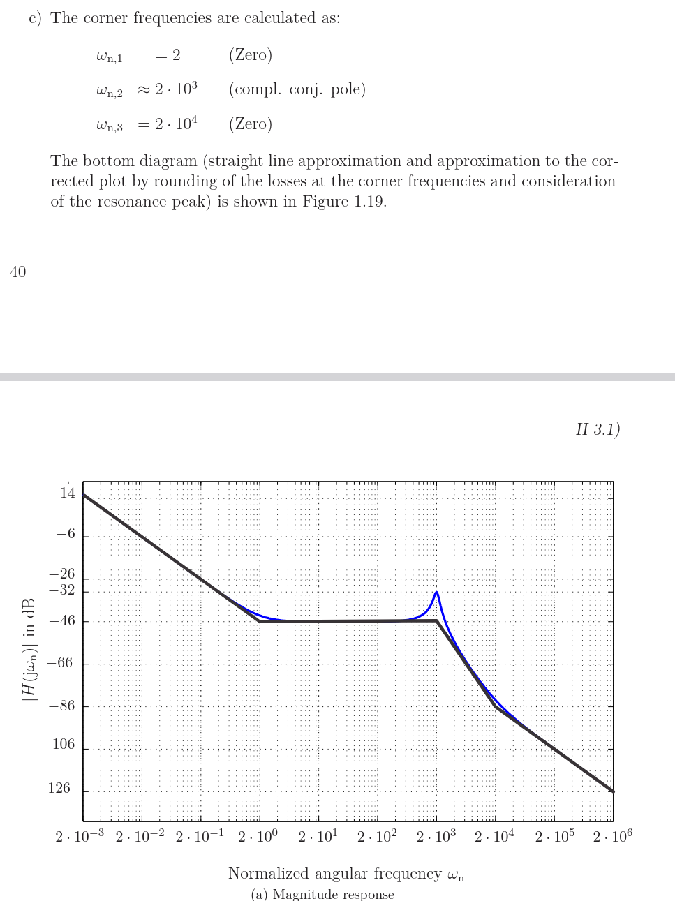

A transfer function $G(sn)$ is a general mathematical object. But a Bode plot specifically shows how the system responds to sinusoidal (harmonic) 
inputs at different frequencies.

### Rule from signals theory: 
when your input is a pure sine wave of frequency $ω$, you evaluate the transfer function at $s=jω$.  You just substitute $s_n→jω_n$  everywhere.

$$
G(s_n) = \frac{s_n + 1}{(s_n + 100)^2} \quad\Rightarrow\quad G(j\omega_n) = \frac{j\omega_n + 1}{(j\omega_n + 100)^2}
$$

When $\omega_n \ll a$: $\sqrt{\omega_n^2 + a^2} \approx a$ (constant, flat line)

When $\omega_n \gg a$: $\sqrt{\omega_n^2 + a^2} \approx \omega_n$ (rises, sloped line)

The changeover happens at $\omega_n = a$. That is the corner.

### Magnitude of one factor:
$$
|j\omega_n + a| = \sqrt{\omega_n^2 + a^2}
$$

$$
|a + jb| = \sqrt{a^2 + b^2}
$$

Taking the magniude of the numerator and denominator 

A zero at $ω_c$ adds +20 dB/decade starting at $ω_c$
	​

A pole at $ω_c$ adds −20 dB/decade starting at $ω_c$
	​

A double pole adds −40 dB/decade

# Transforming a Transfer Function into Standard Form (for Bode Plots)

## Why we do this

The goal of "standard form" is to rewrite every factor so it looks like:

$$
\left(1 + \frac{s}{\omega_c}\right)
$$

This shape is useful for two reasons:

1. You can **read the corner frequency $\omega_c$ directly** off each factor.
2. Each factor equals **1 at low frequency** (when $s \to 0$), so it contributes 0 dB there. This lets you anchor the plot and stack slopes cleanly.

## The mechanical step: factor out the constant

Take a raw factor like $(s + a)$ and pull out the $a$:

$$
s + a = a\left(1 + \frac{s}{a}\right)
$$

- The corner frequency of this factor is $\omega_c = a$.
- The leftover constant $a$ multiplies into the overall gain. It shifts the whole plot up or down, but does **not** change any slopes.

## Worked example

Starting transfer function:

$$
G(s_n) = \frac{s_n + 1}{(s_n + 100)^2}
$$

### Factor the numerator

$$
s_n + 1 = 1 \cdot \left(1 + \frac{s_n}{1}\right) \quad \Rightarrow \quad \omega_c = 1
$$

### Factor the denominator

$$
(s_n + 100)^2 = 100^2\left(1 + \frac{s_n}{100}\right)^2 = 10^4\left(1 + \frac{s_n}{100}\right)^2 \quad \Rightarrow \quad \omega_c = 100
$$

(Squared, so it counts as a **double** pole.)

### Put it together

$$
G(s_n) = \frac{1 + \dfrac{s_n}{1}}{10^4\left(1 + \dfrac{s_n}{100}\right)^2} = \frac{1}{10^4} \cdot \frac{1 + s_n}{\left(1 + \dfrac{s_n}{100}\right)^2}
$$

## The constant out front is the DC gain

That $\dfrac{1}{10^4}$ is the **DC gain**. Convert it to dB and it *is* the flat starting level of the plot:

$$20\lg\frac{1}{10^4} = 20 \cdot (-4) = -80\ \text{dB}$$

This matches the $-80$ dB you get by plugging in $\omega_n = 0$. That is not a coincidence: both methods give the DC gain.

- Reading the constant off the standard form is the **shortcut**.
- Plugging in $\omega = 0$ is the longer **check**.

Either is fine in an exam.

## Summary (the front-end routine)

1. Factor each term as $a\left(1 + \dfrac{s}{a}\right)$. The $a$ inside gives a corner frequency; the $a$ outside joins the gain.
2. Collect all pulled-out constants into one DC gain, convert to dB. That is your flat starting height.
3. List the corner frequencies (poles and zeros). Those are the kink locations, and each kink's slope change comes from whether it is a pole ($-$) or zero ($+$) and its multiplicity.

## Note: don't expand the factored form for Bode plots

When you have a factor like $(s_n + 100)^2$, do **not** apply the $(a+b)^2$ formula to expand it.

**Why not:** expanding gives a polynomial that hides the corner frequency.

$$
(s_n + 100)^2 = s_n^2 + 200s_n + 10^4 \quad \text{(expanded, corner hidden)}
$$

**What to do instead:** factor out the constant so the corner frequency is visible.

$$
(s_n + 100)^2 = 100^2\left(1 + \frac{s_n}{100}\right)^2 = 10^4\left(1 + \frac{s_n}{100}\right)^2 \quad \Rightarrow \quad \omega_c = 100
$$

**Which rules this uses:**

1. Distributive law (factor out the common constant): $s_n + 100 = 100\left(1 + \dfrac{s_n}{100}\right)$
2. Power of a product (send the exponent onto each factor): $(a \cdot b)^n = a^n \cdot b^n$

## Formula for Phase 
$$
\varphi = \arctan\left(\frac{b}{a}\right) = \arctan\left(\frac{\text{imaginary part}}{\text{real part}}\right)
$$

Example 

Here $b=0$ and $a=1/10^4$, so:
$$
\varphi = \arctan\left(\frac{0}{1/10^4}\right) = \arctan(0) = 0°
$$

### Phase rules for multiplication and division
$$
\arg\left(\frac{A}{B^2}\right) = \arg(A) - 2\arg(B)
$$

Example 
$$
G(j) = \frac{j + 1}{(j + 100)^2}
$$

$$
\arg(G) = \arg(j + 1) - 2\arg(j + 100)
$$

Numerator $j+1=1+j$: real part = 1, imaginary part =1.
$$
\arg(1 + j) = \arctan\frac{1}{1}
$$

Denominator base $j+100=100+j$: real part = 100, imaginary part = 1.
$$
\arg(100 + j) = \arctan\frac{1}{100}
$$

Assembel

$$
\arg(G) = \arctan\frac{1}{1} - 2\arctan\frac{1}{100}
$$

$$
\arg(G) = 45° - 2(0.57°) = 45° - 1.14° \approx 44°
$$

### Product of the conjugate pair is:
Root at $s = -a + jb$ gives factor $(s + a - jb)$

Root at $s = -a - jb$ gives factor $(s + a + jb)$

$$
\left(s+a-jb\right)\left(s+a+jb\right) = (s+a)^2 + b^2
$$

**Key point:** $(s+a+jb)^2$ is WRONG. Squaring means a repeated root and leaves $j$ in the expression. The conjugate product is what cancels $j$ and gives a real quadratic.

### Corner Frequency of a Complex Pole (Magnitude of the Root)
For a complex pole, the corner frequency is the magnitude of the root (its distance from the origin)

$$
H(s_n) = \frac{(s_n + 2)(s_n + 2\cdot10^4)}{s_n(s_n + 200 + j2\cdot10^3)(s_n + 200 - j2\cdot10^3)}
$$

**Example**

$$
\omega_c = |{-200 \pm j2\cdot10^3}| = \sqrt{200^2 + (2\cdot10^3)^2} = \sqrt{40000 + 4\cdot10^6}
$$

$$
= \sqrt{4.04\cdot10^6} \approx 2010 \approx 2\cdot10^3
$$

**Corner Frequencies of the Transfer Function**

**From the zeros**

$$
\omega_{c1} = |-2| = 2 \qquad \omega_{c2} = |-2\times10^{4}| = 2\times10^{4}
$$

**From the poles:**
$$
\omega_{c3} = |-200 \pm j\;2\times10^{3}| = \sqrt{200^2 + (2\times10^{3})^2} \approx 2\times10^{3}
$$

## Computing each segment's slope (sweep left to right)

**Region 1: before $\omega = 2$** (only the origin pole is active)
Count $= 0$ zeros $- 1$ pole $= -1$. Slope $= -20$ dB/dec → slanting down. That's the falling line on the far left starting at +14 dB.

**Region 2: between $2$ and $2\cdot10^3$** (origin pole + one zero)
Count $= 1$ zero $- 1$ pole $= 0$. Slope $= 0$ → flat. That's the long horizontal stretch at $-46$ dB across the middle of the graph.

**Region 3: between $2\cdot10^3$ and $2\cdot10^4$** (origin pole + zero + double pole)
Count $= 1$ zero $- 3$ poles $= -2$. Slope $= -40$ dB/dec → steeply down. That's the sharp drop after the resonance peak.

**Region 4: after $2\cdot10^4$** (everything active: 2 zeros, 3 poles)
Count $= 2$ zeros $- 3$ poles $= -1$. Slope $= -20$ dB/dec → down, but gentler. That's the final falling line to the right edge, less steep than Region 3.

## Double pole: two ways it can happen

A "double pole" means two poles land at the **same corner frequency**, so they combine to give $-40$ dB/dec (instead of $-20$) at that corner. It arises in two different ways:

**Way 1: a factor is literally squared**

$$
(s_n + 100)^2
$$

One factor, exponent 2. Corner at $\omega_c = 100$, counts as two poles.

**Way 2: a complex-conjugate pair at the same magnitude**

$$
(s_n + 200 + j2\cdot10^3)(s_n + 200 - j2\cdot10^3)
$$

Two separate factors, roots at $-200 \pm j2000$ (same real part, opposite imaginary parts). Both roots have the same magnitude, so both give the same corner:

$$
\omega_c = |{-200 \pm j2000}| = \sqrt{200^2 + 2000^2} \approx 2\cdot10^3
$$

**Same effect on the plot:** different algebra, but both cross two poles at one corner, so both drop the slope by $-40$ dB/dec there.

### Peak vs notch, side by side
**Complex poles** → the magnitude shoots up above the straight-line asymptote at the corner. That's the peak (bump up), like the one at $2⋅10^3$ in your graph.

**Complex zeros** → the magnitude drops down below the asymptote at the corner. That's the notch (dip down).

## Resonance bumps: general rules for any Bode plot

These hold universally, not just for one problem:

- **Only complex-conjugate pairs can bump.** Real poles and zeros never produce a peak or notch.
- **Poles peak up, zeros notch down.** Always.
- **The bump sits at the pair's corner frequency** $\omega_0 = \sqrt{a^2+b^2}$. Always.
- **A peak exists only if** $\zeta < \frac{1}{\sqrt{2}} \approx 0.707$. This threshold is general.

The damping ratio:

$$
\zeta = \frac{a}{\sqrt{a^2+b^2}} = \frac{\text{real part}}{\text{magnitude}}
$$

### Peak height (general, but approximate)

$$
M_{\text{peak}} \approx \frac{1}{2\zeta} \quad\Rightarrow\quad 20\lg\frac{1}{2\zeta}\ \text{dB above the asymptote}
$$

This is accurate only for small $\zeta$ (roughly $\zeta < 0.3$). The exact versions are:

$$M_{\text{peak, exact}} = \frac{1}{2\zeta\sqrt{1-\zeta^2}}, \qquad \omega_{\text{peak}} = \omega_0\sqrt{1 - 2\zeta^2}$$

For small $\zeta$ both reduce to the easy forms ($M \approx \frac{1}{2\zeta}$, peak at $\omega_0$).

### Why only complex poles resonate

Resonance needs oscillation, and only complex poles carry oscillation. Real poles can't oscillate, so they can't resonate

$$
e^{-at}\cos(bt): \quad \underbrace{e^{-at}}_{\text{how fast it dies (damping, }a\text{)}} \times \underbrace{\cos(bt)}_{\text{the ringing (frequency, }b\text{)}}
$$

## Impulse response 
The impulse response $h(t)$ is how the system reacts to a single, infinitely sharp "kick" at $t=0$ (the unit impulse $δ(t)$).

Basically We convert the frequncy domain to the time domain the transfer function and in order to do this we do the partial fraction of the transfer function and then 
take inverse laplace domain rules to get time domain funciton 

**shifted "cosine" shape → decaying cosine**
$$
\frac{s + a}{(s + a)^2 + b^2} \quad\longleftrightarrow\quad e^{-at}\cos(bt)
$$

**shifted "sine" shape → decaying sine**
$$
\frac{b}{(s + a)^2 + b^2} \quad\longleftrightarrow\quad e^{-at}\sin(bt)
$$

**real pole at origin → constant (step function)**
$$
\frac{1}{s} \quad\longleftrightarrow\quad \varepsilon(t)
$$
