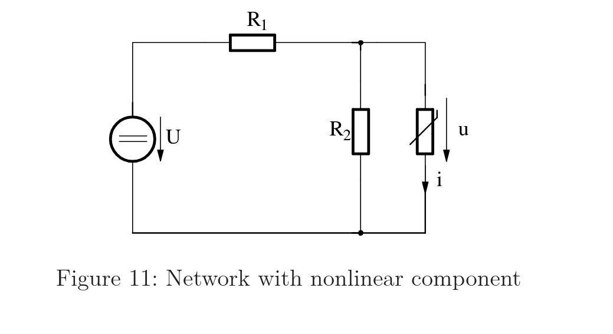
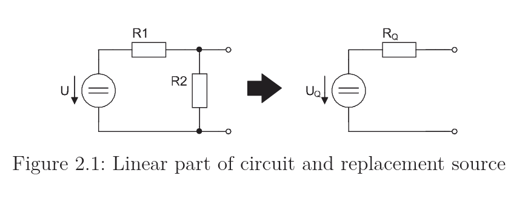
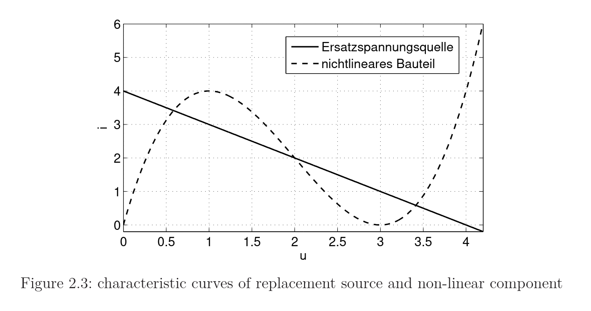

### Main Skills to be learned 

1. **Operating points:** Finding where a nonlinear component sits in a circuit (Key idea: a nonlinear element can have multiple operating points.)
2. **Transient behavior with an inductor (T4.2, H4.1)** (Diode curve is non-monotonic, you get the jump phenomenon: the operating point slides along a branch, hits a fold, and jumps 
discontinuously)
3. **Time-variant capacitor / energy harvesting (H4.2, H4.3):** An LC resonant circuit where the capacitance is deliberately switched $(C_0→C_0−ΔC)$ at each charge extremum 
and back at each zero crossing.

## Core components involved

- **Nonlinear resistor / tunnel diode (Esaki diode):** described by a current-voltage cubic $i_n(u_n) = u_n^3 - 6u_n^2 + 9u_n$. Its non-monotonic (N-shaped) curve is the source of all the interesting behavior.
- **Linear resistors** ($R_1, R_2, R$) and **DC voltage sources** ($U$, $U_Q$).
- **Inductor** $L$ (energy storage, gives first-order ODEs in time).
- **Time-variant capacitor** $C(t)$ (the energy-harvesting idea).

## Thévenin Equivalent for Circuits with a Nonlinear Component

### Why do it
- A circuit with one **nonlinear** element (rest linear) can't be solved with linear tools alone, because a relation like $i = f(u)$ (e.g. a cubic) breaks superposition and matrix methods.
- **Thévenin's theorem:** any linear network seen from two terminals behaves like one voltage source $U_Q$ in series with one resistor $R_Q$. All internal sources and resistors collapse into two numbers.
- The circuit reduces to: source + resistor + nonlinear element → two unknowns ($u, i$), two equations:
  - Load line (linear side): $u = U_Q - R_Q\, i$
  - Characteristic curve (nonlinear side): $i = f(u)$
- **Operating point** = intersection of the load line and the characteristic curve.

### Getting the two Thévenin parameters
- $R_Q$ (internal resistance): set all independent sources to zero (short voltage sources, open current sources), find the resistance looking into the terminals → sets the slope of the load line.
- $U_Q$ (open-circuit voltage): find the terminal voltage with the load removed ($i = 0$, so $R_Q$ drops nothing) → sets where the load line meets the voltage axis.

### Worked example
Linear part: source $U$ feeding $R_1$ in series, with $R_2$ across the terminals; nonlinear element connects at the terminals.

**Internal resistance** (short the source, so $R_1 \parallel R_2$ seen at terminals):
$$R_Q = R_1 \parallel R_2 = \frac{R_1 R_2}{R_1 + R_2}$$

**Open-circuit voltage** (terminals open, $i = 0$, no current in $R_1$, so $R_2$ forms a divider):
$$U_Q = U \cdot \frac{R_2}{R_1 + R_2}$$

**Plug in numbers** ($U = 12\,\text{V}, R_1 = 2\,\Omega, R_2 = 4\,\Omega$):
$$R_Q = \frac{2 \cdot 4}{2 + 4} = \frac{8}{6} = 1.33\ \Omega$$
$$U_Q = 12 \cdot \frac{4}{2 + 4} = 12 \cdot \frac{2}{3} = 8\ \text{V}$$

Load line becomes $u = 8 - 1.33\, i$; intersect with $i = f(u)$ to find the operating point(s).

## Operating Point
An operating point is just the actual voltage and current the circuit settles at when you turn it on. That's it. It's one specific pair of numbers, $(u,i)$, that describes the 
real state of the circuit sitting there in equilibrium.

### Sketching a cubic characteristic by hand

Four pieces of info fully fix the shape:

1. **Turning points** (from $di/du = 0$): the max and min corners.
   - e.g. max $(1, 4)$, min $(3, 0)$
2. **Zeros** (factor the cubic): where the curve meets the $u$-axis.
   - e.g. $i = u(u-3)^2 \Rightarrow$ zeros at $u = 0$ and $u = 3$
3. **Slope pattern** (sign of $di/du$ between turning points):
   - rising → max(point reached) → falling (neg-resistance branch) → min(point) → rising

Then connect the points smoothly following the slope pattern. Optional: plug in one extra $u$ (e.g. $u=2 \Rightarrow i=2$) for a point on the middle branch.

$$
i = u^3 - 6u^2 + 9u
$$

$$
i = u\,(u^2 - 6u + 9)
$$

$$
u^2 - 6u + 9 = (u-3)(u-3) = (u-3)^2
$$

$$
i = u\,(u-3)^2
$$

## Solving the cubic equation for operating points

Cubic has no easy root formula → strategy: knock it down to a quadratic.

1. Set curves equal (linear and linear element equations) → :
   $$u^3 - 6u^2 + 10u - 4 = 0$$
2. Find ONE root by trial (test divisors of the constant term $-4$: $\pm1, \pm2, \pm4$;). Here $u = 2$ gives $8 - 24 + 20 - 4 = 0$ 
3. Divide the cubic by $(u - \text{root})$ → leaves a quadratic:
   $$(u^3 - 6u^2 + 10u - 4) \div (u - 2) = u^2 - 4u + 2$$
4. Solve the quadratic with the formula:
   $$u = \frac{4 \pm \sqrt{16 - 8}}{2} = 2 \pm \sqrt{2}$$
5. Three roots: $u = 2,\ 2+\sqrt{2},\ 2-\sqrt{2}$. Get each current from $i = 4 - u$.

## Finding operating points graphically

Instead of solving algebraically, plot both characteristics on one $i$–$u$ graph and read off the crossings.

1. Draw the nonlinear curve $i = u^3 - 6u^2 + 9u$ (the N-shape).
   - Turning points (using first derivative) : max $(1, 4)$, min $(3, 0)$; zeros at $u = 0, 3$.
2. Draw the load line $i = 4 - u$ (straight line).
   - Two points are enough: $u = 0 \Rightarrow i = 4$; $i = 0 \Rightarrow u = 4$.
3. **Operating points = where the line crosses the curve.**
   - Here it crosses 3 times → three operating points.
   - Read off approximate $(u, i)$ at each crossing.

Why 3 crossings: a straight line can cut the N-shape in up to three places. A linear component (straight-line characteristic) would give only one.

## Characteristic Curve
A characteristic curve is a graph that shows the relationship between the voltage across a component and the current through it.Each component has its own characteristic curve. 
In a series loop they share the same $u$ and $i$, so the actual state must lie on both curves at once, hence the intersection. The load line is literally the characteristic curve
 of the whole linear part (source + resistor) reduced via Thévenin.

### Diode 
A diode is a special type of resistor, specifically a nonlinear resistor. It sits inside the resistor family (instantaneous $i - u$ relationship, no memory), but its curve is 
bent instead of straight. Every diode is a nonlinear resistor, and every nonlinear resistor is a resistor (in the general sense), but not the other way around, a plain linear 
resistor is not a diode.

## Finding current from the differential Equation

$$
\frac{di_n}{dt_n} = -i_n^2 + 8i_n + 9
$$

$$
\underbrace{\frac{di_n}{dt_n}}_{\text{rate (what the ODE gives)}} \quad\xrightarrow{\ \text{integrate}\ }\quad \underbrace{i_n(t_n)}_{\text{the current itself (what we want)}}
$$
Seperate varaibles:
$$
\frac{di_n}{-i_n^2 + 8i_n + 9} = dt_n
$$
integrate both sides 
