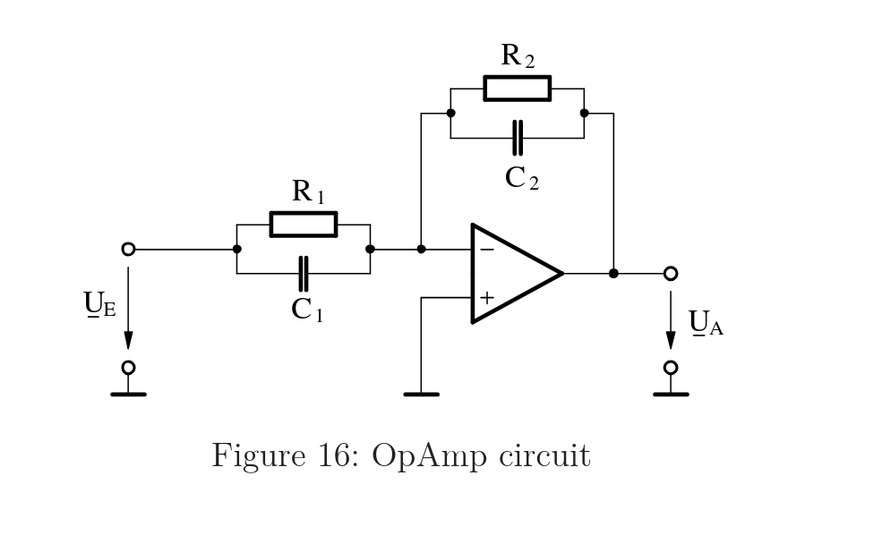
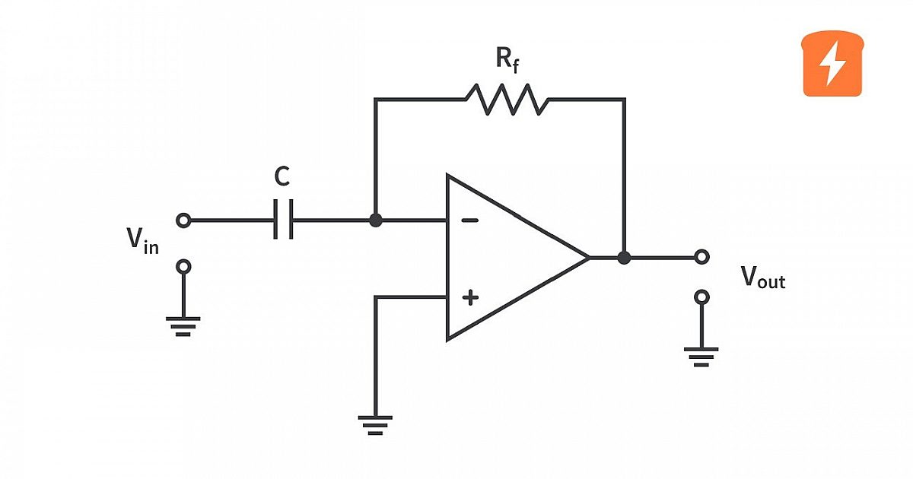
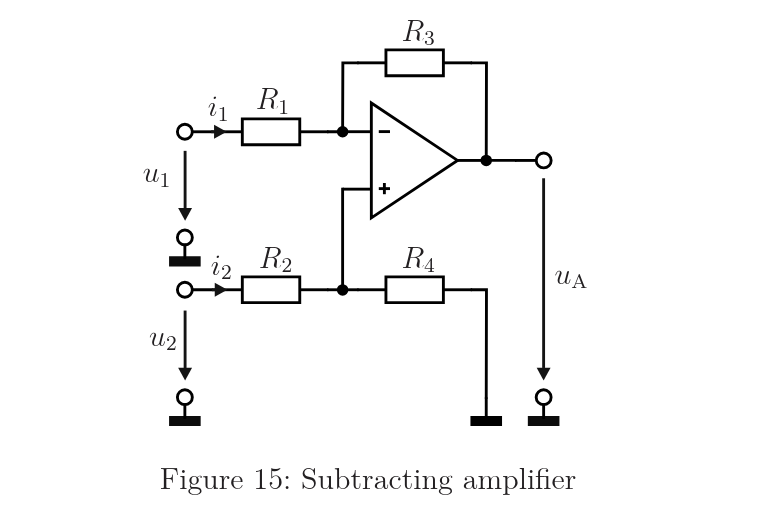
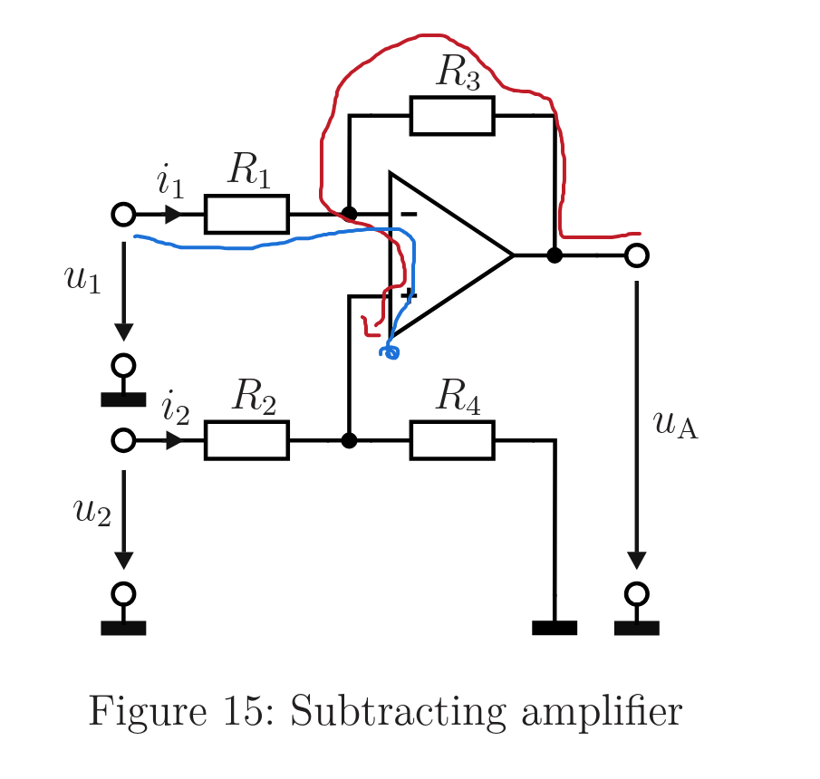

## Op-Amp

The operational amplifier (OpAmp/OPV) is a single component: a high-gain differential amplifier with two inputs (+ and −) and one output. On its 
own it just amplifies the difference between its inputs by a huge factor. It becomes useful only when you wrap external resistors/capacitors
around it to set a defined behavior.

## Op-Amp Feedback: Positive vs. Negative

Trace the wire from the op-amp **output** back to the inputs. Whichever input the feedback path connects to tells you the type:

- Feedback to the inverting input (−) → **negative feedback**
- Feedback to the non-inverting input (+) → **positive feedback**

## Op-Amp Circuit Configurations

The **op-amp** is the building block: a high-gain differential amplifier with two inputs (+, −) and one output. Each named amplifier below is just the op-amp with different components connected in different places.

### Configurations

| Circuit | What's connected & where | Output does |
|---|---|---|
| **Inverting amplifier** | Input through a resistor to (−); feedback resistor from output to (−) | Input scaled and flipped in sign |
| **Non-inverting amplifier** | Input goes to (+) directly; feedback divider to (−) | Input scaled, same sign |
| **Summing amplifier** | Several inputs feed the (−) node through separate resistors | Weighted sum of the inputs |
| **Subtracting (difference) amplifier** | One input each side: $u_1$ via $R_1$ to (−), $u_2$ via $R_2$ to (+); $R_3$, $R_4$ set ratios | Difference of the inputs. All resistors equal → $u_A = u_2 - u_1$ |
| **Integrator** | Feedback element is a capacitor instead of a resistor | Proportional to the time integral of the input (accumulates it) |
| **Differentiator** | Input element is a capacitor | Proportional to the time derivative of the input (rate of change) |
| **Differentiator-integrator** | Each stage has a resistor and capacitor in parallel, so behavior depends on frequency | Integrates in one frequency band, differentiates in another |

### Comparing the Circuits

  <figure style="flex: 1; min-width: 250px; margin: 0;">
    
    <figcaption><strong>Differentiator-integrator</strong> (T5.2): both input and feedback are R∥C blocks, so behavior shifts with frequency.</figcaption>
  </figure>
  <figure style="flex: 1; min-width: 250px; margin: 0;">
    
    <figcaption><strong>Basic differentiator</strong>: pure capacitor in, pure resistor feedback, differentiates across its whole range.</figcaption>
  </figure>
  <figure style="flex: 1; min-width: 250px; margin: 0;">
    
    <figcaption><strong>Subtracting amplifier</strong> (T5.1): signal on each input, resistors only, outputs the difference of the two inputs.</figcaption>
  </figure>

### The Unifying Pattern

For the inverting family (inverting, summing, integrator, differentiator):

$$u_A = -\frac{Z_f}{Z_{in}} \cdot u_{in}$$

where $Z_f$ is the feedback element (output back to the (−) input) and $Z_{in}$ is the input element (source to the (−) input). Swap resistors and capacitors in these two spots to generate almost every circuit above:

- Both resistors → inverting amp (scales)
- Feedback = capacitor → integrator, since $Z_C = 1/(j\omega C)$ falls with frequency
- Input = capacitor → differentiator
- Resistor-capacitor combos → frequency-dependent behavior

The behavior comes from the **impedances**, not the component names: a resistor is a frequency-independent impedance, a capacitor a frequency-dependent one. "Integrator" and "differentiator" are just what an inverting amp becomes when one impedance varies with frequency.

### Why use feedback at all

The raw op-amp is almost useless without it. Open-loop gain is effectively infinite (real ones ~100,000+), so the tiniest input difference (a few µV) slams the output to its rail. On its own, the op-amp is just a switch, output fully high or low. Useful as a comparator, useless as an amplifier.

**Feedback fixes this** by feeding part of the output back to the (−) input, opposing the input. This creates a self-correcting loop:

- Output drifts too high → more fed back to (−) → pulls it back down.
- Output drifts too low → less fed back → lets it rise.

The circuit settles where both inputs are essentially equal. That's the **virtual short** ($u_+ = u_-$), a *consequence* of negative feedback, not an assumption.

**The payoff:** with feedback, behavior no longer depends on the op-amp's huge, imprecise, temperature-sensitive open-loop gain. It depends only on your **external components**. You trade away excess raw gain for **precision and control**, a gain of exactly 10 from two resistors, instead of "about 100,000, give or take."

### Resistor vs. capacitor feedback

Both are feedback; they differ in *what kind* of control you get:

| Feedback element | Gain behavior | Result |
|---|---|---|
| **Resistor** | Frequency-independent (same at every frequency) | Plain scaling (inverting / non-inverting / summing amps) |
| **Capacitor** | Frequency-dependent, since $Z_C = 1/(j\omega C)$ changes with frequency | Integrator / differentiator (performs calculus) |

A capacitor lets more feedback through at high frequencies (low impedance), less at low frequencies. This frequency-dependence is what turns the circuit into an integrator, and it's the mathematical reason integration in the time domain corresponds to dividing by $j\omega$ in the frequency domain.

### **Virtual short = negative feedback confirmation.** 
If a problem lets you assume both inputs sit at the same potential ($u_+ = u_-$), it's 
negative feedback. Comparators and Schmitt triggers (positive feedback) don't get the virtual short.

The virtual short only holds under negative feedback (output fed back to the (−) input). That's what lets the op-amp self-correct and settle at 
the equal-input point. Without feedback (or with positive feedback), the output just saturates and the inputs are not equal, that's a 
comparator, not an amplifier

**why virtual short useful:** Because it hands you a voltage you'd otherwise have to solve for.

The (+) input is usually tied to something known (a divider, a ground, a reference). The virtual short instantly copies that known voltage onto 
the (−) node, which is otherwise buried inside the feedback network and hard to determine directly.

### **Default for linear amplifiers** 
Inverting, non-inverting, summing, subtracting, and integrator circuits are all negative feedback, since 
that's what gives stable, linear operation.

### Why the op-amp impedance drops out of the (+) branch ($r_2$)

The op-amp's input impedance is infinite, and an infinite resistance in parallel is an open branch carrying zero current, so it can be erased. 
The source $u_2$ then sees only $R_2 + R_4$ in series to ground, which is why $r_2 = R_2 + R_4$.

### Why the op-amp impedance and $R_3$ both drop out of the (−) branch ($r_1$)

The op-amp input is again infinite (no current in), and feedback additionally clamps the (−) node to 0 V, so the current exits through $R_3$ driven by the op-amp's output, not by $u_1$. $R_3$ is therefore neither in series with $R_1$ (the node between them is a fixed 0 V wall, so $R_1$'s current is set by its own two ends before $R_3$ matters) nor in parallel (it connects to the op-amp output, not back to $u_1$), so $u_1$ feels only $R_1$, giving $r_1 = R_1$.

### Why $u_2$ is set to zero when finding $r_1$

The virtual short forces $u_- = u_+$, so the (+) voltage leaks into the (−) branch current: $i_1 = \frac{u_1 - u_+}{R_1}$. 
Setting $u_2 = 0$ makes $u_+ = 0$, cutting that coupling so $r_1$ depends only on $R_1$, a clean property of the (−) input alone.

## Exam Recipe: Output of the Subtracting Amplifier

Order to memorize: **divider → virtual short → input loop ($i_1$) → output loop ($u_A$) → sub $i_1$ → sub $u_p$ → set resistors equal.**

### Step 1: Write $u_p$ (voltage divider at + input)

No current into (+), so $u_2$, $R_2$, $R_4$ form a divider:

$$
u_p = u_2\frac{R_4}{R_2 + R_4}
$$

### Step 2: Virtual short

$u_D = 0$, so $u_- = u_p$

### Step 3: Input loop → get $i_1$

KVL on the (−) side, using $u_D = 0$:

$$
i_1 = \frac{u_1 - u_p}{R_1}
$$

### Step 4: Output loop → get $u_A$

Same $i_1$ flows through $R_3$ (no current into (−) input):

$$
u_A = -i_1 R_3 + u_p
$$

### Step 5: Substitute $i_1$ (Step 3) into Step 4, collect $u_p$

Sub $i_1$:

$$
u_A = -\frac{u_1 - u_p}{R_1}R_3 + u_p
$$

Collect the two $u_p$ terms:

$$
u_A = u_p\left(\frac{R_3}{R_1} + 1\right) - u_1\frac{R_3}{R_1}
$$

### Step 6: Substitute $u_p$ (Step 1) → final result

$$
u_A = u_2\frac{R_4}{R_2 + R_4}\left(\frac{R_3}{R_1} + 1\right) - u_1\frac{R_3}{R_1}
$$

### Step 7: All resistors equal ($R$)

Divider $= \frac{1}{2}$, bracket $= 2$, last ratio $= 1$:

$$
u_A = u_2 - u_1
$$

### The two substitutions at a glance

| Into | Substitute | From |
|---|---|---|
| Step 4 ($u_A$) | $i_1 = \frac{u_1 - u_p}{R_1}$ | Step 3 |
| Step 5 result | $u_p = u_2\frac{R_4}{R_2+R_4}$ | Step 1 |

## Input KVL Loop, Labelled (Subtracting Amplifier)

The input equation is Kirchhoff's voltage law walked around one closed loop:
ground → $u_1$ → $R_1$ → (−) input → (+) input → back to ground. Each term is one voltage crossed on that walk. The op-amp's two input terminals are crossed like any other voltage (the gap between them is the differential voltage $u_D$).

$$
\underbrace{-u_p}_{\text{(+) node to ground}} \;\underbrace{+\,u_D}_{\text{across input terminals}} \;\underbrace{-\,i_1 R_1}_{\text{drop across } R_1} \;\underbrace{+\,u_1}_{\text{input source}} \;=\; 0
$$

| Term | Where it comes from | Sign reason |
|---|---|---|
| $+u_1$ | The input source voltage | Step up through the source from ground |
| $-i_1 R_1$ | Voltage drop across $R_1$ | Walk with current $i_1$, so potential drops |
| $+u_D$ | Differential voltage across the (+) and (−) input terminals, $u_D = u_+ - u_-$ | Step from (−) to (+) |
| $-u_p$ | Potential of the (+) node above ground | Step down from (+) node back to ground |

**Notes:**

- **Why $u_2$ isn't here:** the loop never passes through the $u_2$ branch ($R_2$, $u_2$ source), so those voltages don't appear. $u_2$'s whole effect is folded into the single term $u_p$ via the voltage divider $u_p = u_2 \frac{R_4}{R_2 + R_4}$.

- **You can start the walk anywhere:** starting from $u_1$ gives $u_1 - i_1 R_1 + u_D - u_p = 0$, the same equation reordered. Beginning at the source is often cleaner for signs.

- **The key move:** the virtual short sets $u_D = 0$, deleting that term and leaving

$$
i_1 = \frac{u_1 - u_p}{R_1}
$$

$u_D$ is written in first as honest bookkeeping (there really is a voltage between the terminals), then zeroed by the virtual short. That single substitution is the only place the ideal-op-amp-under-negative-feedback assumption enters.

## Important 
In order to find the output voltage we apply the KVL around the Op-Amp. two loops are formed and then solved tto find the output voltage 

## Finding Poles and Zeros from a Transfer Function

### The Rule

| | Zero | Pole |
|---|---|---|
| **Comes from** | Numerator (top) | Denominator (bottom) |
| **Found by** | Setting numerator $= 0$ | Setting denominator $= 0$ |
| **Corner frequency $\omega_c$** | Magnitude of the root (the constant in the factor) | Magnitude of the root (the constant in the factor) |
| **Slope it adds** (above its corner) | $+20$ dB/dec (rises) | $-20$ dB/dec (falls) |

**Corner frequency shortcut:** for a factor $(s + a)$, the corner is $\omega_c = a$. In standard form $\left(1 + \frac{s}{\omega_c}\right)$, the corner is the number under the $s$. It is *not* found by setting $\omega = 1$.

### Example  (two poles)

$$G(s) = \frac{s + 5}{(s + 20)(s + 400)}$$

- Numerator $= 0 \Rightarrow$ **zero at $5$**
- Denominator $= 0 \Rightarrow$ **poles at $20$ and $400$**

### Special cases

| $G(s)$ | Zero | Pole | Meaning |
|---|---|---|---|
| $\frac{1}{s}$ | none | $0$ (origin) | pure integrator, falls $-20$ dB/dec everywhere |
| $s$ | $0$ (origin) | none | pure differentiator, rises $+20$ dB/dec everywhere |

### One-line recipe

Set the **top** to zero → those roots are **zeros**. Set the **bottom** to zero → those roots are **poles**. The **corner frequency** is the magnitude of each root.

## What a cutoff frequency
A cutoff frequency (also called corner or break frequency) is a frequency where the circuit's behavior changes character. On the Bode plot it's 
where the curve bends, the slope switches from one value to another.

It's called "cutoff" because historically it marks where a filter starts to "cut off" (attenuate) signals. More generally, it's the boundary 
between two different regions of behavior.

## Time Domain ↔ s-Domain ↔ Bode Slope

| Time domain | s-domain | Bode slope | Signature |
|---|---|---|---|
| Differentiate $\frac{d}{dt}$ | $\times\ s$ | $+20$ dB/dec (rising) | $G \propto s$ |
| Integrate $\int dt$ | $\times\ \frac{1}{s}$ | $-20$ dB/dec (falling) | $G \propto \frac{1}{s}$ |

$$\frac{d}{dt} \;\leftrightarrow\; s \qquad\qquad \int dt \;\leftrightarrow\; \frac{1}{s}$$

### Reading the slope in a frequency band

The net slope in any band tells you what the circuit does **in that band**:

- Net $-20$ dB/dec → one more active pole than zero → behaves like $\frac{1}{s}$ → **integrates** there
- Net $+20$ dB/dec → one more active zero than pole → behaves like $s$ → **differentiates** there
- Net $0$ (flat) → constant → plain gain, no calculus

Net slope $=$ (active zeros $\times +20$) $+$ (active poles $\times -20$).

### Important caveat

A falling $-20$ dB/dec means integrating **only in that band**, not necessarily the whole circuit. This RC-op-amp circuit is flat below $\omega_1$, falls $-20$ dB/dec between the cutoffs (integrates here), and flat above $\omega_2$. So it's an integrator **only between the two cutoffs**.

A **pure integrator** ($G = \frac{1}{s}$, pole at the origin) falls $-20$ dB/dec everywhere. Real op-amp integrators only approximate this over a limited band, because a true origin pole needs infinite DC gain.

### Applying it to this circuit (T5.2)

Operating **between** the two cutoffs ($\omega_1 \ll \omega \ll \omega_2$):

$$G(s) \approx -\frac{1}{R_1 C_2}\cdot\frac{1}{s} \quad\Rightarrow\quad \text{integrator (part d)}$$

To make it a **differentiator** (part e), swap the R and C values so the cutoffs trade places and the operating band falls in the rising region:

$$G(s) \approx -R_2 C_1 \cdot s \quad\Rightarrow\quad \text{differentiator}$$

## When Superposition Can Be Applied to Op-Amp Circuits

**Rule:** superposition works only on **linear** circuits, where doubling the input exactly doubles the output (no clipping, no jumps).

### What stays linear (superposition OK)

- Resistors, capacitors, and inductors are all linear (a capacitor's $i = C\frac{dv}{dt}$ is a linear relation). Capacitors do **not** break linearity, you just work in the s-domain with impedance $\frac{1}{sC}$.
- An ideal op-amp in **negative feedback** behaves linearly.

### What breaks linearity (superposition fails)

- An op-amp that is **saturated** (output stuck at its supply rail).
- An op-amp in **positive feedback** (comparator, snaps between two states).
- Genuinely nonlinear devices: diodes/transistors in their curved region, or any squaring/multiplying ($x^2$) relationship.

**In short:** negative feedback (and unsaturated operation) = linear = superposition allowed.

### Rule: Why the Inverting Output is Negative

Voltage = height; current always flows **downhill**, dropping by $iR$ across each resistor.

At the virtual-ground node the height is **0 V**. The current keeps flowing downhill *past* that node, out through the feedback resistor toward the output, so the output lands one drop **below zero**:

$$u_A = 0 - i_1 R_3 = -i_1 R_3$$

**Rule:** whenever current flows from the virtual-ground node out through the feedback resistor toward the output, the output is that drop below zero, so it comes out **negative**. The current $i_1$ itself is positive, the minus sign comes purely from the output being downstream of the 0 V node in the direction of current flow. This is the signature of the inverting configuration.

## Op-Amp Pins: Which Carry Current

An op-amp has three pins, and they play completely different roles. Confusing the input pins with the output pin is a common mistake.

| Pin | Role | Current |
|---|---|---|
| **(−) input** | Senses voltage only | Zero, dead end (infinite input impedance) |
| **(+) input** | Senses voltage only | Zero, dead end (infinite input impedance) |
| **Output** | Driven by the op-amp's internal circuitry | Sources or sinks current, this is where circuit current comes from |

### The two input terminals: voltage sensors, nothing else

Both the (−) and (+) inputs are **high-impedance sensors**. They *measure* the voltage at their node but draw no current and supply no current. No current is ever "born" at an input terminal, and none flows into one. An input node is electrically almost disconnected from the op-amp, the op-amp just watches its voltage.

Consequence: current never originates at, splits at, or disappears into an input terminal. At an input node, current from one external resistor simply passes straight through to another (series), because the input pin offers no exit.

### The output terminal: the current source/sink

The **output** pin is a powered, low-impedance pin. Driven by the op-amp's internal transistors, it can **push current out (source)** or **pull current in (sink)**, whatever it takes to satisfy the feedback condition (hold the two inputs equal). All the current in the feedback/output path comes from here, not from the input terminals.

### The correct current path (inverting-style feedback)

$$
\underbrace{\text{output pin}}_{\text{sources/sinks current}} \;\to\; R_f \;\to\; \underbrace{(-)\text{ node}}_{\text{senses voltage only}} \;\to\; R_{in} \;\to\; \text{source/ground}
$$

One stream, sourced by the output, flowing in series through the feedback and input resistors, passing the (−) node without splitting.

**One line:** the (+) and (−) terminals only *read* voltage (no current); the output terminal *drives* current (source or sink). Current lives in the external loop powered by the output, never out of an input pin.

## Recipe: Non-Inverting Path of the Subtracting Amp ($u_1 = 0$)

When $u_1 = 0$, only $u_2$ drives the output. Two steps.

### Step 1: Find the current from $R_1$

$u_2$ sets the virtual point at the (−) node via the divider:

$$
u_p = u_2\frac{R_4}{R_2 + R_4}
$$

$R_1$ sits between $u_p$ and ground (its far end is grounded since $u_1 = 0$). Current is voltage-difference over resistance:

$$
i_1 = \frac{u_p}{R_1}
$$

### Step 2: Find the output across both resistors

The output drives that same $i_1$ through $R_3$ **and** $R_1$ in series (the virtual point sits in the middle, output on top, ground at the bottom). So the output is $i_1$ times both added:

$$
u_A = i_1(R_3 + R_1) = \frac{u_p}{R_1}(R_3 + R_1)
$$

Sub in $u_p$:

$$
u_A\big|_{u_1=0} = u_2\frac{R_4}{R_2 + R_4}\cdot\frac{R_3 + R_1}{R_1}
$$

### The key split (why two different resistor groups)

| Job | Resistors | Why |
|---|---|---|
| Sets the **current** | $R_1$ only | It's the resistor whose two end-voltages you know ($u_p$ and $0$) |
| Sets the **output** | $R_3 + R_1$ | The output pushes that current through both, in series, to reach ground |

### Picture

$$
u_A \;\xrightarrow{\text{drop } i_1 R_3}\; \underbrace{u_p}_{\text{virtual point}} \;\xrightarrow{\text{drop } i_1 R_1}\; 0
$$

Virtual point in the middle: $R_1$ below it (to ground) sets the current, $R_3$ above it (to output) adds the second drop. Output = both drops stacked.

### Key Idea: A Known Node Voltage Breaks the Series Rule

**Normal series resistors:** the middle node is *unknown* and settles based on both resistors, so the current depends on both:

$$
i = \frac{V_\text{total}}{R_3 + R_1}
$$

**With a virtual point (feedback fixes the middle):** the (−) node is pinned at a *known* voltage $u_p$. Once a node's voltage is known, you can treat each resistor **independently**, using that node as a fixed reference, you don't need the other resistor.

So $R_1$ alone sets the current, because both its ends are known ($u_p$ and ground):

$$
i_1 = \frac{u_p - 0}{R_1} = \frac{u_p}{R_1}
$$

$R_3$ drops out of the current calculation entirely. It only returns when finding the **output**, which must sit one $R_3$-drop above the known node:

$$
u_A = u_p + i_1 R_3
$$

**Why it works:** the virtual short acts like a fixed voltage source planted in the middle of the chain. That fixed midpoint isolates the two 
resistors from each other, so they no longer combine as a normal series pair. Current comes from the resistor below the known node; 
the resistor above only sets how high the output must be.

