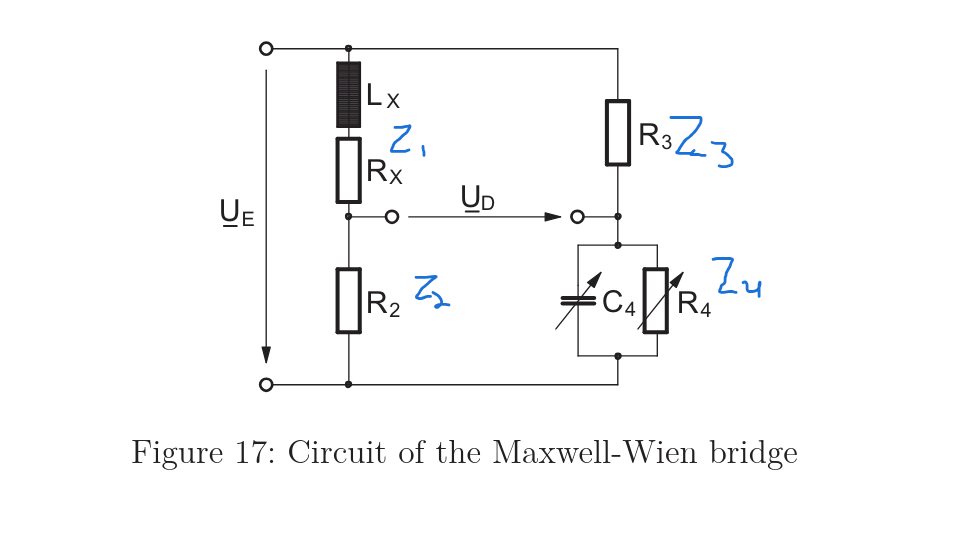

## The general rule for AC bridge balance
Balance (null) condition for any four-arm bridge

At balance the detector voltage is zero, so opposite-arm impedance products are equal.

$$
\underline{Z_1}\,\underline{Z_4} = \underline{Z_2}\,\underline{Z_3}
$$

## Applied to this Maxwell-Wien bridge

Unknown arm $\underline{Z_x}=R_x+j\omega L_x$, opposite arm is the parallel combo $R_4\parallel C_4$:

$$R_2 R_3 = (R_x + j\omega L_x)\,\frac{R_4\,\frac{1}{j\omega C_4}}{R_4 + \frac{1}{j\omega C_4}}$$

Clear the fraction (multiply both sides by $R_4+\frac{1}{j\omega C_4}$, then by $j\omega C_4$):

$$R_2 R_3\,(1 + j\omega R_4 C_4) = (R_x + j\omega L_x)\,R_4$$

**Real part** gives the unknown resistance:

$$R_x = \frac{R_2 R_3}{R_4}$$

**Imaginary part** gives the unknown inductance:

$$
L_x = R_2 R_3 C_4
$$

## Loss Factor (tan δ) — Inductors and Capacitors

| Component | Series model | Parallel model |
|-----------|-------------|----------------|
| Inductor | $\tan\delta_L = \dfrac{R_s}{\omega L}$ | $\tan\delta_L = \dfrac{\omega L}{R_p}$ |
| Capacitor | $\tan\delta_C = \omega R_s C$ | $\tan\delta_C = \dfrac{1}{\omega R_p C}$ |

## Symbol key

- $R_s$: series loss resistance (in series with the reactive element).
- $R_p$: parallel loss/leakage resistance (across the reactive element).
- $\omega L$: ideal inductive reactance; $\dfrac{1}{\omega C}$: ideal capacitive reactance.
- $\omega = 2\pi f$: angular frequency.

## General rule to memorize

For any AC bridge "can it run at another frequency?" question:

1. Write the balance results for the unknowns.
2. If $\omega$ **cancels out**, the balance is frequency-independent, so the answer is yes.
3. Then check whether any **given quantity** ($\tan\delta$, a reactance value, a component tolerance) was specified at a particular frequency; that part must be re-evaluated at the new frequency.

$$
R_x = \frac{R_2 R_3}{R_4} \qquad L_x = R_2 R_3 C_4
$$

$$
R_x = \underbrace{\omega}_{\text{depends on } f}\, L_x\, \underbrace{\tan\delta_x}_{\text{also depends on } f}
$$

# Linearity and Linearization

## 1. Rule for Linearity

A relation $y = f(x)$ is linear if it can be written as

$$
y = k \cdot x
$$

where $k$ contains **only constants**, no $x$. (With a constant offset, $y = kx + d$, the relation is strictly *affine*, but engineers usually call it linear since the slope stays constant.)

### Quick visual test

Look at the input variable $x$ and ask:

| # | Question | If yes |
|---|----------|--------|
| 1 | Does $x$ appear in a denominator? | not linear |
| 2 | Is $x$ squared, rooted, or inside $\sin$, $\exp$, $\ln$? | not linear |
| 3 | Is $x$ multiplied by another variable (not a constant)? | not linear |

Linear means: $x$ appears **once, to the first power, in the numerator only**.

### Numerical test (if unsure)

Double the input. If the output does not exactly double, the relation is nonlinear.

### Example

$$
\Delta R_X = \frac{2R_1 U_D}{U_E - U_D} \quad \Rightarrow \quad \text{nonlinear} \ (U_D \text{ also in denominator})
$$

$$
\Delta R_X = \frac{2R_1}{U_E}\, U_D \quad \Rightarrow \quad \text{linear} \ (\text{slope } 2R_1/U_E)
$$

## 2. Recipe for Linearizing

Given an assumption of the form "small quantity $\ll$ large quantity":

**Step 1.** Locate where the small quantity sits in a **sum** with the large one.

**Step 2.** Factor the large quantity out, so the small one appears only as a dimensionless ratio $u$:

$$
U_E - U_D = U_E\left(1 - \frac{U_D}{U_E}\right), \qquad u = \frac{U_D}{U_E} \ll 1
$$

**Step 3.** Delete the ratio (set the bracket to 1). What remains is the linear result.

$$
\Delta R_X = \frac{2R_1 U_D}{U_E}\cdot\frac{1}{1-u} \;\approx\; \frac{2R_1 U_D}{U_E}
$$

**Step 4.** Report the relative error by dividing approximate by exact and subtracting 1:

$$
f = \frac{y_{\text{approx}}}{y_{\text{exact}}} - 1 = \frac{U_E - U_D}{U_E} - 1 = -\frac{U_D}{U_E}
$$

Common factors cancel, leaving the error expressed in the small ratio itself.

### Standard approximations for $|u| \ll 1$

$$\frac{1}{1-u} \approx 1+u \qquad \frac{1}{1+u} \approx 1-u \qquad (1+u)^n \approx 1+nu$$

$$e^{u} \approx 1+u \qquad \ln(1+u) \approx u \qquad \sin u \approx u \qquad \cos u \approx 1-\tfrac{u^2}{2}$$

