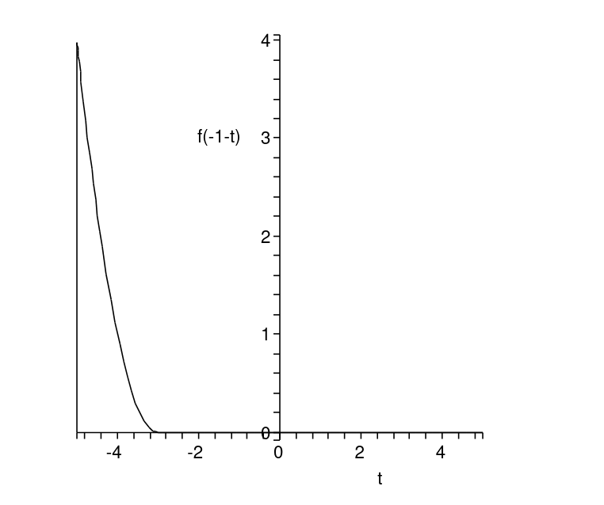
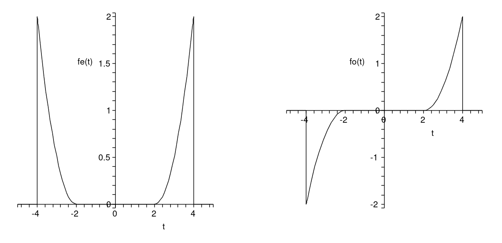

## Plotting a time-transformed signal

Use this whenever you are asked to draw $f$ of some expression in $t$, for example $f(t-\tau)$, $f(-t)$, $f(-1-t)$, or $f(2t)$. The same five steps handle delays, reflections, and scalings, with no ordering decisions and no sign guessing.

Worked on the example $f(-1-t)$, where the original signal is

$$
f(t) = \begin{cases} t^2 - 4t + 4 = (t-2)^2 & \text{for } 2 < t < 4 \\ 0 & \text{else} \end{cases}
$$

### Step 1: Find the new range

The signal is nonzero only when the **argument of $f$** lies inside the original support $2 < (\cdot) < 4$. Set the argument $-1-t$ equal to each boundary and solve for $t$.

$$
-1 - t = 2 \quad\Longrightarrow\quad t = -3
$$

$$
-1 - t = 4 \quad\Longrightarrow\quad t = -5
$$

Order smallest to largest: the transformed signal lives on

$$
-5 < t < -3
$$

### Step 2: Build the transformed formula

Do not re-plot the old points. $f$ is a rule, so substitute the whole argument $-1-t$ into it wherever the original variable stood. Using the 
factored form $f(t) = (t-2)^2$:

Follwoing indentity applied on the oringal fucntion to get the concise form

$$
a^2 - 2ab + b^2 = (a-b)^2
$$

$$
f(-1-t) = \big[(-1-t) - 2\big]^2 = (-3 - t)^2 = (t+3)^2
$$

The overall minus sign vanishes because squaring removes it. This $(t+3)^2$ is the new signal on the new range.

### Step 3: Get the endpoint heights from the new formula

Plug the two edges of the new range into the transformed formula, never into the old graph.

$$
t = -3: \quad (-3+3)^2 = 0
$$

$$
t = -5: \quad (-5+3)^2 = 4
$$

New corner points: $(-3,\ 0)$ and $(-5,\ 4)$.

since the original equation is quadratic the shape will be parabolic 

## Even and Odd Decomposition of a Signal

## The Formulas

**Even part:**

$$
f_e(t) = \frac{f(t) + f(-t)}{2}
$$

**Odd part:**

$$
f_o(t) = \frac{f(t) - f(-t)}{2}
$$

Adding them recovers the original signal: $f_e(t) + f_o(t) = f(t)$.

The key task is finding $f(-t)$, since $f(t)$ is already given in the question. Once you have both, you add them for the even part and subtract for the odd part.

### Step 1: Write Down the Given Signal

$$
f(t) = \begin{cases} t^2 - 4t + 4 & 2 < t < 4 \\ 0 & \text{else} \end{cases}
$$

### Step 2: Find $f(-t)$

Substitute $-t$ for every $t$ in the formula:

$$
f(-t) = (-t)^2 - 4(-t) + 4 = t^2 + 4t + 4
$$

### Step 3: Adjust the Range

The interval condition transforms too. The original was valid on $2 < t < 4$, so replacing $t$ with $-t$:

$$
2 < -t < 4
$$

Multiply all three parts by $-1$, flipping the inequality signs (because you multiply by a negative):

$$
-2 > t > -4 \quad\Longleftrightarrow\quad -4 < t < -2
$$

So the full time-reversed signal is:

$$
f(-t) = \begin{cases} t^2 + 4t + 4 & -4 < t < -2 \\ 0 & \text{else} \end{cases}
$$

### Step 4: Combine on Each Interval

Line up both functions on the number line. They never overlap: $f(t)$ is nonzero only on $(2, 4)$, and $f(-t)$ is nonzero only on $(-4, -2)$. 
On each interval, one term is a bump and the other is zero.

**Even part**

On $-4 < t < -2$ (here $f(t) = 0$, $f(-t) = t^2 + 4t + 4$):

$$
f_e(t) = \frac{0 + (t^2 + 4t + 4)}{2} = \frac{t^2}{2} + 2t + 2
$$

On $2 < t < 4$ (here $f(t) = t^2 - 4t + 4$, $f(-t) = 0$):

$$
f_e(t) = \frac{(t^2 - 4t + 4) + 0}{2} = \frac{t^2}{2} - 2t + 2
$$

**Odd part**

Same process, but subtract instead of add.

On $-4 < t < -2$ (here $f(t) = 0$):

$$
f_o(t) = \frac{0 - (t^2 + 4t + 4)}{2} = -\frac{t^2}{2} - 2t - 2
$$

On $2 < t < 4$ (here $f(-t) = 0$):

$$
f_o(t) = \frac{(t^2 - 4t + 4) - 0}{2} = \frac{t^2}{2} - 2t + 2
$$

### Shortcut for One-Sided Signals

When $f(t) = 0$ for $t < 0$, the two halves never overlap, so you can skip most of the algebra:

| | Right side ($2 < t < 4$) | Left side ($-4 < t < -2$) |
|---|---|---|
| Even $f_e$ | $\frac{1}{2}f(t)$ | mirror, same sign |
| Odd $f_o$ | $\frac{1}{2}f(t)$ | mirror, flip sign |

**Note:** This shortcut only works for a one-sided signal, i.e. one where $f(t) = 0$ for $t < 0$. If the signal has nonzero values on both sides, you must use the full formulas $f_e(t) = \frac{f(t)+f(-t)}{2}$ and $f_o(t) = \frac{f(t)-f(-t)}{2}$ instead.

## Plotting $f(2t)$ — a time scaling

Same five steps as any transform. The one new effect: a factor on $t$ **compresses or stretches** the signal, so the width changes (unlike a shift or reflection, which keep the width the same).

**Rule of thumb:** $f(at)$ with $a > 1$ **compresses** by a factor $a$ (signal gets narrower); $a < 1$ stretches it. Here $a = 2$, so the bump becomes half as wide.

Original signal:

$$
f(t) = \begin{cases} t^2 - 4t + 4 = (t-2)^2 & \text{for } 2 < t < 4 \\ 0 & \text{else} \end{cases}
$$

### Step 1: Find the new range

Set the argument $2t$ equal to each original boundary and solve for $t$.

$$
2t = 2 \quad\Longrightarrow\quad t = 1
$$

$$
2t = 4 \quad\Longrightarrow\quad t = 2
$$

The transformed signal lives on

$$
1 < t < 2
$$

The original width was $4 - 2 = 2$; the new width is $2 - 1 = 1$. Halved, exactly as expected for $a = 2$.

### Step 2: Build the transformed formula

Substitute $2t$ into $f$ wherever the old variable stood. Using $f(t) = (t-2)^2$:

$$
f(2t) = (2t - 2)^2 = 4(t-1)^2
$$

This $4(t-1)^2$ is the new signal on the new range.

### Step 3: Get the endpoint heights from the new formula

Plug the two edges of the new range into the transformed formula.

$$
t = 1: \quad 4(1-1)^2 = 0
$$

$$
t = 2: \quad 4(2-1)^2 = 4
$$

New corner points: $(1,\ 0)$ and $(2,\ 4)$.

### Step 4: Read off the shape

- Left edge $t = 1$: height $0$
- Right edge $t = 2$: height $4$, the peak
- Zero everywhere outside $1 < t < 2$

The peak is still on the right edge (no reflection, since the factor is positive), but the whole bump is squeezed into half the horizontal space.

### The one line to remember

Scaling by $a$ moves the boundaries in by a factor $a$ (here $2 \to 1$ and $4 \to 2$), so the width divides by $a$. Heights stay the same because
 scaling only touches the time axis, not the amplitude.

## Running integral: why the upper limit is t, not 4

**The concept in one equation:**

$$
F_1(t) = \int_0^t f(\tau)\ d\tau \quad\longrightarrow\quad \int_2^t f(\tau)\ d\tau \quad \text{for } 2 \leq t < 4
$$

**The core confusion:** the case heading $2 \leq t < 4$ and the integral limits look like the same numbers, but they mean different things.

- **Case condition ($2 \leq t < 4$):** a label saying *where the moving point $t$ is allowed to sit*. It selects which formula applies. It is NOT an integration range.
- **Integration limits (2 to $t$):** what you actually sweep over, written on the integral sign: $\int_2^t f(\tau)\ d\tau$.

**Why lower limit = 2:** the signal is zero before $t=2$, so the stretch from 0 to 2 adds no area. Accumulation only starts at 2.

$$
\int_0^t f\ d\tau = \underbrace{\int_0^2 f\ d\tau}_{=\ 0} + \int_2^t f\ d\tau = \int_2^t f\ d\tau
$$

**Why upper limit = t (not 4):**

- $F_1(t)$ is a *running total*, so the answer must stay a function of $t$.
- When $2 \leq t < 4$, the point $t$ is still *inside* the bump, partway through.
- Example: at $t=3$ you integrate from 2 to 3 only, not to 4. You have swept only part of the bump.
- Using 4 would pretend $t$ already reached the far edge, which it has not yet.

## Integrating f(2τ): u-substitution + why boundaries change

### Step 1: Substitute (rename the messy inside)

$$F_2(t) = \int_0^t f(2\tau)\ d\tau, \qquad \text{let } \tilde{\tau} = 2\tau$$

Now $f(2\tau)$ becomes the plain $f(\tilde{\tau})$.

### Step 2: Adjust dτ (differentiate the substitution)

$$\tilde{\tau} = 2\tau \Rightarrow \frac{d\tilde{\tau}}{d\tau} = 2 \Rightarrow d\tau = \frac{1}{2}\ d\tilde{\tau}$$

- $\tilde{\tau}$ moves twice as fast as $\tau$, so a step in $\tilde{\tau}$ is only half a step in $\tau$.
- That factor $\tfrac{1}{2}$ is where the $\tfrac{1}{2}$ out front comes from.

### Step 3: Convert the limits (use $\tilde{\tau} = 2\tau$)

$$\tau = 0 \Rightarrow \tilde{\tau} = 0 \qquad\qquad \tau = t \Rightarrow \tilde{\tau} = 2t$$

### Step 4: Put it together

$$F_2(t) = \int_0^t f(2\tau)\ d\tau = \frac{1}{2}\int_0^{2t} f(\tilde{\tau})\ d\tilde{\tau} = \frac{1}{2}F_1(2t)$$

### General rule (for any constant a)

$$\int f(a\tau)\ d\tau \ \xrightarrow{\ \tilde{\tau}=a\tau\ }\ \frac{1}{a}\int f(\tilde{\tau})\ d\tilde{\tau}, \quad \text{limits} \times a$$

Rename inside, divide by $a$ (the dτ fix), multiply both limits by $a$.

**Intuition:** $f(a\tau)$ runs at speed $a$; squishing time by $a$ shrinks every area slice by $a$, hence the $\tfrac{1}{a}$.

---

## Why F₂ has different case boundaries (1, 2 instead of 2, 4)

**Root cause:** after substitution the upper limit is $2t$, not $t$.

$$F_2(t) = \frac{1}{2}\int_0^{2t} f(\tilde{\tau})\ d\tilde{\tau}$$

- The bump edges never move: $f$ is nonzero on 2 to 4 in both problems.
- What changed is the **moving endpoint**: F₁ sweeps with $t$, F₂ sweeps with $2t$.
- So ask "where is $2t$ relative to the edges 2 and 4?", not "where is $t$?".

**Find the new boundaries** (set endpoint = each edge):

$$2t = 2 \Rightarrow t = 1 \qquad 2t = 4 \Rightarrow t = 2$$

**Comparison (every F₂ boundary = F₁ boundary ÷ 2):**

| Endpoint position | F₁ (endpoint $t$) | F₂ (endpoint $2t$) |
|---|---|---|
| Before bump | $t < 2$ | $t < 1$ |
| Crossing bump | $2 \leq t < 4$ | $1 \leq t < 2$ |
| Past bump | $t \geq 4$ | $t \geq 2$ |

**Intuition:** $f(2\tau)$ runs at double speed, so the bump is squished into 1 to 2 instead of 2 to 4. The endpoint reaches it sooner, so boundaries halve.

**Takeaway:** solve $2t = (\text{old edge})$ to get each new boundary. Double-speed endpoint hits every edge at half the $t$-value.

## Closed form
Piecewise function can be written in closed form which means using the unit step function to write the single equation for the whole signal 
$$
\varepsilon(t) = \begin{cases} 0 & t < 0 \\ 1 & t \geq 0 \end{cases}
$$

### Key building block window 

$$
\varepsilon(t-a) - \varepsilon(t-b) = \begin{cases} 1 & a \leq t < b \\ 0 & \text{otherwise} \end{cases}
$$

**Given (piecewise):**

$$
h(t) = \begin{cases} t^2 - 2t + 1 & 1 \leq t < 3 \\ 4 & 3 \leq t < 4 \\ 12 - 2t & 4 \leq t \leq 6 \\ 0 & \text{else} \end{cases}
$$

**Closed form (one equation, each piece windowed by its edges):**

$$
\begin{aligned} h(t) = \ & (t^2 - 2t + 1)\big(\varepsilon(t-1) - \varepsilon(t-3)\big) \\ & + 4\big(\varepsilon(t-3) - \varepsilon(t-4)\big) \\ & + (12 - 2t)\big(\varepsilon(t-4) - \varepsilon(t-6)\big) \end{aligned}
$$

